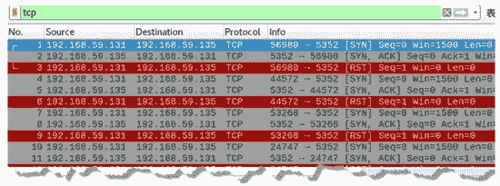
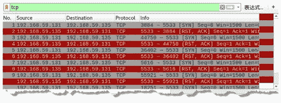
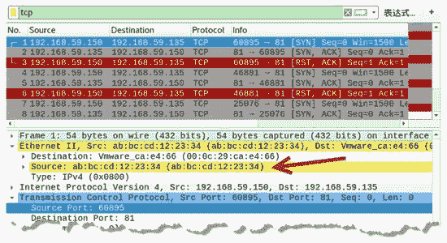

# 使用 TCP 协议扫描主机

> 原文：[`c.biancheng.net/view/6429.html`](http://c.biancheng.net/view/6429.html)

通常，用户通过 ping 命令判断目标主机是否开启；但是，很多主机都是禁止使用 ping 命令的。如果目标主机开放，并有程序在运行和监听特定的 TCP 端口，那么就可以通过 TCP 协议连接该端口从而判断主机是否运行。

## 构造 TCP Ping 包实施扫描

构造 TCP Ping 包实质上是构建一个 [SYN] 包，它模拟 TCP 连接中的第 1 次握手，向目标主机的端口发出请求。如果指定的端口开放，将返回第 2 次握手包[SYN，ACK]；如果端口未开放，将返回 [RST，ACK] 包。

可以借助 netwox 工具中编号为 51 的模块进行构建 TCP Ping 包。

【实例】在主机 192.168.59.131 上构建 TCP Ping 包，对目标主机进行扫描，判断主机是否启用。

1) 判断目标主机 192.168.59.135 是否启用，执行命令如下：

root@daxueba:~# netwox 51 -i 192.168.59.135

输出信息如下：

Ok
Ok
Ok
Ok
Ok
…  #省略其他信息

该模块默认向目标主机的 80 端口发送 SYN 包。上述输出信息中持续显示 OK，表示目标主机的 80 端口返回了响应，从而确定该主机已启用。

2) 如果目标主机开放的不是 80 端口，就需要指定其他端口号。例如，基于 5352 端口，判断目标主机是否开启。执行命令如下：

root@daxueba:~# netwox 51 -i 192.168.59.135 -p 5352

执行命令后，将会向目标主机的 5352 端口发送 SYN 请求包。

3) 为了验证发送的 SYN 包情况，通过抓包进行查看，如图所示。

其中，第 1 个数据包的源 IP 地址为 192.168.59.131，目标 IP 地址为 192.168.59.135，源端口为随机端口 56980，目标端口为要探测的端口 5352。

在 Info 列中可以看到 [SYN]，表示该数据包为向目标主机发送的第 1 次握手包。第 2 个数据包的源 IP 地址为 192.168.59.135，目标 IP 地址为 192.168.59.131，源端口为 5352，目标端口为 56980，Info 列中包含 [SYN，ACK]，表示该数据包是第 1 个数据包的响应包。

这说明目标主机上的 5352 端口是开放的，从而判定目标主机也是开启的。

4) 如果目标主机上的端口不开放，将返回 [RST，ACK] 包。例如，连接不开放的端口 5533，如图所示。

其中，第 1 个数据包为向目标主机 5533 端口发送的第 1 次握手包，第 2 个数据包为对应的响应包，该包不是 [SYN，ACK] 包，而是 [RST，ACK] 包。这表示目标主机端口没有进行回复，目标端口 5533 没有启用。

## 伪造 TCP Ping 包实施扫描

通过构造 TCP Ping 包来判断目标主机是否开启，很容易被发现。为了避免被发现，可以伪造 TCP Ping 包实施扫描。

【实例】在主机 192.168.59.131 上伪造 TCP Ping 包，尝试访问目标主机的 81 端口。

1) 伪造 IP 地址为 192.168.59.150，MAC 地址为 ab：bc：cd：12：23：34。执行命令如下：

root@daxueba:~# netwox 52 -i 192.168.59.135 -p 81 -E ab:bc:cd:12:23:34 -I 192.168.59.150 -e 00:0c:29:ca:e4:66

输出信息如下：

Ok
Ok
Ok
Ok
Ok
…  #省略其他信息

2) 通过抓包验证发送的 TCP Ping 包，并查看伪造的地址，如图所示。
其中，第 1 个数据包为发送的 [SYN] 包，可以看到源 IP 地址为 192.168.59.150（伪造的），目标 IP 地址为 192.168.59.135。

在 Ethernet II 部分中可以看到源 MAC 地址为 ab：bc：cd：12：23：34（伪造的）。

第 2 个数据包为对应的响应包 [SYN，ACK]，表示目标端口 81 开放。