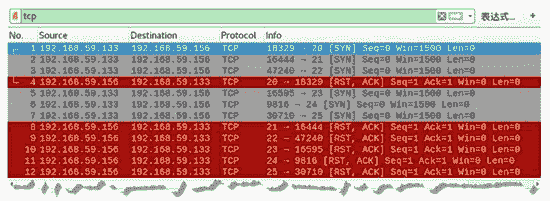
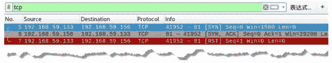
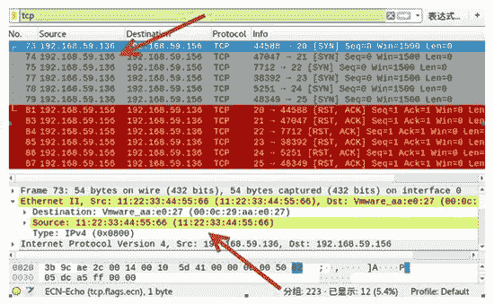

# 使用 TCP 协议批量扫描端口

> 原文：[`c.biancheng.net/view/6431.html`](http://c.biancheng.net/view/6431.html)

在 TCP 协议中，计算机与计算机之间的通信都是通过端口识别进行传输的，不同的应用程序使用的端口也不同，通过判断开放的端口，可以了解目标主机运行哪些程序。

通过构造 TCP Ping 包实施扫描可以判断端口是否开放，但它一次只能判断一个端口。下面将讲解如何批量扫描端口，以判断端口的开放情况。

## 构造 TCP 端口扫描包

TCP 端口扫描也是构造的是 TCP 连接中的第 1 次握手包 [SYN] 包。如果端口开放，将返回第二次握手包 [SYN，ACK]；如果端口未开放，将返回 [RST，ACK] 包。

用户可以借助 netwox 工具中编号为 67 的模块构造 TCP 端口扫描包。

【实例】在主机 192.168.59.133 上进行实施 TCP 端口扫描，探测目标主机 192.168.59.156 的端口开放情况。

1) 判断端口 20～25 的开放情况，执行命令如下：

root@daxueba:~# netwox 67 -i 192.168.59.156 -p 20-25

输出信息如下：

192.168.59.156 - 20 : closed
192.168.59.156 - 21 : closed
192.168.59.156 - 22 : closed
192.168.59.156 - 23 : closed
192.168.59.156 - 24 : closed
192.168.59.156 - 25 : closed

上述输出信息显示对端口 20～25 进行了扫描，closed 表示这些端口都是关闭状态。

2) 通过抓包，可以捕获扫描发送的 TCP SYN 请求包和返回的 TCP RST-ACK 包，如图所示。

这里，捕获到 12 个数据包。其中，第 1～3 个和第 5～7 个包分别为向端口 20～25 发送的 SYN 请求包。其中，源 IP 地址为 192.168.59.133（实施主机地址）。

由于这些端口关闭，每个请求都返回了 RST-ACK 响应包。其中，第 4 个和第 8～12 个包为返回的响应包，表示端口未开放。

3) 判断端口 81 的开放情况，执行命令如下：

root@daxueba:~# netwox 67 -i 192.168.59.156 -p 81

输出信息如下：

192.168.59.156 - 81 : open

上述输出信息表示端口 81 是开放的。

4) 此时捕获到的数据包，将返回的是 SYN-ACK 包，如图所示。

其中，第 5 个数据包为发送的 SYN 请求包；第 6 个数据包为返回的 SYN-ACK 包，表示端口 81 是开放的。

## 伪造 TCP 扫描包

直接基于本机构造 TCP 端口扫描包，很容易被发现。为了避免被发现，可以伪造 TCP 包实施扫描，如伪造 IP 地址和 MAC 地址。

【实例】在主机 192.168.59.133 上构造 TCP 扫描包，探测目标主机 192.168.59.156 的端口开放情况。

1) 伪造 IP 地址为 192.168.59.136，MAC 地址为 11：22：33：44：55：66，判断端口 20～25 的开放情况，执行命令如下：

root@daxueba:~# netwox 68 -i 192.168.59.156 -p 20-25 -E 11:22:33:44:55:66 -I 192.168.59.136

输出信息如下：

192.168.59.156 - 20 : closed
192.168.59.156 - 21 : closed
192.168.59.156 - 22 : closed
192.168.59.156 - 23 : closed
192.168.59.156 - 24 : closed
192.168.59.156 - 25 : closed

2) 当目标主机捕获到数据包时，发现的地址是虚假的地址，如图所示。

上图中请求数据包的 IP 地址都为 192.168.59.136（伪造的 IP 地址），MAC 地址为 11：22：33：44：55：66（伪造的 MAC 地址）。