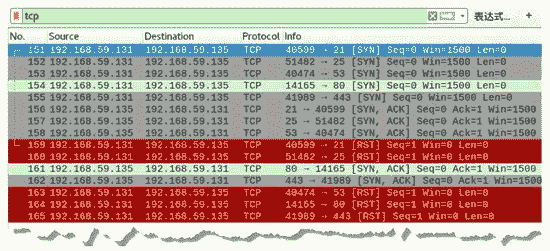
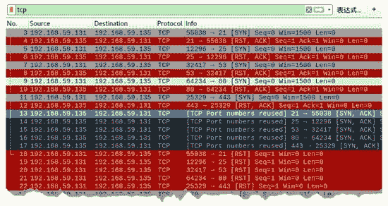

# 防止使用 TCP 协议扫描端口

> 原文：[`c.biancheng.net/view/6433.html`](http://c.biancheng.net/view/6433.html)

为了防御攻击者对主机端口的扫描，可以干扰攻击者的判断。例如，当扫描未开放的端口时，也返回 [SYN，ACK] 包，使攻击者认为该端口是开放的。

防御扫描干扰需要使用 netwox 工具中编号为 79 的模块。

【实例】已知主机 A 的 IP 地址为 192.168.59.135，主机 B 的 IP 地址为 192.168.59.131。在主机 192.168.59.135 上实施防御扫描。

1) 查看主机 A 当前监听的端口，执行命令如下：

root@daxueba:~# netstat -l

输出信息如下：

```

Active Internet connections (only servers)
Proto            Recv-Q       Send-Q   Local Address        Foreign Address         State
tcp              0            0        0.0.0.0:5227            0.0.0.0:*            LISTEN
tcp              0            0        0.0.0.0:5228            0.0.0.0:*            LISTEN
tcp              0            0        0.0.0.0:5229            0.0.0.0:*            LISTEN
udp              19584        0        0.0.0.0:bootpc          0.0.0.0:*
raw6             0            0        [::]:ipv6-icmp           [::]:*                   7
Active UNIX domain sockets (only servers)
```

上述输出信息表示主机 A 当前开启了端口 5227、5228、5229 这 3 个端口。

2) 干扰主机 B，使主机 B 认为除了上述 3 个端口以外，其他端口都是开放状态，执行命令如下：

root@daxueba:~# netwox 79 -i 192.168.59.135 -p 1-5226,5230-65535

执行命令后没有任何输出信息，但是会对命令中指定的端口都进行响应，返回 [SYN，ACK] 包。

3) 目标主机 B 对主机 A 进行扫描，例如，对端口 21、25、53、80、443 进行扫描，执行命令如下：

root@daxueba:~# netwox 67 -i 192.168.59.135 -p 21,25,53,80,443

输出信息如下：

192.168.59.135 - 21 : open
192.168.59.135 - 25 : open
192.168.59.135 - 53 : open
192.168.59.135 - 80 : open
192.168.59.135 - 443 : open

以上输出信息表示目标主机 A 的 21、25、53、80、443 端口都是开放状态，而实际并没有开放。

4) 通过抓包，查看捕获的数据包，如图所示。

从上图中可以看到，主机 B 对主机 A 的 21、25、53、80、443 端口依次发送了 TCP[SYN] 包，并且都得到了对应的 [SYN，ACK] 响应包，表示这些端口是开放的。

通常，目标主机上都有自己的内核防火墙。当攻击主机对目标主机端口扫描时，内核防火墙也会向攻击主机回复响应包。这时，不仅 netwox 工具会发出响应包，内核防火墙也会进行回复，导致发送响应包 [SYN，ACK] 和 [RST]。

例如，上述对端口 21、25、53、80、443 进行扫描，将会得到的响应包，如图所示。

图中第 13～17 个数据包，分别是端口 21、25、53、80、443 给出的 [SYN，ACK] 响应包，第 18～22 个数据包，分别是端口 21、25、53、80、443 给出的 [RST] 响应包。

为了能够使 netwox 工具起到干扰作用，需要在目标主机上内核防火墙中进行配置，丢弃接收的数据包，执行命令如下：

root@daxueba:~# iptables -P INPUT DROP

如果继续接收进入的数据包，执行命令如下：

root@daxueba:~# iptables -P INPUT ACCEPT