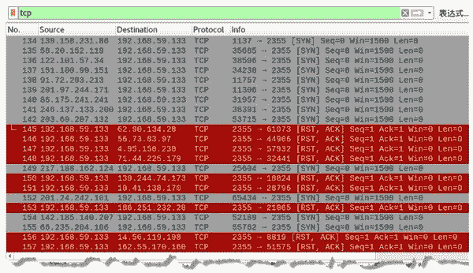
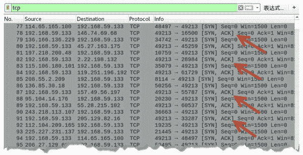
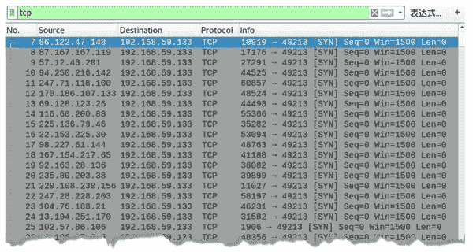
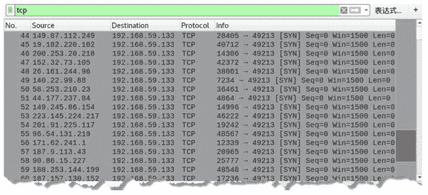
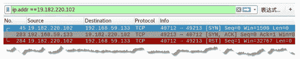
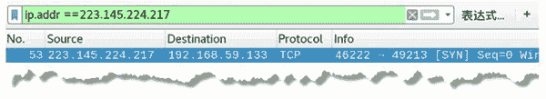
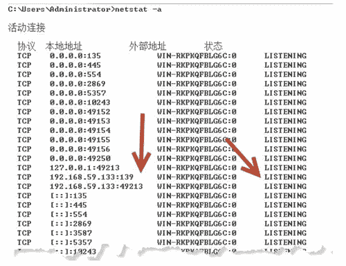
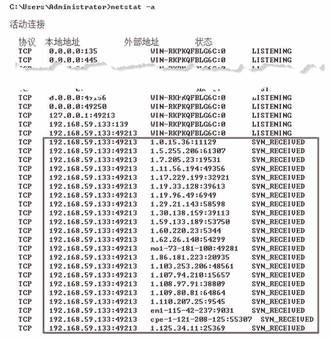
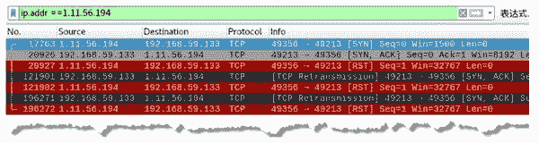

# 使用 TCP 协议检测防火墙

> 原文：[`c.biancheng.net/view/6434.html`](http://c.biancheng.net/view/6434.html)

为了安全，主机通常会安装防火墙。防火墙设置的规则可以限制其他主机连接。例如，在防火墙规则中可以设置 IP 地址，允许或阻止该 IP 地址主机对本机的连接；还可以设置监听端口，允许或阻止其他主机连接到本地监听的端口。

为了清楚地了解目标主机上是否安装防火墙，以及设置了哪些限制，netwox 工具提供了编号为 76 的模块来实现。它通过发送大量的 TCP[SYN] 包，对目标主机进行防火墙探测，并指定端口通过得到的响应包进行判断。

*   如果目标主机的防火墙处于关闭状态，并且指定的端口没有被监听，将返回 [RST，ACK] 包。
*   如果目标主机上启用了防火墙，在规则中设置了端口，阻止其他主机连接该端口，那么在探测时将不会返回响应信息。如果设置为允许其他主机连接该端口，将返回 [SYN，ACK] 包。
*   如果在规则中设置了 IP 地址，并允许该 IP 地址的主机进行连接，探测时返回 [SYN，ACK] 包；当阻止该 IP 地址的主机进行连接，探测时将不会返回数据包。

由于它可以发送大量的 TCP[SYN] 包，用户还可以利用该模块实施洪水攻击，耗尽目标主机资源。

【实例】在主机 192.168.59.131 上对目标主机 192.168.59.133 进行防火墙探测。

1) 向目标主机端口 2355 发送 TCP[SYN] 包，探测是否有防火墙。执行命令如下：

root@daxueba:~# netwox 76 -i 192.168.59.133 -p 2355

执行命令后没有任何输出信息，但是会不断地向目标主机发送 TCP[SYN] 包。

2) 为了验证发送探测包情况，可以通过 Wireshark 抓包进行查看，如图所示。

其中，一部分数据包目标 IP 地址都为 192.168.59.133，源 IP 地址为随机的 IP 地址，源端口为随机端口，目标端口为 2355。这些数据包是探测防火墙时发送的 TCP[SYN] 数据包。

另一部分数据包源 IP 地址为 192.168.59.133，目标 IP 地址为随机的 IP 地址，源端口为 2355，目标端口为随机端口。这些数据包为对应的响应包。这里的响应包为 [RST，ACK] 包，表示目标主机的防火墙没有开启，并且目标主机没有监听 2355 端口。

3) 目标主机没有开启防火墙时，如果监听了端口（如监听了 49213 端口），将会得到 [SYN，ACK ] 响应包，如图所示。

其中，一部分数据包的源 IP 地址为 192.168.59.133，目标 IP 地址为随机的 IP 地址，源端口为 49213，目标端口为随机端口。这些数据包为对应的响应包。这里的响应包为第 2 次握手包，表示目标主机监听了 49213 端口。

4) 当目标主机上开启了防火墙，再进行探测时，如果目标主机监听了端口，并且在防火墙规则中允许连接到该端口，那么将会收到 [SYN，ACK] 响应包。

如果不允许连接到该端口，那么将不会返回任何响应数据包。例如，防火墙规则中不允许连接 49213 端口，那么在探测时，将只有 TCP[SYN] 包，如图所示。

其中，所有的数据包目标 IP 地址都为 192.168.59.133，源 IP 地址为随机的 IP 地址，源端口为随机端口，目标端口为 49213。这些数据包就是探测时发送的 TCP[SYN] 包。

5) 目标主机的防火墙规则可能限制了特定 IP 地址的主机进行连接。那么，在进行探测时，其他 IP 地址的 TCP[SYN] 包会得到对应的 [SYN，ACK] 响应包，被限制的 IP 地址主机将不会收到响应包。捕获到的探测数据包，如图所示。

其中，伪造了大量的 IP 地址向目标主机发送的 TCP[SYN] 包。例如，第 45 个数据包为伪造主机 19.182.220.102 向目标主机 192.168.59.133 发送的探测包。第 53 个数据包为伪造主机 223.145.224.217 向目标主机 192.168.59.133 发送的探测包。

6) 通过显示过滤器，过滤主机 19.182.220.102 的数据包，如图所示。

图中第 45 个数据包为发送的探测包，第 283 个数据包为对应的响应包 [SYN，ACK]。这说明目标主机防火墙规则中没有限制主机 19.182.220.102 的连接。

7) 过滤主机 223.145.224.217 的数据包，如图所示。

该数据包为进行探测发送的 [SYN] 包，主机 IP 地址为 223.145.224.217，但是该数据包没有对应的响应包。这说明目标主机防火墙规则中限制了主机 223.145.224.217 的连接。

8) 对目标主机实施洪水攻击，在攻击之前，在目标主机上查看所有端口的相关状态信息，如图所示。

其中，192.168.59.133:49213 表示主机 192.168.59.133 开启了 49213 端口。状态列中的 LISTENING 表示该端口处于监听状态。

9) 对目标主机进行洪水攻击，执行命令如下：

root@daxueba:~# netwox 76 -i 192.168.59.133 -p 49213

10) 再次在目标主机上查看所有端口的相关状态信息，如图所示。

图中显示了大量的地址 192.168.59.133:49213，表示有大量的主机连接了主机的 49213 端口。其中，1.11.56.194:49356 表示，主机 1.11.56.194 的 49356 端口连接了主机 192.168.59.133 的 49213 端口。

11) 由于目标主机上监听了 49213 端口，捕获到对应的响应包 [SYN，ACK]，如图所示。

