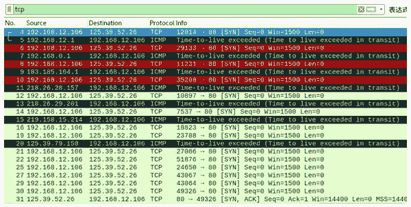
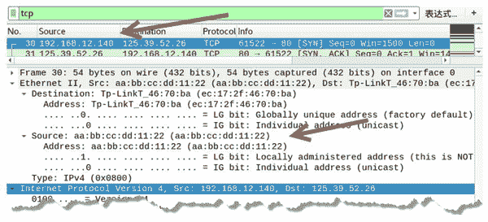

# 使用 TCP 协议进行路由跟踪

> 原文：[`c.biancheng.net/view/6435.html`](http://c.biancheng.net/view/6435.html)

当目标主机禁止 ping 时，就无法通过 ICMP 请求包进行路由跟踪，这时可以借助 TCP 协议实施跟踪。

用户可以使用 netwox 工具提供的相关模块发送 TCP 包，与目标主机连接，然后通过返回的响应来判断经过的路由信息。

## 构造 TCP 包进行路由跟踪

通过 TCP 包进行路由跟踪实际上也是构造一个 [SYN] 包，向目标主机进行发送，通过控制 TTL 值，从而获取路由信息。

例如，向目标主机发送 [SYN] 包后，到达经过的路由器时，TTL 值已经变为 0，但还没有到达目标主机，则该路由器将返回表示超时消息的 ICMP 数据包。如果到达目标主机，将返回 TCP[SYN，ACK] 响应包。

【实例】在主机 192.168.12.106 上构造 TCP 包，对目标主机 125.39.52.26 进行路由跟踪，判断到达目标主机都经过哪些路由。

1) 构造 TCP 包进行路由跟踪，执行命令如下：

root@kali:~# netwox 59 -i 125.39.52.26

输出信息如下：

1 : 192.168.12.1
2 : 192.168.0.1
3 : 183.185.164.1
4 : 218.26.28.157
5 : 218.26.29.201
6 : 219.158.15.214
8 : 125.39.79.158
14 : 125.39.52.26

以上输出信息显示了经过的所有路由器的 IP 地址信息。例如，经过的第一个路由器地址为 192.168.12.1。

2) 为了验证成功构造了 TCP 包，并得到了每个路由器的响应信息，可以进行捕获数据包来查看，如图所示。

从上图可知：

*   第 4 个数据包源 IP 地址为 192.168.12.106，目标 IP 地址为 125.39.52.26，是实施主机向目标主机发送的 TCP[SYN] 包。
*   第 5 个数据包源 IP 地址为 192.168.12.1，目标 IP 地址为 192.168.12.106，该数据包是经过的第 1 个网关返回的超时消息的 ICMP 数据包，表示还没有达到目标主机 125.39.52.26。
*   第 6 个数据包为实施主机 192.168.12.106 继续向目标主机 125.39.52.26 发送的 TCP[SYN] 包。
*   第 7 个数据包为经过的第 2 个网关返回的超时消息的 ICMP 数据包。

以此类推，第 30 个数据包为向目标主机 125.39.52.26 发送的 TCP[SYN] 包，第 31 个数据包为目标主机 125.39.52.26 返回的 TCP[SYN，ACK] 包。

## 伪造 TCP 包进行路由跟踪

使用本机进行路由跟踪，很容易被发现。为了避免被发现，用户可以伪造 TCP 包进行路由跟踪，如伪造 IP 地址和 MAC 地址。

【实例】已知目标主机 IP 地址为 125.39.52.26，MAC 地址为 ec：17：2f：46：70：ba。在主机 192.168.12.106 上伪造 TCP 包进行路由跟踪。

1) 伪造源 IP 地址为 192.168.12.140，MAC 地址为 aa：bb：cc：dd：11：22，执行命令如下：

root@kali:~# netwox 60 -i 125.39.52.26 -E aa:bb:cc:dd:11:22 -I 192.168.v12.140 -e ec:17:2f:46:70:ba

输出信息如下：

1 : 192.168.12.1
2 : 192.168.0.1
3 : 183.185.164.1
4 : 218.26.28.157
5 : 218.26.29.201
6 : 219.158.15.214
8 : 125.39.79.166
14 : 125.39.52.26

2) 通过抓包，验证成功伪造 TCP[SYN] 进行路由跟踪数据包，如图所示。

其中，第 30 个数据包的源 IP 地址为 192.168.12.140（伪造的），目标 IP 地址为 125.39.52.26；在 Ethernet II 部分中，源 MAC 地址为 aa：bb：cc：dd：11：22（伪造的）。

第 31 个数据包为对应的响应包，目标 IP 地址为 192.168.12.140，说明成功将返回的信息发送给了伪造的地址。