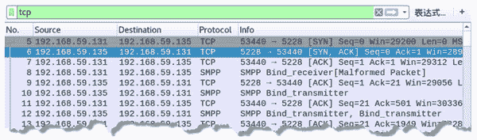

# 使用 TCP 协议检测网络性能

> 原文：[`c.biancheng.net/view/6437.html`](http://c.biancheng.net/view/6437.html)

TCP 协议通过滑动窗口方式，可以充分利用网络性能传输数据。所以，利用 TCP 传输机制，可以检测网络性能。

netwox 工具提供了相关模块来实现该功能，可以使用编号为 155 的模块建立 TCP 服务器，使用编号为 156 的模块建立 TCP 客户端。然后，使用 TCP 客户端连接 TCP 服务器端，测试网络性能。

【实例】已知主机 A 的 IP 地址为 192.168.59.135，主机 B 的 IP 地址为 192.168.59.131。使用这两个主机进行网络性能检测。具体步骤如下：

1) 将主机 A 设置为 TCP 服务器端，监听的端口为 5228，执行命令如下：

root@daxueba:~# netwox 155 -P 5228

执行命令后没有任何输出信息。

2) 将主机 B 设置为 TCP 客户端，并连接 TCP 服务器端，执行命令如下：

root@daxueba:~# netwox 156 -p 5228 -i 192.168.59.135

输出信息如下：

```

37226820 Bytes/sec [=~=  333636 kbit/sec]    jitter=    1420 usec
21462698 Bytes/sec [=~=  192354 kbit/sec]    jitter=    12990 usec
46895528 Bytes/sec [=~=  420290 kbit/sec]    jitter=    14478 usec
33407776 Bytes/sec [=~=  299409 kbit/sec]    jitter=    2011 usec
23745772 Bytes/sec [=~=  212815 kbit/sec]    jitter=    547 usec
```

以上输出信息显示了每秒传输位数和 TCP 的抖动（jitter）。

3) 为了验证测试过程，通过抓包查看，如图所示。

其中，第 5～7 个数据包为 3 次握手包。