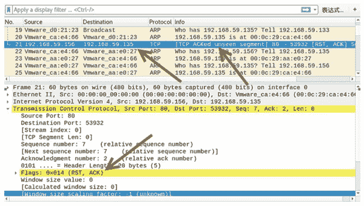
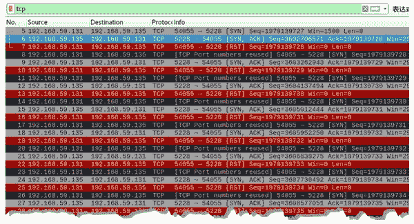

# 如何干扰 TCP 数据传输？

> 原文：[`c.biancheng.net/view/6438.html`](http://c.biancheng.net/view/6438.html)

TCP 协议通过三次握手和四次挥手建立和断开连接，利用握手和挥手机制，也可以干扰正常的 TCP 数据传输。本节将详细讲解如何干扰 TCP 数据传输。

## 重置会话

正常情况下，客户端与服务器端不再通信时，需要通过四次挥手断开连接。利用该机制，用户可以手动发送 TCP 重置包，断开客户端与服务器之间的连接，干扰正常的数据传输。

重置会话可以使用 netwox 工具提供的编号为 78 的模块。

【实例】已知主机 A 的 IP 地址为 192.168.59.156，主机 B 的 IP 地址为 192.168.59.135，主机 C 的 IP 地址为 192.168.59.133。使用 netwox 工具重置 TCP 会话。具体步骤如下：

1) 在主机 A 上建立 TCP 服务器端，并发送消息 ni hao，如下：

root@daxueba:~# netwox 89 -P 80
ni hao

2) 在主机 B 上建立 TCP 客户端，并回复消息 hao，如下：

root@daxueba:~# netwox 87 -i 192.168.59.156 -p 80
ni hao
hao

从以上输出信息可以看到 TCP 客户端与服务器端的会话消息。

3) 在主机 C 上使用 netwox 重置 TCP 会话，指定服务器端 IP 地址，执行命令如下：

root@daxueba:~# netwox 78 -i 192.168.59.156

执行命令后没有任何输出信息。

4) 当在 TCP 服务器端再次向 TCP 客户端发送消息时，则 TCP 会话中断。例如，发送消息 hello，如下：

root@daxueba:~# netwox 89 -P 80
ni hao
hao
hello
root@daxueba:~#    #中断 TCP 会话

5) 在服务器端进行抓包，将捕获到 TCP 会话中断的相关数据包，如图所示。

图中第 21 个数据包为 TCP 数据包，在 Info 列中可以看到 [TCP ACKed unseen segment] 信息，表示该数据包的 TCP 会话不存在，已经重置了。

在 Transmission Control Protocol 部分中可以看到 Flags: 的值为 (RST，ACK)，表示该数据包为重置数据包。

## 检查盲注攻击漏洞

发送一个 [SYN] 请求包，会得到一个包含序列号的 [SYN，ACK] 响应包。连续发送 [SYN] 请求包时，会得到一系列的序列号。如果序列号的值是有规律的，那么当请求主机不再发送 [SYN] 请求包时，攻击者可以利用发现的规律预测到下一个序列号的值。该现象被称为 TCP 序列号预测漏洞。

为了判断目标主机上是否存在该漏洞，netwox 工具提供了编号为 77 的模块来实现。它可以向目标主机发送大量的 [SYN] 请求包。如果目标主机端口处于开放状态，可以得到一系列的序列号值。通过比对这些值是否具有规律性，可以判断是否存在该漏洞。

【实例】检查目标主机是否存在 TCP 序列号预测漏洞。

1) 对目标主机进行检查，执行命令如下：

root@daxueba:~# netwox 77 -i 192.168.59.135 -p 5228

输出信息如下：

3602706571 [+3602706571]
3603262943 [+556372]
3604137494 [+874551]
3605012444 [+874950]
3605952250 [+939806]
3606839275 [+887025]
3607738492 [+899217]
3608577051 [+838559]
3609516111 [+939060]
3610388602 [+872491]
3611263469 [+874867]
3612140273 [+876804]
…  #省略其他信息

以上输出信息中，每一行的值表示响应包中序列号（SEQ）的值，如 3603262943[+556372]。其中，3603262943 为第 2 个响应包 [SYN，ACK] 中序列号的值，+556372 表示该响应包序列号的值和上一个响应包序列号的差值。根据输出信息可以了解到，每次的差值都是随机的，说明序列号没有规律，证明目标主机不存在盲注攻击漏洞。

2) 为了验证该模块的工作机制，通过抓包进行人工判断，如图所示。

从上图中可以看出：

*   第 5 个数据包为向目标主机 192.168.59.135 发送的 [SYN] 请求包。
*   第 6 个数据包为对应的 [SYN，ACK] 响应包，序列号为 3602706571。
*   第 8 个数据包为第 2 次向目标主机 192.168.59.135 发送的 [SYN] 请求包。
*   第 9 个数据包为对应的 [SYN，ACK] 响应包，序列号为 3603262943。

以此类推，可以看到 [SYN，ACK] 响应包中的序列号是随机的。

3) 如果目标主机上的端口没有开放，将返回如下信息：

No answer for this SYN (try to increase max-wait)
No answer for this SYN (try to increase max-wait)
No answer for this SYN (try to increase max-wait)
No answer for this SYN (try to increase max-wait)
No answer for this SYN (try to increase max-wait)