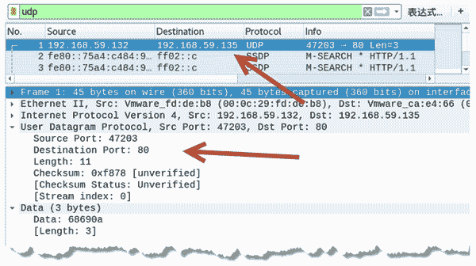
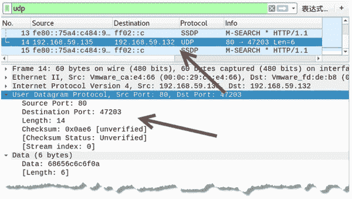

# UDP 报文格式详解

> 原文：[`c.biancheng.net/view/6440.html`](http://c.biancheng.net/view/6440.html)

相比 TCP 协议，UDP 协议的报文结构相对简单。本节将详细讲解 UDP 报文的格式。

## UDP 报文格式

每个 UDP 报文分为 UDP 报头和 UDP 数据区两部分。报头由 4 个 16 位长（2 字节）字段组成，分别说明该报文的源端口、目的端口、报文长度和校验值。

UDP 报文格式如图所示。

UDP 报文中每个字段的含义如下：

*   源端口：这个字段占据 UDP 报文头的前 16 位，通常包含发送数据报的应用程序所使用的 UDP 端口。接收端的应用程序利用这个字段的值作为发送响应的目的地址。这个字段是可选的，所以发送端的应用程序不一定会把自己的端口号写入该字段中。如果不写入端口号，则把这个字段设置为 0。这样，接收端的应用程序就不能发送响应了。
*   目的端口：接收端计算机上 UDP 软件使用的端口，占据 16 位。
*   长度：该字段占据 16 位，表示 UDP 数据报长度，包含 UDP 报文头和 UDP 数据长度。因为 UDP 报文头长度是 8 个字节，所以这个值最小为 8。
*   校验值：该字段占据 16 位，可以检验数据在传输过程中是否被损坏。

## 分析 UDP 数据包

客户端与服务器建立连接后进行通信，除了使用 TCP 协议外，还可以使用 UDP 协议。netwox 工具提供了相关模块，用于建立 UDP 服务器和 UDP 客户端，实现基于 UDP 协议的数据交互。

【实例】已知主机 A 的 IP 地址为 192.168.59.132，主机 B 的 IP 地址为 192.168.59.135。分别在这两个主机上建立 UDP 服务器和客户端，并进行连接，监听指定端口上的通信信息。具体步骤如下：

1) 在主机 A 上建立 UDP 服务器，设置监听端口为 80，执行命令如下：

root@daxueba:~# netwox 90 -P 80

执行命令后，没有任何输出信息，但是成功建立了 UDP 服务器端。

2) 在主机 B 上建立 UDP 客户端，连接 UDP 服务器端 80 端口，执行命令如下：

root@daxueba:~# netwox 88 -i 192.168.59.135 -p 80

执行命令后，没有任何输出信息，但是成功连接到了 UDP 服务器端，这里可以输入通信内容。

3) 与 UDP 服务器端进行通信，在客户端输入 hi：

root@daxueba:~# netwox 88 -i 192.168.59.135 -p 80
hi

4) 在服务端可以看到客户端发来的消息如下：

root@daxueba:~#  netwox 90 -P 80
hi

5) 为了验证发送的消息使用的是 UDP 协议，可以通过抓包进行查看，如图所示。

从图中第 1 个数据包可以看到，是 UDP 客户端（源 IP 地址为 192.168.59.132）向 UDP 服务器端（目的 IP 地址为 192.168.59.135）发送的 UDP 数据包，使用的源端口为随机端口 47203，目的端口为 80（UDP 服务器端监听的端口）。

在 User Datagram Protocol 部分中显示了 UDP 数据包的详细信息。可以看到源端口、目的端口，以及包长度为 11 字节、校验值为 0xf878 等信息。

6) 当服务器向客户端发送消息时，使用的也是 UDP 协议。例如，在服务器端回复客户端，输入 hello：

root@daxueba:~# netwox 90 -P 80
hi
hello

7) 通过抓包验证使用的是 UDP 协议，如图所示。

从第 14 个数据包可以看到，源 IP 地址为 192.168.59.135，目的 IP 地址为 192.168.59.132，源端口为 80，目的端口为随机端口 47203。该数据包正好是 UDP 服务器回复客户端的 UDP 数据包。在 User Datagram Protocol 部分中可以看到详细信息。