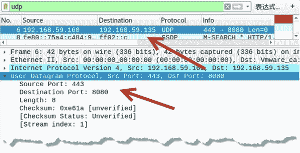
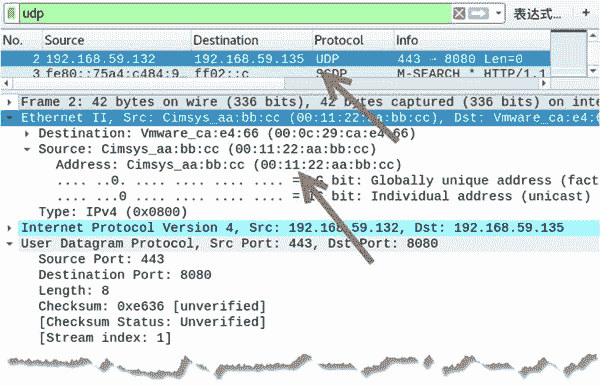

# 伪造 UDP 数据包

> 原文：[`c.biancheng.net/view/6442.html`](http://c.biancheng.net/view/6442.html)

在发送 UDP 数据包时，为了避免被发现，我们可以伪造假的 UDP 数据包。

## 基于 IPv4 伪造 UDP 数据包

可以基于 IPv4 伪造 UDP 包，它可以设置假的 IP 地址和假的端口等。伪造包需要使用 netwox 工具中编号为 39 的模块来实现。

【实例】基于 IPv4 伪造 UDP 包。

1) 不使用选项，直接运行并查看基于 IPv4 的 UDP 包，执行命令如下：

root@daxueba:~# netwox 39

输出信息如下：

```

IP______________________________________________________________.
|version|   ihl |      tos      |            totlen               |
|___4___|___5___|____0x00=0____ |___________0x001C=28______       |
|              id                    |r|D|M|       offsetfrag     |
|_________0x5578=21880__________      |0|0|0|________0x0000=0____ |
|      ttl      |   protocol    |           checksum              |
|____0x00=0_____|____0x11=17____|____________0x5D1F_______        |
|                                  source                         |
|________________________192.168.59.132_______________________    |
|                                destination                      |
|____________________________    5.6.7.8_____________________     |
UDP___________________________________________________________
|          source port          |       destination port          |
|__________0x04D2=1234__________|___________0x0050=80_______      |
|            length             |           checksum              |
|___________0x0008=8____________|_________0xF281=62081_______     |
```

其中，IP 部分为 IPv4 数据报文头信息，可以看到源 IP 地址为 192.168.59.132，该地址为当前主机的 IP 地址。UDP 部分为 UDP 数据报文头信息，在该信息中可以看到每个字段的默认值。

2) 基于 IPv4 伪造 UDP 数据包，伪造源 IP 地址为 192.168.59.160，源端口为 443。向目标主机 192.168.59.135 的 8080 端口发送 UDP 数据包，执行命令如下：

root@daxueba:~# netwox 39 -l 192.168.59.160 -m 192.168.59.135 -o 443 -p 8080

输出信息如下：

```

IP______________________________________________________________.
|version|   ihl |      tos      |            totlen              |
|___4___|___5___|____0x00=0_____|___________0x001C=28______      |
|              id                     |r|D|M|       offsetfrag   |
|_________ 0x76A7=30375_________|0|0|0|________0x0000=0______    |
|      ttl      |   protocol    |           checksum             |
|____0x00=0_____|____0x11=17____|____________ 0x4BB2_______      |
|                                  source                        |
|________________________192.168.59.160_______________________   |
|                                destination                     |
|________________________192.168.59.135_____________________     |
UDP___________________________________________________________
|          source port          |       destination port         |
|__________ 0x01BB=443__________|_________0x1F90=8080______      |
|            length             |           checksum             |
|___________0x0008=8____________|_________ 0xE61A=58906_______   |
```

在 IP 部分中可以看到，源 IP 地址变为了伪造的地址 192.168.59.160。目的 IP 地址为目标主机的地址。在 UDP 部分可以看到，源端口为伪造的端口 443，UDP 数据包的长度为 8，校验值为 0xE61A。

3) 通过抓包验证成功伪造了 UDP 数据包，如图所示。

从第 6 个数据包可以看到，源 IP 地址为 192.168.59.160，目的 IP 地址为 192.168.59.135，源端口为 443，目的端口为 8080。

该数据包正是伪造的 UDP 数据包，在 User Datagram Protocol 部分中可以看到 UDP 数据报头字段信息，如长度为 8、校验值为 0xe61a 等。

## 基于 Ethernet 和 IPv4 伪造 UDP 数据包

上述基于 IPv4 伪造 UDP 包只能伪造 IP 地址，但是不能伪造 MAC 地址。netwox 工具提供编号为 35 的模块，它可以基于 Ethernet 和 IPv4 伪造 UDP 包，可以伪造 MAC 地址。

【实例】基于 Ethernet 和 IPv4 伪造 UDP 包。

1) 不使用选项直接运行查看基于 Ethernet 和 IPv4 的 UDP 包，执行命令如下：

root@daxueba:~# netwox 35

输出信息如下：

```

Ethernet________________________________________________________.
| 00:0C:29:FD:DE:B8->00:08:09:0A:0B:0C type:0x0800               |
|_____________________________________________________________   |
IP______________________________________________________________.
|version|  ihl  |      tos      |            totlen              |
|___4___|___5___|____0x00=0_____|___________0x001C=28______      |
|              id                     |r|D|M|       offsetfrag   |
|_________ 0x555E=21854_________|0|0|0|________0x0000=0______    |
|      ttl      |   protocol    |           checksum             |
|____0x00=0_____|____0x11=17____|____________ 0x5D39_______      |
|                                  source                        |
|________________________192.168.59.132_______________________   |
|                                destination                     |
|____________________________    5.6.7.8_____________________    |
UDP__________________________________________________________
|          source port          |       destination port         |
|__________0x04D2=1234__________|___________0x0050=80_______     |
|            length             |           checksum             |
|___________0x0008=8____________|_________0xF281=62081_______    |
```

其中，Ethernet 部分表示以太网的数据报信息，在该部分中，00:0C:29:FD:DE:B8 为源 MAC 地址，是当前主机的 MAC 地址。其他字段的值都为默认值。

2) 基于 Ethernet 和 IPv4 伪造 UDP 包。伪造 MAC 地址为 00:11:22:aa:bb:cc，源端口为 443。向目标主机 192.168.59.135（其 MAC 地址为 00:0c:29:ca:e4:66）的 8080 端口发送 UDP 数据包，执行命令如下：

root@daxueba:~# netwox 35 -a 00:11:22:aa:bb:cc -b 00:0c:29:ca:e4:66 -m 192.168.59.135 -o 443 -p 8080

输出信息如下：

```

Ethernet________________________________________________________.
| 00:11:22:AA:BB:CC-> 00:0C:29:CA:E4:66 type:0x0800              |
|_____________________________________________________________   |
IP______________________________________________________________.
|version|  ihl  |      tos      |            totlen              |
|___4___|___5___|____0x00=0_____|___________0x001C=28______      |
|              id                     |r|D|M|       offsetfrag   |
|_________ 0xA313=41747_________|0|0|0|________0x0000=0______    |
|      ttl      |   protocol    |           checksum             |
|____0x00=0_____|____0x11=17____|____________ 0x1F62_______      |
|                                  source                        |
|________________________192.168.59.132_______________________   |
|                                destination                     |
|__________________________192.168.59.135_____________________   |
UDP___________________________________________________________
|          source port          |       destination port         |
|__________ 0x01BB=443__________|___________ 0x1F90=8080______   |
|            length             |           checksum             |
|___________0x0008=8____________|_________ 0xE636=58934_______   |
```

在 Ethernet 部分可以看到，源 MAC 地址变为了伪造的地址 00:11:22:AA:BB:CC。在 IP 部分中可以看到，源 IP 地址仍然为当前主机的 IP 地址 192.168.59.132。

3) 通过抓包验证伪造了 MAC 地址的 UDP 数据包，如图所示。

其中，第 2 个数据包为伪造的 UDP 包，源 IP 地址为真实的 IP 地址 192.168.59.132。

在 Ethernet II 部分中可以看到，Source 的值为 00:11:22:aa:bb:cc，该地址为伪造的 MAC 地址，而不是真实的 MAC 地址。