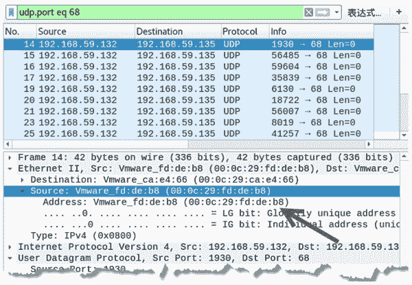
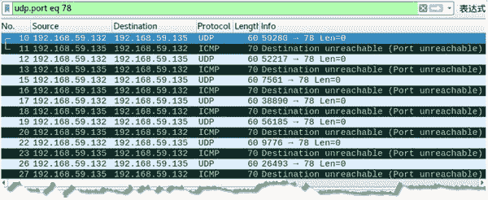
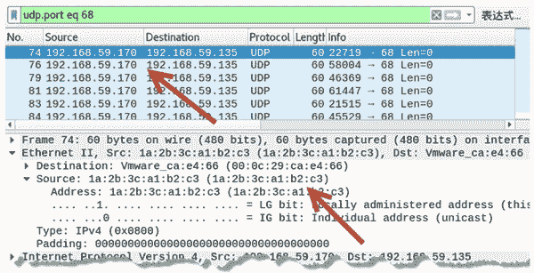

# 使用 UDP 协议扫描主机

> 原文：[`c.biancheng.net/view/6444.html`](http://c.biancheng.net/view/6444.html)

如果目标主机禁止响应 ICMP 协议，就无法使用 Ping 命令来判断主机是否存在。除了使用发送 TCP 包进行判断以外，还可以通过发送 UDP 包对主机和端口进行判断。

对目标主机进行扫描，实质上是向目标主机的指定端口发送 UDP Ping 包。如果目标主机开启，且对应端口打开，则不返回响应包；如果对应端口未打开，则返回目标主机不可达的 ICMP 包。

netwox 工具提供编号为 53 和 54 的模块，用来构造 UDP Ping 包。

【实例】已知目标主机 IP 地址为 192.168.59.135，其 MAC 地址为 00:0c:29:ca:e4:66。在主机 192.168.59.132 上实施扫描，判断目标主机是否启用，指定端口是否开放。

1) 判断目标主机是否启用，68 端口是否开放，执行命令如下：

root@daxueba:~# netwox 53 -i 192.168.59.135 -p 68

输出信息如下：

Ok
Ok
Ok
Ok
Ok
…  #省略其他信息

输出信息在不断持续的显示 OK，表示目标主机已启用，端口没有开放。

如果没有任何输出信息，有两种情况：第一种情况是目标主机不存在，第二种情况是目标主机已启用，端口处于开放状态。为了能够更清楚的判断需要进行抓包，通过查看是否有返回的响应来进行判断。

2) 如果没有相应，则捕获到的数据包如图所示。

其中，所有的数据包源 IP 地址都为 192.168.59.132（实施主机真实的 IP 地址），目标 IP 地址为 192.168.59.135，源端口为随机端口，目标端口为 68。说明这些数据包就是构造的 UDP Ping 包。并且，在数据包的 Ethernet II 部分中可以看到，Source 的值为 00:0c:29:fd:de:b8，是实施主机真实的 MAC 地址。

3) 如果有相应，捕获到的数据包如图所示。

图中捕获到大量的 UDP Ping 请求包，目标端口为 78。每个 UDP 请求包有对应的响应包，该响应包是一个端口不可达的 ICMP 包，说明目标主机 78 端口未开放。

4) 在进行发送 UDP Ping 包对目标主机进行扫描时，为了避免被发现可以进行伪造 UDP Ping 包。设置假的源 IP 地址和 MAC 地址。

例如，伪造源 IP 地址为 192.168.59.170，源 MAC 地址为 1a:2b:3c:a1:b2:c3，执行命令如下：

root@daxueba:~# netwox 54 -i 192.168.59.135 -p 68 -E 1a:2b:3c:a1:b2:c3 -I 192.168.59.170 -e 00:0c:29:ca:e4:66

5) 通过抓包验证成功伪造的地址，如图所示。

其中，所有 UDP 数据包的源 IP 地址都为伪造地址 192.1468.59.170，在 Ethernet II 部分中可以看到 Source 的值为 1a:2b:3c:a1:b2:c3，该值是伪造的 MAC 地址。