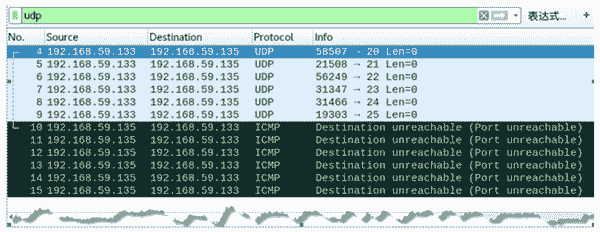

# 使用 UDP 协议扫描端口

> 原文：[`c.biancheng.net/view/6445.html`](http://c.biancheng.net/view/6445.html)

使用 UDP 协议扫描主机的方法发送 UDP Ping 扫描，只能判断目标主机上一个端口，不能批量地对端口进行扫描。netwox 工具提供了编号为 69 和 70 的模块，用来构造 UDP 端口扫描包，进行批量扫描。

【实例】已知目标主机 IP 地址为 192.168.59.135，其 MAC 地址为 00:0c:29:ca:e4:66。在主机 192.168.59.132 上实施端口扫描，判断目标主机多个端口的开放情况。

1) 判断端口 20-25 的开放情况，执行命令如下：

root@daxueba:~# netwox 69 -i 192.168.59.135 -p 20-25

输出信息如下：

192.168.59.135 - 20 : closed
192.168.59.135 - 21 : closed
192.168.59.135 - 22 : closed
192.168.59.135 - 23 : closed
192.168.59.135 - 24 : closed
192.168.59.135 - 25 : closed

输出信息显示了对端口 20-25 进行了扫描，closed 表示这些端口都是关闭状态。

2) 如果进行抓包，将会捕获到扫描的 UDP 请求包和返回的 ICMP 包，如图所示。

这时，捕获到 12 个数据包。其中，数据包 4-9 为向端口 20-25 发送的 UDP 请求包，可以看到源 IP 地址为 192.168.59.133（实施主机的地址），目标 IP 为 192.168.59.135（目标主机）。由于目标主机上的 UDP 端口 20-25 未开放，因此返回了对应的 ICMP 响应包，第 10-15 的数据包。

3) 如果目标主机端口开放，执行命令后显示信息如下：

root@daxueba:~# netwox 69 -i 192.168.59.135 -p 75-80

输出信息如下：

192.168.59.135 - 75 : timeout (perhaps open)
192.168.59.135 - 76 : timeout (perhaps open)
192.168.59.135 - 77 : timeout (perhaps open)
192.168.59.135 - 78 : timeout (perhaps open)
192.168.59.135 - 79 : timeout (perhaps open)
192.168.59.135 - 80 : timeout (perhaps open)

输出信息显示了对端口 75-80 进行了扫描，perhaps open 表示端口可能为开放状态。

4) 端口为开放状态将不会有对应的响应包。通过抓包进行查看，如图所示。

5) 在批量扫描端口时，为了避免被发现，可以进行伪造 UDP 包，如设置假的源 IP 地址和 MAC 地址。

例如，伪造源 IP 地址为 192.168.59.150，源 MAC 地址为 10:20:30:40:50:60，执行命令如下：

root@daxueba:~#  netwox 70 -i 192.168.59.135 -p 75-80 -E 10:20:30:40:50:60 -I 192.168.59.150

输出信息如下：

192.168.59.135 - 75 : closed
192.168.59.135 - 76 : closed
192.168.59.135 - 77 : closed
192.168.59.135 - 78 : closed
192.168.59.135 - 79 : closed
192.168.59.135 - 80 : closed

输出信息表示目标主机 192.168.59.135 上的 75-80 端口为关闭状态。

6) 通过抓包方式，查看伪造的包，如图所示。

其中，第 17 个数据包源 IP 地址为 192.168.59.150（伪造 IP 地址），源 MAC 地址为 10:20:30:40:50:60（伪造 MAC 地址），使用的源端口为随机端口 43046，目标端口为 75。

7) 端口未开放将返回 ICMP 包，返回的数据包目标地址同样也为伪造的地址。选择对应的响应包进行查看，如图所示。

例如，第 25 个数据包的目标地址为 192.168.59.150（伪造的），目标 MAC 地址为 10:20:30:40:50:60（伪造地址），说明响应信息发送到了伪造的主机上。