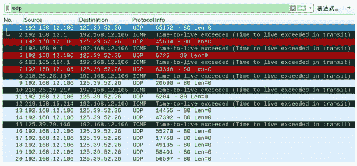
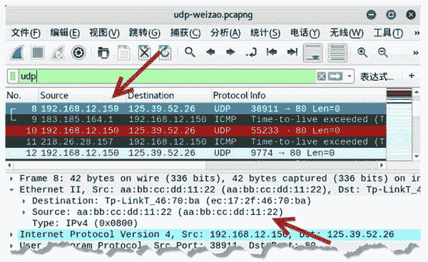

# 使用 UDP 协议进行路由跟踪

> 原文：[`c.biancheng.net/view/6446.html`](http://c.biancheng.net/view/6446.html)

除了使用 TCP 包来进行路由跟踪，还可以 UDP 包实现。它会向目标主机发送 UDP 包，当到达经过的路由器时，TTL 值为 0，还没有找到目标主机，经过的路由器将返回超时消息的 ICMP 数据包，如果成功到达主机，将不会返回任何响应信息。

netwox 工具提供了编号为 61 和 62 的模块，用来构造 UDP 包进行路由跟踪。

【实例】主机 192.168.12.106 向主机 125.39.52.26 发送 UDP 包，进行路由跟踪，判断经过哪些路由。

（1）构造 UDP 包进行路由跟踪，执行命令如下：

root@kali:~# netwox 61 -i 125.39.52.26

输出信息如下：

1 : 192.168.12.1
2 : 192.168.0.1
3 : 183.185.164.1
4 : 218.26.28.157
5 : 218.26.29.217
6 : 219.158.15.214
8 : 125.39.79.166

输出信息显示了经过的所有路由器的 IP 地址信息。例如，经过的第三个路由器地址为 171.117.240.1。

2) 为了验证构建的 UDP 包和得到的响应信息，进行抓包查看，如图所示。

从上图中可以看出：

*   第 1 个数据包的源 IP 地址为 192.168.12.106，目标 IP 地址为 125.39.52.26，是构造的 UDP 包。
*   第 2 个数据包源 IP 地址为 192.168.12.1，目标 IP 地址为 192.168.12.106，该数据包是第一个网关返回的超时消息的 ICMP 数据包，表示还没有达到目标主机 125.39.52.26。
*   第 3 个数据包为主机 192.168.12.106 继续向目标主机 125.39.52.26 发送的 UDP 包。
*   第 4 个数据包为第二个网关返回的超时消息的 ICMP 数据包。

以此类推，直到第 16 个数据包向目标主机 25.39.52.26 发送的 UDP 包以后，并且一直向目标主机发送 UDP 包都不再得到任何响应包，说明此时成功到达了目标主机。

3) 在进行路由跟踪时为了防止被发现，可以伪造源 IP 地址和 MAC 地址。设置源 IP 地址为 192.168.12.150，MAC 地址为 aa:bb:cc:dd:11:22，进行路由跟踪，执行命令如下：

root@kali:~# netwox 62 -i 125.39.52.26 -E aa:bb:cc:dd:11:22 -I 192.168.12.150 -e ec:17:2f:46:70:ba

输出信息如下：

1 : 192.168.12.1
2 : 192.168.0.1
3 : 183.185.164.1
4 : 218.26.28.157
5 : 218.26.29.217
6 : 219.158.15.214
8 : 125.39.79.162

4) 通过抓包验证伪造地址的 UDP 包，如图所示。

其中，第 8 个数据包的源 IP 地址为 192.168.59.150（伪造的），目标 IP 地址为 125.39.52.26（目标主机），该数据包就是伪造的 UDP 包。

在 Ethernet II 部分中可以看到源 MAC 地址为 aa:bb:cc:dd:11:22（伪造的）。第 9 个数据包为经过的路由 183.185.164.1 返回的 ICMP 包，返回的地址为伪造的地址 192.168.59.150。