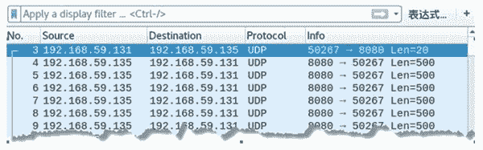

# 使用 UDP 协议检测网络性能

> 原文：[`c.biancheng.net/view/6447.html`](http://c.biancheng.net/view/6447.html)

为了了解网络的性能，netwox 工具提供了编号编号为 157 和 158 的模块，进行测试。其中，157 模块用于建立 UDP 服务器，158 模块用于建立 UDP 客户端。

【实例】已知主机 A 的 IP 地址为 192.168.59.135，主机 B 的 IP 地址为 192.168.59.131。使用 netwox 工具的第 157 个和 158 个模块分别在主机 A 和 B 进行设置 UDP 服务器端和客户端，并连接进行网络性能检测。具体步骤如下：

1) 将主机 A 设置为 UDP 服务器端，监听的端口为 8080，执行命令如下：

root@daxueba:~# netwox 157 -p 8080

执行命令后没有任何输出信息。

2) 将主机 B 设置为 UDP 客户端，并连接 UDP 服务器端，执行命令如下：

root@daxueba:~# netwox 158 -p 8080 -i 192.168.59.135

输出信息如下：

8406000 Bytes/sec [=~=   75336 kbit/sec]    jitter=    40 usec
6281860 Bytes/sec [=~=   56299 kbit/sec]    jitter=    6366 usec
7856287 Bytes/sec [=~=   70410 kbit/sec]    jitter=    399 usec
6037962 Bytes/sec [=~=   54113 kbit/sec]    jitter=    335 usec
7500995 Bytes/sec [=~=   67225 kbit/sec]    jitter=    413 usec
Packets sent by server: 91770
Packets recv by client: 74469

输出信息显示了每秒的字节数和 UDP 抖动（jitter）。

3) 为了验证 UDP 客户端向 UDP 服务端的 8080 端口发包，可以通过抓包查看，如图所示。

其中，第 3 个数据包可以看到主机 B 向主机 A 发送的 UDP 数据包，在 Info 列中可以看到源端口为随机 50267，目标端口为 8080（监听的端口）。