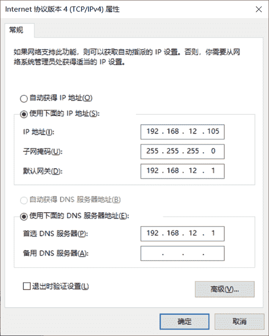
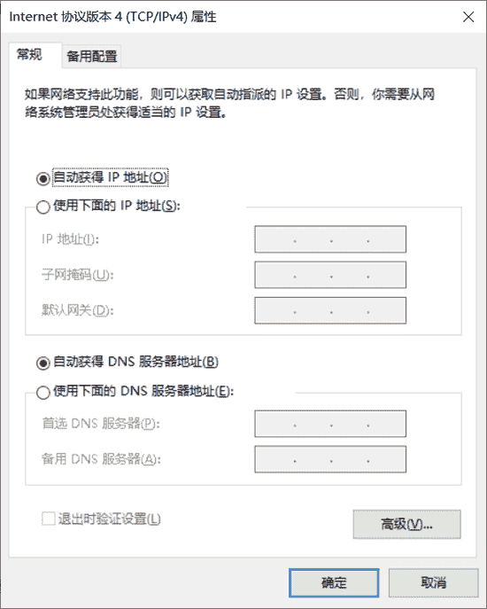

# IP 地址分配（静态分配+动态分配+零配置）

> 原文：[`c.biancheng.net/view/6449.html`](http://c.biancheng.net/view/6449.html)

计算机为了在 TCP/IP 网络中正常工作，需要获取相应的 IP 地址。获取 IP 地址的过程被称为地址分配。计算机获取 IP 地址的方式有 3 种，即静态分配、动态分配和零配置。下面依次讲解这 3 种方式。

## 静态分配 IP 地址

静态分配也称为手工分配。网络管理员在计算机中直接设置所使用的 IP 地址。在 Windows 系统中，用户可以在“Internet 协议版本 4（TCP/IPv4）属性”对话框中手动配置静态地址，如图所示。

勾选“使用下面的 IP 地址(S)”复选框，然后输入所要使用的 IP 地址、子网掩码和默认网关。这些信息必须与自己所在的网络信息一致。在“使用下面的 DNS 服务器地址(E)”文本框中输入首选 DNS 服务器地址，一般为网关地址。

## 动态分配 IP 地址

动态分配是指计算机向 DHCP 服务器申请 IP 地址，获取后使用该地址。这时，计算机作为 DHCP 客户机。

在这个过程中，DHCP 客户机向 DHCP 服务器租用 IP 地址，DHCP 服务器只是暂时分配给客户机一个 IP 地址。只要租约到期，这个地址就会还给 DHCP 服务器，以供其他客户机使用。如果 DHCP 客户机仍需要一个 IP 地址来完成工作，则可以再申请另外一个 IP 地址。所以，计算机获取的 IP 地址每次都可能变化，属于动态分配。

在 Windows 系统中，用户可以在“Internet 协议版本 4（TCP/IPv4）属性”对话框中进行动态分配地址，如图所示。

这时，只要勾选“自动获得 IP 地址(0)”和“自动获得 DNS 服务器地址(B)”复选框，计算机就会尝试向 DHCP 服务器请求 IP 地址了。

## 零配置

在动态分配方式中，如果 DHCP 服务器不在线或出现故障等情况时，客户机就无法获取地址。这时，有些系统将会通过零配置技术为自己分配一个私有的地址，范围为 169.254.0.0~169.254.255.255。