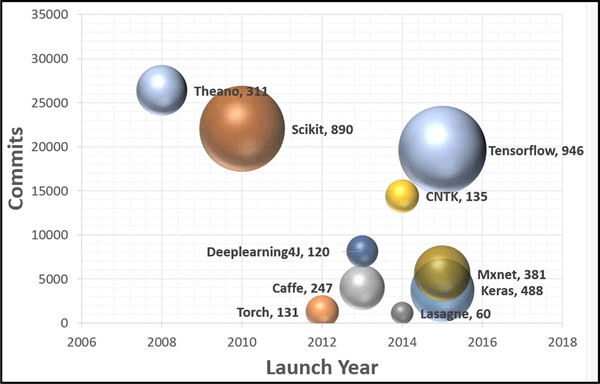

# TensorFlow 是什么

任何曾经试图在 Python 中只利用 NumPy 编写神经网络代码的人都知道那是多么麻烦。编写一个简单的一层前馈网络的代码尚且需要 40 多行代码，当增加层数时，编写代码将会更加困难，执行时间也会更长。

TensorFlow 使这一切变得更加简单快捷，从而缩短了想法到部署之间的实现时间。在本教程中，你将学习如何利用 TensorFlow 的功能来实现深度神经网络。

TensorFlow 是由 Google Brain 团队为深度神经网络（DNN）开发的功能强大的开源软件库，于 2015 年 11 月首次发布，在 Apache 2.x 协议许可下可用。截至今天，短短的两年内，其 [GitHub 库](https://github.com/tensorflow/tensorflow)大约 845 个贡献者共提交超过 17000 次，这本身就是衡量 TensorFlow 流行度和性能的一个指标。

图 1 列出了当前流行的深度学习框架，从中能够清楚地看到 TensorFlow 的领先地位：

图 1 TensorFlow 的领先地位示意图
先来了解一下 TensorFlow 究竟是什么，以及它为什么在 DNN 研究人员和工程师中如此受欢迎。

开源深度学习库 TensorFlow 允许将深度神经网络的计算部署到任意数量的 CPU 或 GPU 的服务器、PC 或移动设备上，且只利用一个 TensorFlow API。你可能会问，还有很多其他的深度学习库，如 Torch、Theano、Caffe 和 MxNet，那 TensorFlow 与其他深度学习库的区别在哪里呢？包括 TensorFlow 在内的大多数深度学习库能够自动求导、开源、支持多种 CPU/GPU、拥有预训练模型，并支持常用的 NN 架构，如递归神经网络（RNN）、卷积神经网络（CNN）和深度置信网络（DBN）。

TensorFlow 则还有更多的特点，如下：

*   支持所有流行语言，如 Python、C++、Java、R 和 Go。
*   可以在多种平台上工作，甚至是移动平台和分布式平台。
*   它受到所有云服务（AWS、Google 和 Azure）的支持。
*   Keras——高级神经网络 API，已经与 TensorFlow 整合。
*   与 Torch/Theano 比较，TensorFlow 拥有更好的计算图表可视化。
*   允许模型部署到工业生产中，并且容易使用。
*   有非常好的社区支持。
*   TensorFlow 不仅仅是一个软件库，它是一套包括 TensorFlow，TensorBoard 和 TensorServing 的软件。

[谷歌 research 博客](https://research.googleblog.com/2016/11/celebrating-tensorflows-first-year-html)列出了全球一些使用 TensorFlow 开发的有趣项目：

*   Google 翻译运用了 TensorFlow 和 TPU（Tensor Processing Units）。
*   Project Magenta 能够使用强化学习模型生成音乐，运用了 TensorFlow。
*   澳大利亚海洋生物学家使用了 TensorFlow 来发现和理解濒临灭绝的海牛。
*   一位日本农民运用 TensorFlow 开发了一个应用程序，使用大小和形状等物理特性对黄瓜进行分类。

使用 TensorFlow 的项目还有很多。本教程旨在让读者理解 TensorFlow 在深度学习模型中的应用，使读者可以轻松地将模型用于数据集并开发有用的应用程序。每章包含一系列处理技术问题、依赖性、代码和解读的示例，在每章的最后，还有一个功能完善的深度学习模型。