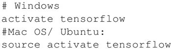
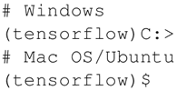
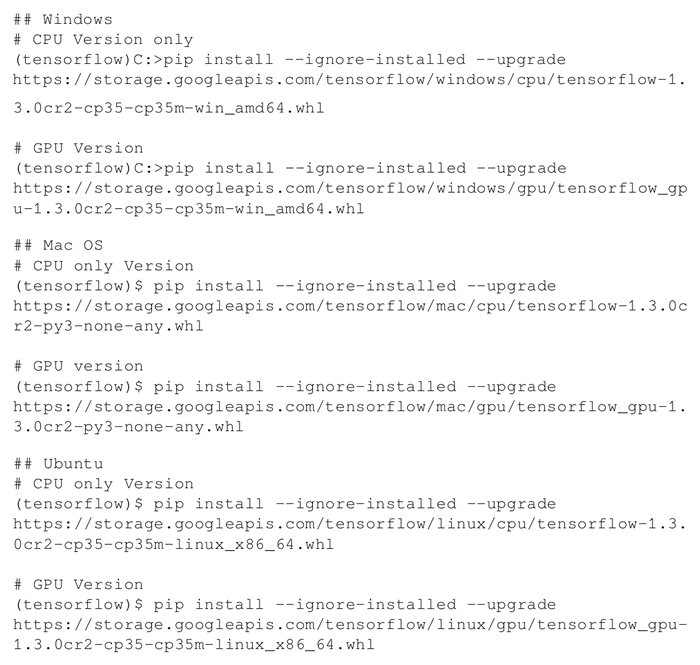
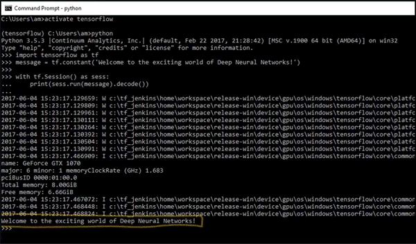

# TensorFlow 安装和下载（超详细）

本节将介绍在不同的操作系统（Linux、Mac 和 Windows）上如何全新安装 TensorFlow 1.3。

首先了解安装 TensorFlow 的必要要求，TensorFlow 可以在 Ubuntu 和 macOS 上基于 native pip、Anaconda、virtualenv 和 Docker 进行安装，对于 Windows 操作系统，可以使用 native pip 或 Anaconda。

Anaconda 适用于这三种操作系统，安装简单，在同一个系统上维护不同的项目环境也很方便，因此本教程将基于 Anaconda 安装 TensorFlow。

有关 Anaconda 及其环境管理的更多详细信息，请参考[`conda.io/docs/user-guide/index.html`](https://conda.io/docs/user-guide/index.html)。

本教程中的代码已经在以下平台上进行了测试：

*   Windows 10，Anaconda 3，Python 3.5，TensorFlow GPU，CUDA toolkit 8.0，cuDNN v5.1，NVDIA GTX 1070
*   Windows 10/Ubuntu 14.04/Ubuntu 16.04/macOS Sierra，Anaconda 3，Python 3.5，TensorFlow（CPU）

## TensorFlow 安装准备工作

TensorFlow 安装的前提是系统安装了 Python 2.5 或更高版本，教程中的例子是以 Python 3.5（Anaconda 3 版）为基础设计的。为了安装 TensorFlow，首先确保你已经安装了 Anaconda。可以从网址（[`www.continuum.io/downloads`](https://www.continuum.io/downloads)）中下载并安装适用于 Windows/macOS 或 Linux 的 Anaconda。

安装完成后，可以在窗口中使用以下命令进行安装验证：

conda --version

安装了 Anaconda，下一步决定是否安装 TensorFlow CPU 版本或 GPU 版本。几乎所有计算机都支持 TensorFlow CPU 版本，而 GPU 版本则要求计算机有一个 CUDA compute capability 3.0 及以上的 NVDIA GPU 显卡（对于台式机而言最低配置为 NVDIA GTX 650）。 

CPU 与 GPU 的对比：中央处理器（CPU）由对顺序串行处理优化的内核（4～8 个）组成。图形处理器（GPU）具有大规模并行架构，由数千个更小且更有效的核芯（大致以千计）组成，能够同时处理多个任务。

对于 TensorFlow GPU 版本，需要先安装 CUDA toolkit 7.0 及以上版本、NVDIA【R】驱动程序和 cuDNN v3 或以上版本。Windows 系统还另外需要一些 DLL 文件，读者可以下载所需的 DLL 文件或安装 Visual Studio C++。

还有一件事要记住，cuDNN 文件需安装在不同的目录中，并需要确保目录在系统路径中。当然也可以将 CUDA 库中的相关文件复制到相应的文件夹中。

## TensorFlow 安装具体做法

1.  在命令行中使用以下命令创建 conda 环境（如果使用 Windows，最好在命令行中以管理员身份执行）：

    conda create -n tensorflow python=3.5

2.  激活 conda 环境：
    

3.  该命令应提示：
    

4.  根据要在 conda 环境中安装的 TensorFlow 版本，输入以下命令：
    

5.  在命令行中输入 python，并输入以下代码：
    

6.  输出如下：
    
7.  在命令行中禁用 conda 环境（Windows 调用 deactivate 命令，MAC/Ubuntu 调用 source deactivate 命令）。

#### TensorFlow 安装过程解读分析

Google 使用 wheel 标准分发 TensorFlow，它是 .whl 后缀的 ZIP 格式文件。Python 3.6 是 Anaconda 3 默认的 Python 版本，且没有已安装的 wheel。在编写本教程时，Python 3.6 支持的 wheel 仅针对 Linux/Ubuntu，因此，在创建 TensorFlow 环境时，这里指定 Python 3.5。接着新建 conda 环境，命名为 tensorflow，并安装 pip，python，wheel 及其他软件包。

conda 环境创建后，调用 source activate/activate 命令激活环境。在激活的环境中，使用 pip install 命令安装所需的 TensorFlow（从相应的 TensorFlow-API URL 下载）。尽管有利用 conda forge 安装 TensorFlow CPU 的 Anaconda 命令，但 TensorFlow 推荐使用 pip install。在 conda 环境中安装 TensorFlow 后，就可以禁用了。现在可以执行第一个 TensorFlow 程序了。

程序运行时，可能会看到一些警告（W）消息和提示（I）消息，最后是输出代码：

Welcome to the exciting world of Deep Neural Networks!

恭喜你已成功安装并执行了第一个 TensorFlow 代码，在下一节中更深入地通读代码。

#### 拓展阅读

另外，你也可以安装 Jupyter notebook：

1.  安装 python：

    conda install -c anaconda ipython

2.  安装 nb_conda_kernels：

    conda install -channel=conda-forge nb_conda_kernels

3.  启动 Jupyter notebook：

    jupyter notebook

TIP：这将会打开一个新的浏览器窗口。

如果已安装了 TensorFlow，则可以调用 `pip install--upgrade tensorflow` 进行升级。

另外，你可以通过以下网址找到关于 TensorFlow 安装的更多资料：

*   [`www.tensorflow.org/install/`](http://www.tensorflow.org/install/)
*   [https:www.tensorflow.org/install/install_sources](http://https:www.tensorflow.org/install/install_sources)
*   [`llvm.org/`](http://llvm.org/)
*   [`bazel.build/`](https://bazel.build/)