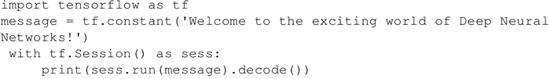
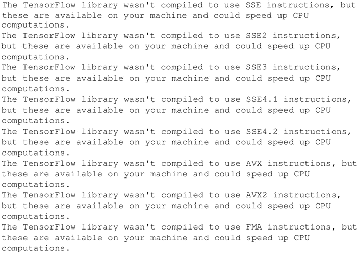
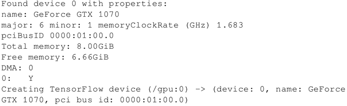

# 第一个 TensorFlow 程序（hello world）详解

在任何计算机语言中学习的第一个程序是都是 Hello world，本教程中也将遵守这个惯例，从程序 Hello world 开始。

上一节进行 TensorFlow 安装验证的代码如下：
 下面一起看一下这段简单的代码：

1.  导入 tensorflow，这将导入 TensorFlow 库，并允许使用其精彩的功能：

    import tensorflow as if

2.  由于要打印的信息是一个常量字符串，因此使用 tf.constant：

    message = tf.constant('Welcome to the exciting world of Deep Neural Networks!')

3.  为了执行计算图，利用 with 语句定义 Session，并使用 run 来运行：

    with tf.Session() as sess:
        print(sess.run(message).decode())

4.  输出中包含一系列警告消息（W），具体取决于所使用的计算机和操作系统，并声明如果针对所使用的计算机进行编译，代码运行速度可能会更快：
    

5.  如果使用 TensorFlow GPU 版本，则还会获得一系列介绍设备的提示消息（I）：
    

6.  最后是在会话中打印的信息：

    Welcome to the exciting world of Deep Neural Networks!

## TensorFlow 程序解读分析

前面的代码分为以下三个主要部分：

*   第一部分 import 模块包含代码将使用的所有库，在目前的代码中只使用 TensorFlow，其中语句 import tensorflow as tf 则允许 Python 访问 TensorFlow 所有的类、方法和符号。
*   第二个模块包含图形定义部分...创建想要的计算图。在本例中计算图只有一个节点，tensor 常量消息由字符串“Welcome to the exciting world of Deep Neural Networks”构成。
*   第三个模块是通过会话执行计算图，这部分使用 with 关键字创建了会话，最后在会话中执行以上计算图。

现在来解读输出。收到的警告消息提醒 TensorFlow 代码可以以更快的速度运行，这能够通过从 source 安装 TensorFlow 来实现（本章后面的章节中会提及）。收到的提示消息给出计算设备的信息。这两个消息都是无害的，如果不想看到它们，可以通过以下两行代码实现：

import os
os.environ['TF_CPP_MIN_LOG_LEVEL']='2'

以上代码用于忽略级别 2 及以下的消息（级别 1 是提示，级别 2 是警告，级别 3 是错误）。

该程序打印计算图执行的结果，计算图的执行则使用 sess.run() 语句，sess.run 求取 message 中所定义的 tensor 值；计算图执行结果输入到 print 函数，并使用 decode 方法改进，print 函数向 stdout 输出结果：

b'Welcome to the exciting world of Deep Neural Networks!'

这里的输出结果是一个字节字符串。要删除字符串引号和“b”（表示字节，byte）只保留单引号内的内容，可以使用 decode() 方法。