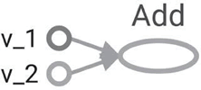
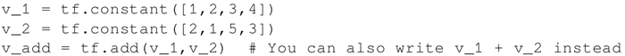
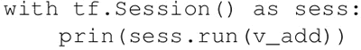
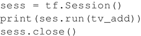
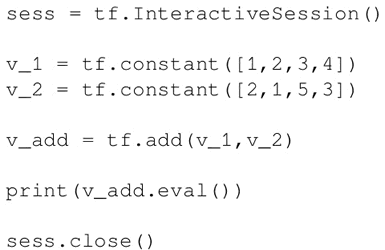

# TensorFlow 程序结构（深度剖析）

TensorFlow 与其他编程语言非常不同。

首先通过将程序分为两个独立的部分，构建任何拟创建神经网络的蓝图，包括计算图的定义及其执行。起初这对于传统程序员来说看起来很麻烦，但是正是图定义和执行的分开设计让 TensorFlow 能够多平台工作以及并行执行，TensorFlow 也因此更加强大。

计算图：是包含节点和边的网络。本节定义所有要使用的数据，也就是张量（tensor）对象（常量、变量和占位符），同时定义要执行的所有计算，即运算操作对象（Operation Object，简称 OP）。

每个节点可以有零个或多个输入，但只有一个输出。网络中的节点表示对象（张量和运算操作），边表示运算操作之间流动的张量。计算图定义神经网络的蓝图，但其中的张量还没有相关的数值。

为了构建计算图，需要定义所有要执行的常量、变量和运算操作。常量、变量和占位符将在下一节中介绍，数学运算操作将在矩阵运算章节中详细讨论。

本节将用一个简单的例子描述程序结构——通过定义并执行计算图来实现两个向量相加。

计算图的执行：使用会话对象来实现计算图的执行。会话对象封装了评估张量和操作对象的环境。这里真正实现了运算操作并将信息从网络的一层传递到另外一层。不同张量对象的值仅在会话对象中被初始化、访问和保存。在此之前张量对象只被抽象定义，在会话中才被赋予实际的意义。

## 具体做法

通过以下步骤定义一个计算图：

1.  在此以两个向量相加为例给出计算图。假设有两个向量 v_1 和 v_2 将作为输入提供给 Add 操作。建立的计算图如下：
2.  定义该图的相应代码如下所示：

3.  然后在会话中执行这个图：

4.  以上两行相当于下面的代码。上面的代码的优点是不必显式写出关闭会话的命令：

5.  运行结果是显示两个向量的和：

    {3 3 8 7}

请记住，每个会话都需要使用 close() 来明确关闭，而 with 格式可以在运行结束时隐式关闭会话。

## 解读分析

计算图的构建非常简单。添加变量和操作，并按照逐层建立神经网络的顺序传递它们（让张量流动）。TensorFlow 还允许使用 with tf.device() 命令来使用具有不同计算图形对象的特定设备（CPU/GPU）。在例子中，计算图由三个节点组成， v_1 和 v_2 表示这两个向量，Add 是要对它们执行的操作。

接下来，为了使这个图生效，首先需要使用 tf.Session() 定义一个会话对象 sess。然后使用 Session 类中定义的 run 方法运行它，如下所示：

run(fetches,feed_dict=None,options=None,run_metadata)

运算结果的值在 fetches 中提取；在示例中，提取的张量为 v_add。run 方法将导致在每次执行该计算图的时候，都将对与 v_add 相关的张量和操作进行赋值。如果抽取的不是 v_add 而是 v_1，那么最后给出的是向量 v_1 的运行结果：

{1,2,3,4}

此外，一次可以提取一个或多个张量或操作对象，例如，如果结果抽取的是 [v_1...v_add]，那么输出如下：

{array([1,2,3,4]),array([2,1,5,3]),array([3,3,8,7])}

在同一段代码中，可以有多个会话对象。

## 拓展阅读

你一定会问为什么必须编写这么多行的代码来完成一个简单的向量加，或者显示一条简单的消息。其实你可以利用下面这一行代码非常方便地完成这个工作：

print(tf.Session().run(tf.add(tf.constant([1,2,3,4]),tf.constant([2,1,5,3]))))

编写这种类型的代码不仅影响计算图的表达，而且当在 for 循环中重复执行相同的操作（OP）时，可能会导致占用大量内存。养成显式定义所有张量和操作对象的习惯，不仅可使代码更具可读性，还可以帮助你以更清晰的方式可视化计算图。

注意，使用 TensorBoard 可视化图形是 TensorFlow 最有用的功能之一，特别是在构建复杂的神经网络时。我们构建的计算图可以在图形对象的帮助菜单下进行查看。

如果你正在使用 Jupyter Notebook 或者 Python shell 进行编程，使用 tf.InteractiveSession 将比 tf.Session 更方便。InteractiveSession 使自己成为默认会话，因此你可以使用 eval() 直接调用运行张量对象而不用显式调用会话。下面给出一个例子：

