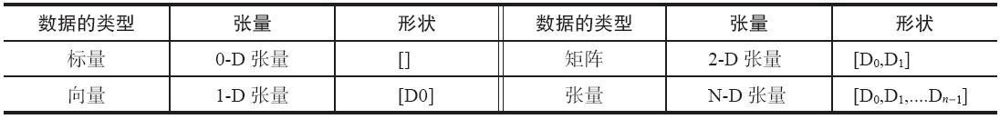
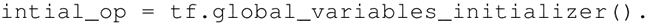

# TensorFlow 常量、变量和占位符详解

最基本的 TensorFlow 提供了一个库来定义和执行对张量的各种数学运算。张量，可理解为一个 n 维矩阵，所有类型的数据，包括标量、矢量和矩阵等都是特殊类型的张量。

 TensorFlow 支持以下三种类型的张量：

1.  常量：常量是其值不能改变的张量。
2.  变量：当一个量在会话中的值需要更新时，使用变量来表示。例如，在神经网络中，权重需要在训练期间更新，可以通过将权重声明为变量来实现。变量在使用前需要被显示初始化。另外需要注意的是，常量存储在计算图的定义中，每次加载图时都会加载相关变量。换句话说，它们是占用内存的。另一方面，变量又是分开存储的。它们可以存储在参数服务器上。
3.  占位符：用于将值输入 TensorFlow 图中。它们可以和 feed_dict 一起使用来输入数据。在训练神经网络时，它们通常用于提供新的训练样本。在会话中运行计算图时，可以为占位符赋值。这样在构建一个计算图时不需要真正地输入数据。需要注意的是，占位符不包含任何数据，因此不需要初始化它们。

## TensorFlow 常量

声明一个标量常量：

t_1 = tf.constant(4)

一个形如 [1，3] 的常量向量可以用如下代码声明：

t_2 = tf.constant([4,3,2])

要创建一个所有元素为零的张量，可以使用 tf.zeros() 函数。这个语句可以创建一个形如 [M，N] 的零元素矩阵，数据类型（dtype）可以是 int32、float32 等：

tf.zeros([M,N],tf.dtype)

例如：

zero_t = tf.zeros([2,3],tf.int32)
# Results in an 2x3 array of zeros:[[0 0 0],[0 0 0]]

还可以创建与现有 Numpy 数组或张量常量具有相同形状的张量常量，如下所示：

创建一个所有元素都设为 1 的张量。下面的语句即创建一个形如 [M，N]、元素均为 1 的矩阵：

tf.ones([M,N],tf,dtype)

例如：

ones_t = tf.ones([2,3],tf.int32)
# Results in an 2x3 array of ones:[[1 1 1],[1 1 1]]

更进一步，还有以下语句：

*   在一定范围内生成一个从初值到终值等差排布的序列：

    tf.linspace(start,stop,num)

    相应的值为 (stop-start)/(num-1)。例如：

    range_t = tf.linspace(2.0,5.0,5)
    #We get:[2\. 2.75 3.5 4.25 5.]

*   从开始（默认值=0）生成一个数字序列，增量为 delta（默认值=1），直到终值（但不包括终值）：

    tf.range(start,limit,delta)

    下面给出实例：

    range_t = tf.range(10)
    #Result:[0 1 2 3 4 5 6 7 8 9]

TensorFlow 允许创建具有不同分布的随机张量：

1.  使用以下语句创建一个具有一定均值（默认值=0.0）和标准差（默认值=1.0）、形状为 [M，N] 的正态分布随机数组：
    

2.  创建一个具有一定均值（默认值=0.0）和标准差（默认值=1.0）、形状为 [M，N] 的截尾正态分布随机数组：

    

3.  要在种子的 [minval（default=0），maxval] 范围内创建形状为 [M，N] 的给定伽马分布随机数组，请执行如下语句：

    

4.  要将给定的张量随机裁剪为指定的大小，使用以下语句：

    tf.random_crop(t_random,[2,5],seed=12)

    这里，t_random 是一个已经定义好的张量。这将导致随机从张量 t_random 中裁剪出一个大小为 [2，5] 的张量。

    很多时候需要以随机的顺序来呈现训练样本，可以使用 tf.random_shuffle() 来沿着它的第一维随机排列张量。如果 t_random 是想要重新排序的张量，使用下面的代码：

    tf.random_shuffle(t_random)

5.  随机生成的张量受初始种子值的影响。要在多次运行或会话中获得相同的随机数，应该将种子设置为一个常数值。当使用大量的随机张量时，可以使用 tf.set_random_seed() 来为所有随机产生的张量设置种子。以下命令将所有会话的随机张量的种子设置为 54：

    tf.set_random_seed(54)

    TIP：种子只能有整数值。

## TensorFlow 变量

它们通过使用变量类来创建。变量的定义还包括应该初始化的常量/随机值。下面的代码中创建了两个不同的张量变量 t_a 和 t_b。两者将被初始化为形状为 [50，50] 的随机均匀分布，最小值=0，最大值=10：

注意：变量通常在神经网络中表示权重和偏置。

下面的代码中定义了两个变量的权重和偏置。权重变量使用正态分布随机初始化，均值为 0，标准差为 2，权重大小为 100×100。偏置由 100 个元素组成，每个元素初始化为 0。在这里也使用了可选参数名以给计算图中定义的变量命名：

在前面的例子中，都是利用一些常量来初始化变量，也可以指定一个变量来初始化另一个变量。下面的语句将利用前面定义的权重来初始化 weight2：

变量的定义将指定变量如何被初始化，但是必须显式初始化所有的声明变量。在计算图的定义中通过声明初始化操作对象来实现：

每个变量也可以在运行图中单独使用 tf.Variable.initializer 来初始化：

保存变量：使用 Saver 类来保存变量，定义一个 Saver 操作对象：

saver = tf.train.Saver()

## TensorFlow 占位符

介绍完常量和变量之后，我们来讲解最重要的元素——占位符，它们用于将数据提供给计算图。可以使用以下方法定义一个占位符：

tf.placeholder(dtype,shape=None,name=None)

dtype 定占位符的数据类型，并且必须在声明占位符时指定。在这里，为 x 定义一个占位符并计算 y=2*x，使用 feed_dict 输入一个随机的 4×5 矩阵：

## 解读分析

需要注意的是，所有常量、变量和占位符将在代码的计算图部分中定义。如果在定义部分使用 print 语句，只会得到有关张量类型的信息，而不是它的值。

为了得到相关的值，需要创建会话图并对需要提取的张量显式使用运行命令，如下所示：

print(sess.run(t_1))
#Will print the value of t_1 defined in step 1

## 拓展阅读

很多时候需要大规模的常量张量对象；在这种情况下，为了优化内存，最好将它们声明为一个可训练标志设置为 False 的变量：

t_large = tf.Varible(large_array,trainable = False)

TensorFlow 被设计成与 Numpy 配合运行，因此所有的 TensorFlow 数据类型都是基于 Numpy 的。使用 tf.convert_to_tensor() 可以将给定的值转换为张量类型，并将其与 TensorFlow 函数和运算符一起使用。该函数接受 Numpy 数组、Python 列表和 Python 标量，并允许与张量对象互操作。

下表列出了 TensorFlow 支持的常见的数据类型：

 请注意，与 Python/Numpy 序列不同，TensorFlow 序列不可迭代。试试下面的代码：

for i in tf.range(10)

你会得到一个错误提示：

#typeError("'Tensor'object id not iterable.")