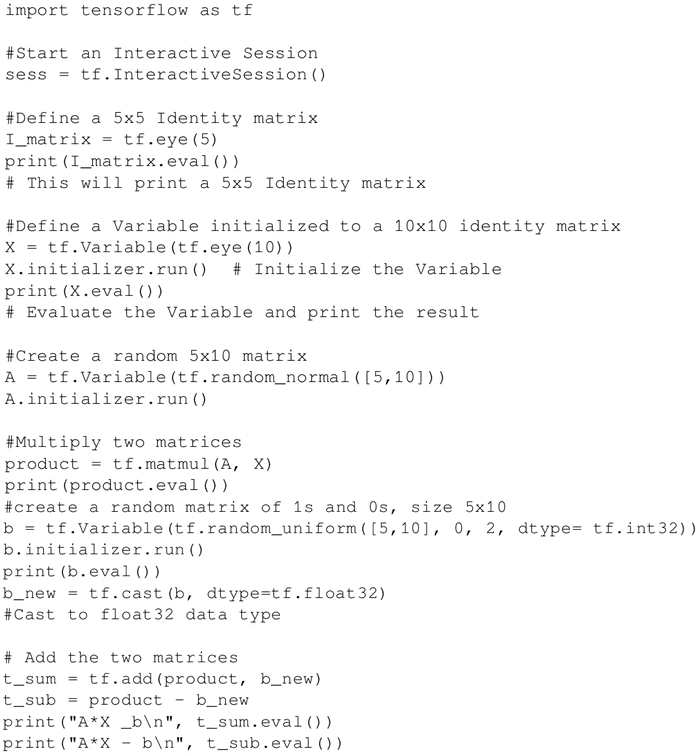
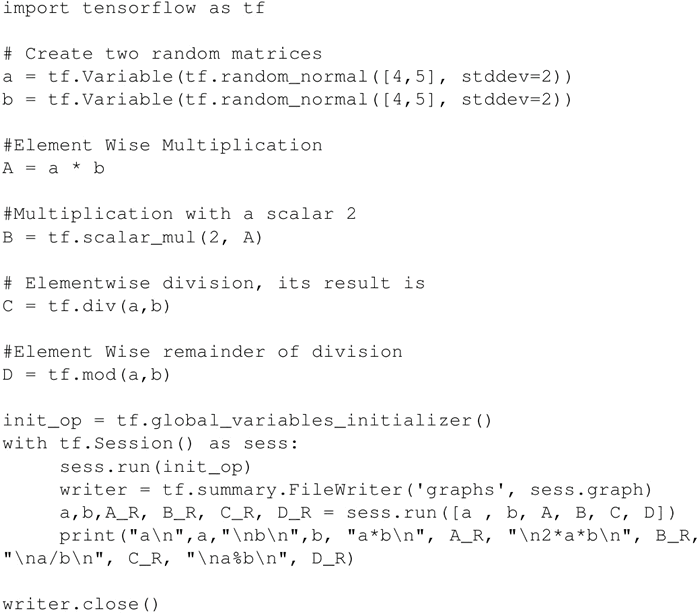

# TensorFlow 矩阵基本操作及其实现

矩阵运算，例如执行乘法、加法和减法，是任何神经网络中信号传播的重要操作。通常在计算中需要随机矩阵、零矩阵、一矩阵或者单位矩阵。

本节将告诉你如何获得不同类型的矩阵，以及如何对它们进行不同的矩阵处理操作。

## 具体做法

开始一个交互式会话，以便得到计算结果：

一些其他有用的矩阵操作，如按元素相乘、乘以一个标量、按元素相除、按元素余数相除等，可以执行如下语句：

tf.div 返回的张量的类型与第一个参数类型一致。

#### 解读分析

所有加法、减、除、乘（按元素相乘）、取余等矩阵的算术运算都要求两个张量矩阵是相同的数据类型，否则就会产生错误。可以使用 tf.cast() 将张量从一种数据类型转换为另一种数据类型。

#### 拓展阅读

如果在整数张量之间进行除法，最好使用 tf.truediv(a，b)，因为它首先将整数张量转换为浮点类，然后再执行按位相除。