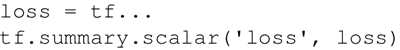
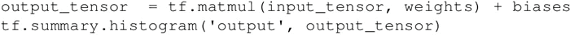
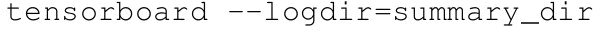
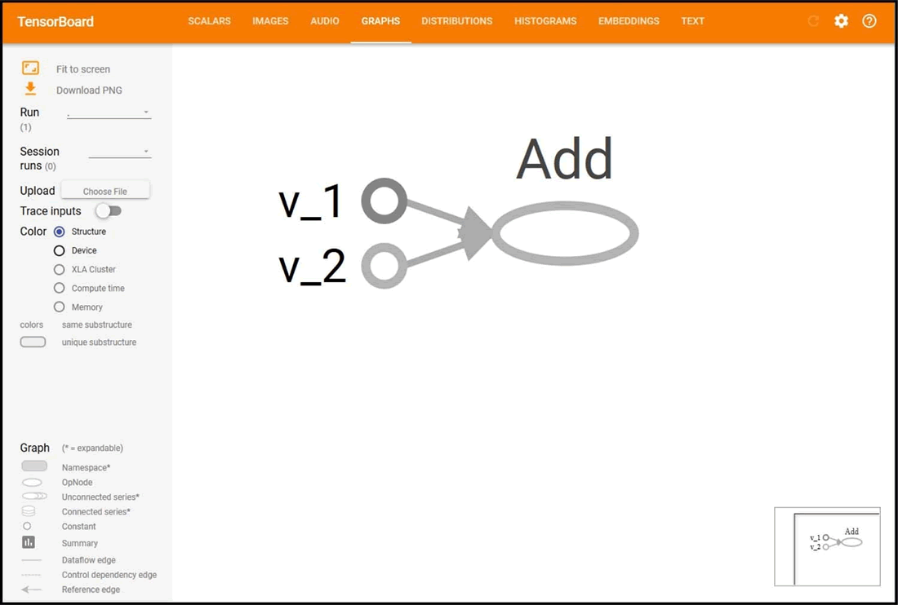

# TensorFlow TensorBoard 可视化数据流图

TensorFlow 使用 TensorBoard 来提供计算图形的图形图像。这使得理解、调试和优化复杂的神经网络程序变得很方便。TensorBoard 也可以提供有关网络执行的量化指标。它读取 TensorFlow 事件文件，其中包含运行 TensorFlow 会话期间生成的摘要数据。

#### 具体做法

使用 TensorBoard 的第一步是确定想要的 OP 摘要。以 DNN 为例，通常需要知道损失项（目标函数）如何随时间变化。在自适应学习率的优化中，学习率本身会随时间变化。可以在 tf.summary.scalar OP 的帮助下得到需要的术语摘要。假设损失变量定义了误差项，我们想知道它是如何随时间变化的：

还可以使用 tf.summary.histogram 可视化梯度、权重或特定层的输出分布：

摘要将在会话操作中生成。可以在计算图中定义 tf.merge_all_summaries OP 来通过一步操作得到摘要，而不需要单独执行每个摘要操作。

生成的摘要需要用事件文件写入：

这会将所有摘要和图形写入 summary_dir 目录中。现在，为了可视化摘要，需要从命令行中调用 TensorBoard：

接下来，打开浏览器并输入地址 http://localhost:6006/（或运行 TensorBoard 命令后收到的链接）。

你会看到类似于图 1 中的图，顶部有很多标签。Graphs（图表）选项卡能将运算图可视化：

图 1 运算图可视化