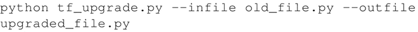
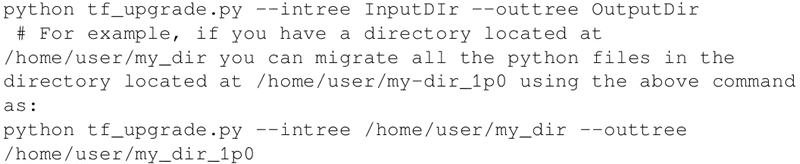
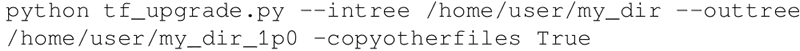
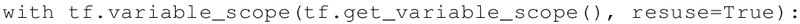

# TensorFlow 低版本代码自动升级为 1.0 版本

TensorFlow 1.x 不提供向后兼容性。这意味着在 TensorFlow 0.x 上运行的代码可能无法在 TensorFlow 1.0 上运行。因此，如果代码是用 TensorFlow 0.x 框架编写的，你需要升级它们（旧的 GitHub 存储库或你自己的代码）。

这一节将指出 TensorFlow 0.x 和 TensorFlow 1.0 之间的主要区别，并展示如何使用脚本 tf_upgrade.py 自动升级 TensorFlow 1.0 的代码。

#### 具体做法

1.  从网址 [`github.com/tensorflow/tensorflow/tree/master/tensorflow/tools/compatibility`](https://github.com/tensorflow/tensorflow/tree/master/tensorflow/tools/compatibility) 下载 tf_upgrade.py。
2.  如果要将一个文件从 TensorFlow 0.x 转换为 TensorFlow 1.0，请在命令行使用以下命令：
    

3.  例如，如果有一个名为 test.py 的 TensorFlow 程序文件，可使用下述命令：
    
     这将创建一个名为 test_1.0.py 的新文件。
4.  如果要迁移目录中的所有文件，请在命令行中使用以下命令：
    

5.  在大多数情况下，该目录还包含数据集文件；可以使用以下命令确保非 Python 文件也会被复制到新目录（上例中的 my-dir_1p0）中：
    

6.  在所有这些情况下，都会生成一个 report.txt 文件。该文件包含转换的细节和过程中的任何错误。
7.  对于无法更新的部分代码，需要阅读 report.txt 文件并手动升级脚本。

#### 拓展阅读

tf_upgrade.py 有一些局限性：

*   它不能改变 tf.reverse() 的参数，因此必须手动修复。
*   对于参数列表重新排序的方法，如 tf.split() 和 tf.reverse_split()，它会尝试引入关键字参数，但实际上并不能重新排列参数。
*   有些结构必须手动替换，例如：
    

    替换为：

    