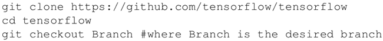
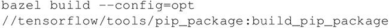
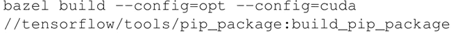
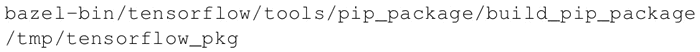
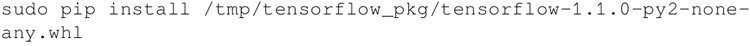
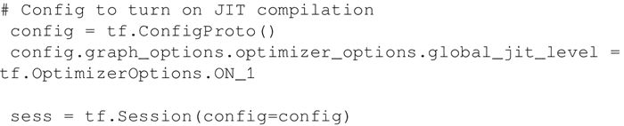
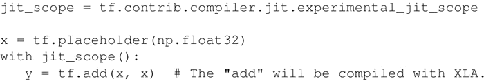
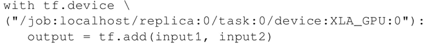

# TensorFlow XLA 加速线性代数编译器

加速线性代数器（Accelerated linear algebra，XLA）是线性代数领域的专用编译器。根据 [`www.tensorflow.org/performance/xla/`](https://www.tensorflow.org/performance/xla/)，它仍处于实验阶段，用于优化 TensorFlow 计算。

XLA 可以提高服务器和移动平台的执行速度、内存使用率和可移植性。它提供了双向 JIT（Just In Time）编译或 AoT（Ahead of Time）编译。使用 XLA，你可以生成平台相关的二进制文件（针对大量平台，如 x64、ARM 等），可以针对内存和速度进行优化。

## 准备工作

目前，XLA 并不包含在 TensorFlow 的二进制版本中。用时需要从源代码构建它。

从源代码构建 TensorFlow，需要 TensorFlow 版的 LLVM 和 Bazel。TensorFlow.org 仅支持从 macOS 和 Ubuntu 的源代码构建。从源代码构建 TensorFlow 所需的步骤如下（参见[`www.tensorflow.org/install/install_sources`](https://www.tensorflow.org/install/install_sources)）：

1.  确定要安装哪个版本的 TensorFlow——仅支持 CPU 的 TensorFlow 或支持 GPU 的 TensorFlow。
2.  复制 TensorFlow 存储库：
    

3.  安装以下依赖：
    *   Bazel
    *   TensorFlow 的 Python 依赖项
    *   对 GPU 版本，需要 NVIDIA 软件包以支持 TensorFlow
4.  配置安装。在这一步中，需要选择不同的选项，如 XLA、Cuda 支持、Verbs 等：

    ./configure

5.  使用 bazel-build。
6.  对于仅使用 CPU 的版本：
    

7.  如果有兼容的 GPU 设备，并且需要 GPU 支持，请使用：
    

8.  成功运行后，将获得一个脚本：build_pip_package。按如下所示运行这个脚本来构建 whl 文件：
    

9.  安装 pip 包：
    

现在你已经准备好了。

## 具体做法

TensorFlow 生成 TensorFlow 图表。在 XLA 的帮助下，可以在任何新类型的设备上运行 TensorFlow 图表。

*   JIT 编译：在会话级别中打开 JIT 编译：
    

*   这是手动打开 JIT 编译：
    

*   还可以通过将操作指定在特定的 XLA 设备（XLA_CPU 或 XLA_GPU）上，通过 XLA 来运行计算：
    
     AoT 编译：独立使用 tfcompile 将 TensorFlow 图转换为不同设备（手机）的可执行代码。

    TensorFlow.org 中关于 tfcompile 的论述：tfcompile 采用一个由 TensorFlow 的 feed 和 fetch 概念所标识的子图，并生成一个实现该子图的函数。feed 是函数的输入参数，fetch 是函数的输出参数。所有的输入必须完全由 feed 指定；生成的剪枝子图不能包含占位符或变量节点。通常将所有占位符和变量指定值，这可确保生成的子图不再包含这些节点。生成的函数打包为一个 cc_library，带有导出函数签名的头文件和一个包含实现的对象文件。用户编写代码以适当地调用生成的函数。

要进行相同的高级步骤，可以参考[`www.tensorflow.org/performance/xla/tfcompile`](https://www.tensorflow.org/performance/xla/tfcompile)。