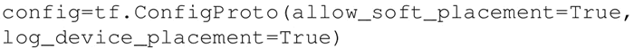
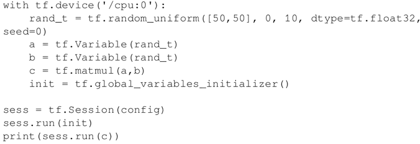
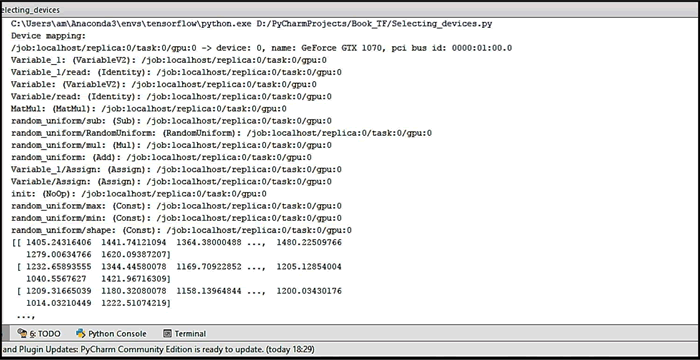
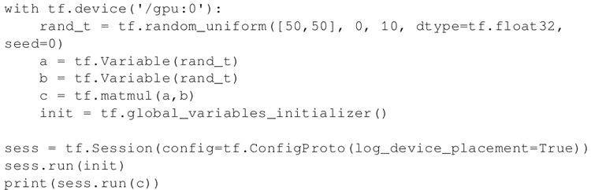
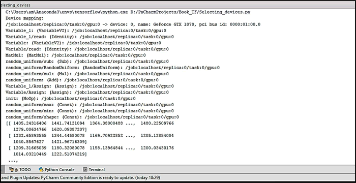
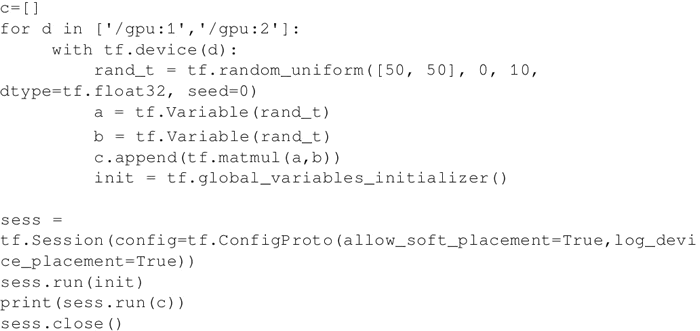

# TensorFlow 指定 CPU 和 GPU 设备操作详解

TensorFlow 支持 CPU 和 GPU。它也支持分布式计算。可以在一个或多个计算机系统的多个设备上使用 TensorFlow。

TensorFlow 将支持的 CPU 设备命名为“/device：CPU：0”（或“/cpu：0”），第 i 个 GPU 设备命名为“/device：GPU：I”（或“/gpu：I”）。

如前所述，GPU 比 CPU 要快得多，因为它们有许多小的内核。然而，在所有类型的计算中都使用 GPU 也并不一定都有速度上的优势。有时，比起使用 GPU 并行计算在速度上的优势收益，使用 GPU 的其他代价相对更为昂贵。

为了解决这个问题，TensorFlow 可以选择将计算放在一个特定的设备上。默认情况下，如果 CPU 和 GPU 都存在，TensorFlow 会优先考虑 GPU。

TensorFlow 将设备表示为字符串。本节展示如何在 TensorFlow 中指定某一设备用于矩阵乘法的计算。

## 具体做法

*   要验证 TensorFlow 是否确实在使用指定的设备（CPU 或 GPU），可以创建会话，并将 log_device_placement 标志设置为 True，即：
    

*   如果你不确定设备，并希望 TensorFlow 选择现有和受支持的设备，则可以将 allow_soft_placement 标志设置为 True：
    

*   手动选择 CPU 进行操作：
    
     得到以下输出：
    
     可以看到，在这种情况下，所有的设备都是 '/cpu：0'。
*   手动选择一个 GPU 来操作：
    
    输出现在更改为以下内容：

    
    每个操作之后的'/cpu：0'现在被替换为'/gpu：0'。
*   手动选择多个 GPU：
    
    在这种情况下，如果系统有 3 个 GPU 设备，那么第一组乘法将由'/：gpu：1'执行，第二组乘以'/gpu：2'执行。

## 解读分析

函数 tf.device() 选择设备（CPU 或 GPU）。with 块确保设备被选择并用于其操作。with 块中定义的所有变量、常量和操作将使用在 tf.device() 中选择的设备。

会话配置使用 tf.ConfigProto 进行控制。通过设置 allow_soft_placement 和 log_device_placement 标志，告诉 TensorFlow 在指定的设备不可用时自动选择可用的设备，并在执行会话时给出日志消息作为描述设备分配的输出。