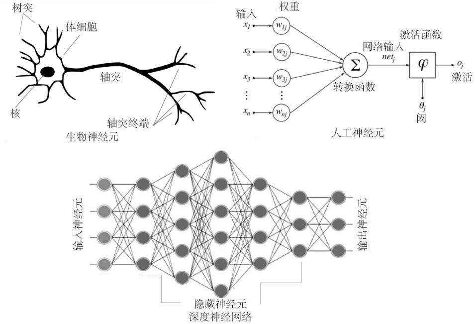
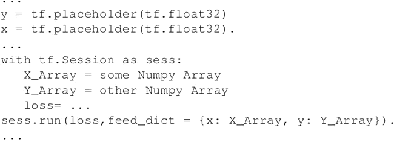
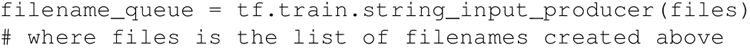
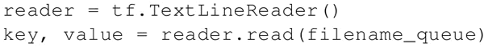
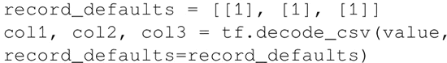
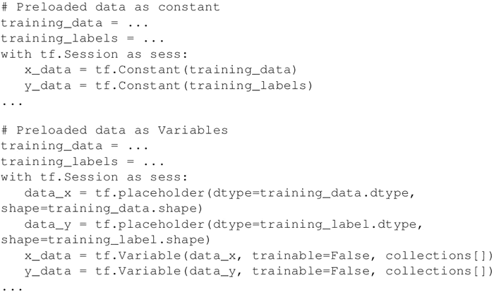
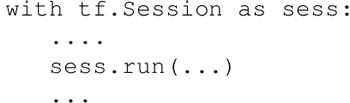

# 浅谈深度学习之 TensorFlow

DNN（深度神经网络算法）现在是 AI 社区的流行词。最近，DNN 在许多数据科学竞赛/Kaggle 竞赛中获得了多次冠军。

自从 1962 年 Rosenblat 提出感知机（Perceptron）以来，DNN 的概念就已经出现了，而自 Rumelhart、Hinton 和 Williams 在 1986 年发现了梯度下降算法后，DNN 的概念就变得可行了。直到最近 DNN 才成为全世界 AI/ML 爱好者和工程师的最爱。

主要原因在于现代计算能力的可用性，如 GPU 和 TensorFlow 等工具，可以通过几行代码轻松访问 GPU 并构建复杂的神经网络。

作为一名机器学习爱好者，你必须熟悉神经网络和深度学习的概念，但为了完整起见，我们将在这里介绍基础知识，并探讨 TensorFlow 的哪些特性使其成为深度学习的热门选择。

神经网络是一个生物启发式的计算和学习模型。像生物神经元一样，它们从其他细胞（神经元或环境）获得加权输入。这个加权输入经过一个处理单元并产生可以是二进制或连续（概率，预测）的输出。

人工神经网络（ANN）是这些神经元的网络，可以随机分布或排列成一个分层结构。这些神经元通过与它们相关的一组权重和偏置来学习。

下图对生物神经网络和人工神经网络的相似性给出了形象的对比：

图 1 生物神经网络和人工神经网络的相似性根据 Hinton 等人的定义，深度学习（[`www.cs.toronto.edu/~hinton/absps/NatureDeepReview.pdf`](https://www.cs.toronto.edu/~hinton/absps/NatureDeepReview.pdf)）是由多个处理层（隐藏层）组成的计算模型。层数的增加会导致学习时间的增加。由于数据量庞大，学习时间进一步增加，现今的 CNN 或生成对抗网络（GAN）的规范也是如此。

因此，为了实际实现 DNN，需要高计算能力。NVDIA 公司 GPU 的问世使其变得可行，随后 Google 的 TensorFlow 使得实现复杂的 DNN 结构成为可能，而不需要深入复杂的数学细节，大数据集的可用性为 DNN 提供了必要的数据来源。

TensorFlow 成为最受欢迎的深度学习库，原因如下：

1.  TensorFlow 是一个强大的库，用于执行大规模的数值计算，如矩阵乘法或自动微分。这两个计算是实现和训练 DNN 所必需的。
2.  TensorFlow 在后端使用 C/C++，这使得计算速度更快。
3.  TensorFlow 有一个高级机器学习 API（tf.contrib.learn），可以更容易地配置、训练和评估大量的机器学习模型。
4.  可以在 TensorFlow 上使用高级深度学习库 Keras。Keras 非常便于用户使用，并且可以轻松快速地进行原型设计。它支持各种 DNN，如 RNN、CNN，甚至是两者的组合。

任何深度学习网络都由四个重要部分组成：数据集、定义模型（网络结构）、训练/学习和预测/评估。可以在 TensorFlow 中实现所有这些。

## 数据集

DNN 依赖于大量的数据。可以收集或生成数据，也可以使用可用的标准数据集。TensorFlow 支持三种主要的读取数据的方法，可以在不同的数据集中使用；本教程中用来训练建立模型的一些数据集介绍如下：

*   MNIST：这是最大的手写数字（0～9）数据库。它由 60000 个示例的训练集和 10000 个示例的测试集组成。该数据集存放在 Yann LeCun 的主页（[`yann.lecun.com/exdb/mnist/`](http://yann.lecun.com/exdb/mnist/)）中。这个数据集已经包含在 tensorflow.examples.tutorials.mnist 的 TensorFlow 库中。
*   CIFAR10：这个数据集包含了 10 个类别的 60000 幅 32×32 彩色图像，每个类别有 6000 幅图像。其中训练集包含 50000 幅图像，测试数据集包含 10000 幅图像。数据集的 10 个类别分别是：飞机、汽车、鸟、猫、鹿、狗、青蛙、马、船和卡车。该数据由多伦多大学计算机科学系维护（[`www.cs.toronto.edu/kriz/cifar.html`](https://www.cs.toronto.edu/kriz/cifar.html)）。
*   WORDNET：这是一个英文的词汇数据库。它包含名词、动词、副词和形容词，被归为一组认知同义词（Synset），即代表相同概念的词语，例如 shut 和 close，car 和 automobile 被分组为无序集合。它包含 155287 个单词，组织在 117659 个同义词集合中，总共 206941 个单词对。该数据集由普林斯顿大学维护（[`wordnet.princeton.edu/`](https://wordnet.princeton.edu/)）。
*   ImageNET：这是一个根据 WORDNET 层次组织的图像数据集（目前只有名词）。每个有意义的概念（synset）由多个单词或单词短语来描述。每个子空间平均由 1000 幅图像表示。目前共有 21841 个同义词，共有 14197122 幅图像。自 2010 年以来，每年举办一次 ImageNet 大规模视觉识别挑战赛（ILSVRC），将图像分类到 1000 个对象类别中。这项工作是由美国普林斯顿大学、斯坦福大学、A9 和谷歌赞助（[`www.image-net.org/`](http://www.image-net.org/)）。
*   YouTube-8M：这是一个由数百万 YouTube 视频组成的大型标签视频数据集。它有大约 700 万个 YouTube 视频网址，分为 4716 个小类，并分为 24 个大类。它还提供预处理支持和框架功能。数据集由 Google Research（[`research.google.com/youtube8m/`](https://research.google.com/youtube8m/)）维护。

### 读取数据

在 TensorFlow 中可以通过三种方式读取数据：

1.  通过 feed_dict 传递数据；
2.  从文件中读取数据；
3.  使用预加载的数据；

在本教程中都使用这三种方式来读取数据。

接下来，你将依次学习每种数据读取方式。

#### 通过 feed_dict 传递数据

在这种情况下，运行每个步骤时都会使用 run() 或 eval() 函数调用中的 feed_dict 参数来提供数据。这是在占位符的帮助下完成的，这个方法允许传递 Numpy 数组数据。可以使用 TensorFlow 的以下代码：

这里，x 和 y 是占位符；使用它们，在 feed_dict 的帮助下传递包含 X 值的数组和包含 Y 值的数组。

#### 从文件中读取

当数据集非常大时，使用此方法可以确保不是所有数据都立即占用内存（例如 60 GB 的 YouTube-8m 数据集）。从文件读取的过程可以通过以下步骤完成：

*   使用字符串张量 ["file0"，"file1"] 或者 [("file%d"i)for in in range(2)] 的方式创建文件命名列表，或者使用 `files=tf.train.match_filenames_once('*.JPG')` 函数创建。
*   文件名队列：创建一个队列来保存文件名，此时需要使用 tf.train.string_input_producer 函数：
    
     这个函数还提供了一个选项来排列和设置批次的最大数量。整个文件名列表被添加到每个批次的队列中。如果选择了 shuffle=True，则在每个批次中都要重新排列文件名。
*   Reader 用于从文件名队列中读取文件。根据输入文件格式选择相应的阅读器。read 方法是标识文件和记录（调试时有用）以及标量字符串值的关键字。例如，文件格式为.csv 时：
    

*   Decoder：使用一个或多个解码器和转换操作来将值字符串解码为构成训练样本的张量：
    

#### 预加载的数据

当数据集很小时可以使用，可以在内存中完全加载。因此，可以将数据存储在常量或变量中。在使用变量时，需要将可训练标志设置为 False，以便训练时数据不会改变。预加载数据为 TensorFlow 常量时：

一般来说，数据被分为三部分：训练数据、验证数据和测试数据。

## 定义模型

建立描述网络结构的计算图。它涉及指定信息从一组神经元到另一组神经元的超参数、变量和占位符序列以及损失/错误函数。你将在本章后面的章节中了解更多有关计算图的内容。

## 训练/学习

在 DNN 中的学习通常基于梯度下降算法（后续章节将详细讨论），其目的是要找到训练变量（权重/偏置），将损失/错误函数最小化。这是通过初始化变量并使用 run() 来实现的：

## 评估模型

一旦网络被训练，通过 predict() 函数使用验证数据和测试数据来评估网络。这可以评价模型是否适合相应数据集，可以避免过拟合或欠拟合的问题。一旦模型取得让人满意的精度，就可以部署在生产环境中了。

#### 拓展阅读

在 TensorFlow 1.3 中，增加了一个名为 TensorFlow Estimator 的新功能。 TensorFlow Estimator 使创建神经网络模型的任务变得更加容易，它是一个封装了训练、评估、预测和服务过程的更高层次的 API。它提供了使用预先制作的估算器的选项，或者可以编写自己的定制估算器。通过预先制定的估算器，不再需要担心构建计算或创建会话，它会处理所有这些。

目前 TensorFlow Estimator 有 6 个预先制定的估算器。使用 TensorFlow 预制的 Estimator 的另一个优点是，它本身也可以在 TensorBoard 上创建可视化的摘要。

有关 Estimator 的更多详细信息，请访问[`www.google.com/supporttensorflow.org/programmers_guide/estimators`](https://www.google.com/supporttensorflow.org/programmers_guide/estimators)。