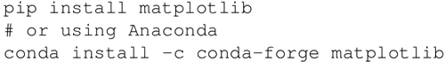

# TensorFlow 常用 Python 扩展包

TensorFlow 能够实现大部分神经网络的功能。但是，这还是不够的。对于预处理任务、序列化甚至绘图任务，还需要更多的 Python 包。

下面列出了一些常用的 Python 包：

*   Numpy：这是用 Python 进行科学计算的基础包。它支持 n 维数组和矩阵的计算，还拥有大量的高级数学函数。这是 TensorFlow 所需的必要软件包，因此，使用 `pip install tensorflow` 时，如果尚未安装 Numpy，它将被自动安装。
*   Matplolib：这是 Python 2D 绘图库。使用它可以只用几行代码创建各类图，包括直方、条形图、错误图、散点图和功率谱等。它可以使用 pip 进行安装：
    

*   OS：这包括在基本的 Python 安装中。它提供了一种使用操作系统相关功能（如读取、写入及更改文件和目录）的简单便携方式。
*   Pandas：这提供了各种数据结构和数据分析工具。使用 Pandas，您可以在内存数据结构和不同格式之间读取和写入数据。可以读取 .csv 和文本文件。可以使用 `pip install` 或 `conda install` 进行安装。
*   Seaborn：这是一个建立在 Matplotlib 上的专门的统计数据可视化工具。
*   H5fs：H5fs 是能够在 HDFS（分层数据格式文件系统）上运行的 Linux 文件系统（也包括其他带有 FUSE 实现的操作系统，如 macOS X）。
*   PythonMagick：这是 ImageMagick 库的 Python 绑定。它是一个显示、转换和编辑光栅图像及矢量图像文件的库。它支持超过 200 个图像文件格式。它可以使用 ImageMagick 提供的源代码来安装。某些 .whl 格式也可用 pip install([`www.lfd.uci.edu/%7Egohlke/pythonlibs/#pythonmagick`](http://www.lfd.uci.edu/%7Egohlke/pythonlibs/#pythonmagick)) 来安装。
*   TFlearn：TFlearn 是一个建立在 TensorFlow 之上的模块化和透明的深度学习库。它为 TensorFlow 提供更高级别的 API，以促进和加速实验。它目前支持最近的大多数深度学习模型，如卷积、LSTM、BatchNorm、BiRNN、PReLU、残差网络和生成网络。它只适用于 TensorFlow 1.0 或更高版本。请使用 `pip install tflearn` 安装。
*   Keras：Keras 也是神经网络的高级 API，它使用 TensorFlow 作为其后端。它可以运行在 Theano 和 CNTK 之上。添加图层只需要一行代码，非常用户友好，可以使用 `pip install keras` 来安装。