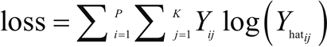

# 回归算法有哪些，常用回归算法（3 种）详解

回归是数学建模、分类和预测中最古老但功能非常强大的工具之一。回归在工程、物理学、生物学、金融、社会科学等各个领域都有应用，是数据科学家常用的基本工具。

回归通常是机器学习中使用的第一个算法。通过学习因变量和自变量之间的关系实现对数据的预测。例如，对房价估计时，需要确定房屋面积（自变量）与其价格（因变量）之间的关系，可以利用这一关系来预测给定面积的房屋的价格。可以有多个影响因变量的自变量。

因此，回归有两个重要组成部分：自变量和因变量之间的关系，以及不同自变量对因变量影响的强度。

以下是几种常用的回归方法：

1.  线性回归：使用最广泛的建模技术之一。已存在 200 多年，已经从几乎所有可能的角度进行了研究。线性回归假定输入变量（X）和单个输出变量（Y）之间呈线性关系。它旨在找到预测值 Y 的线性方程：
    
     其中，X=(x[1],​x[2],...,x[n]) 为 n 个输入变量，W=(w[1],w[2],...,w[n]) 为线性系数，b 是偏置项。目标是找到系数 W 的最佳估计，使得预测值 Y 的误差最小。使用最小二乘法估计线性系数 W，即使预测值 (Yhat) 与观测值 (Y) 之间的差的平方和最小。

    因此，这里尽量最小化损失函数：
    
     其中，需要对所有训练样本的误差求和。根据输入变量 X 的数量和类型，可划分出多种线性回归类型：简单线性回归（一个输入变量，一个输出变量），多元线性回归（多个输入变量，一个输出变量），多变量线性回归（多个输入变量，多个输出变量）。

    更多线性回归的相关内容，可参考[`en.wikipedia.org/wiki/Linear_regression`](https://en.wikipedia.org/wiki/Linear_regression)。

2.  逻辑回归：用来确定一个事件的概率。通常来说，事件可被表示为类别因变量。事件的概率用 logit 函数（Sigmoid 函数）表示：
    
     现在的目标是估计权重 W=(w[1],w[2],...,w[n]) 和偏置项 b。在逻辑回归中，使用最大似然估计量或随机梯度下降来估计系数。损失函数通常被定义为交叉熵项：
    
     逻辑回归用于分类问题，例如，对于给定的医疗数据，可以使用逻辑回归判断一个人是否患有癌症。如果输出类别变量具有两个或更多个层级，则可以使用多项式逻辑回归。另一种用于两个或更多输出变量的常见技术是 OneVsAll。对于多类型逻辑回归，交叉熵损失函数被修改为：
    

    其中，K 是类别总数。更多逻辑回归的相关内容，可参考[`en.wikipedia.org/wiki/Logistic_regression`](https://en.wikipedia.org/wiki/Logistic_regression)。

3.  正则化：当有大量的输入特征时，需要正则化来确保预测模型不会 太复杂。正则化可以帮助防止数据过拟合。它也可以用来获得一个凸损失函数。有两种类型的正则化——L1 和 L2 正则化，其描述如下：
    *   当数据高度共线时，L1 正则化也可以工作。在 L1 正则化中，与所有系数的绝对值的和相关的附加惩罚项被添加到损失函数中。L1 正则化的正则化惩罚项如下：
    

    *   L2 正则化提供了稀疏的解决方案。当输入特征的数量非常大时，非常有用。在这种情况下，惩罚项是所有系数的平方之和：
    其中，λ是正则化参数。