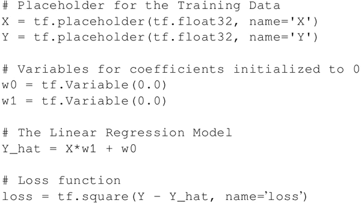

# TensorFlow 损失函数（定义和使用）详解

正如前面所讨论的，在回归中定义了损失函数或目标函数，其目的是找到使损失最小化的系数。本节将介绍如何在 TensorFlow 中定义损失函数，并根据问题选择合适的损失函数。

声明一个损失函数需要将系数定义为变量，将数据集定义为占位符。可以有一个常学习率或变化的学习率和正则化常数。

在下面的代码中，设 m 是样本数量，n 是特征数量，P 是类别数量。这里应该在代码之前定义这些全局参数：

在标准线性回归的情况下，只有一个输入变量和一个输出变量：

在多元线性回归的情况下，输入变量不止一个，而输出变量仍为一个。现在可以定义占位符 X 的大小为 [m，n]，其中 m 是样本数量，n 是特征数量，代码如下：

在逻辑回归的情况下，损失函数定义为交叉熵。输出 Y 的维数等于训练数据集中类别的数量，其中 P 为类别数量：

如果想把 L1 正则化加到损失上，那么代码如下：

对于 L2 正则化，代码如下：

由此，你应该学会了如何实现不同类型的损失函数。那么根据手头的回归任务，你可以选择相应的损失函数或设计自己的损失函数。在损失项中也可以结合 L1 和 L2 正则化。

#### 拓展阅读

为确保收敛，损失函数应为凸的。一个光滑的、可微分的凸损失函数可以提供更好的收敛性。随着学习的进行，损失函数的值应该下降，并最终变得稳定。