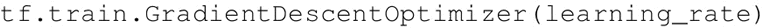
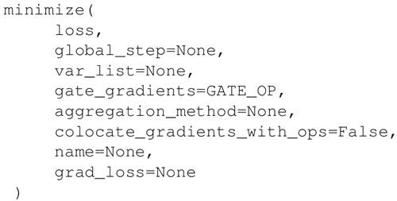
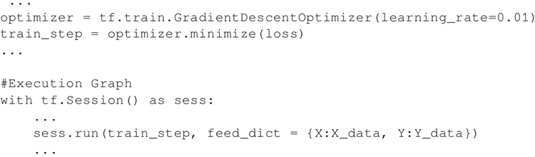
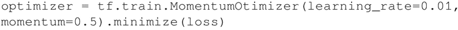
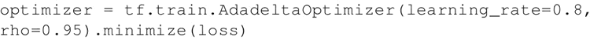
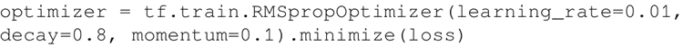
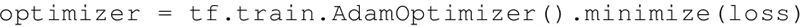
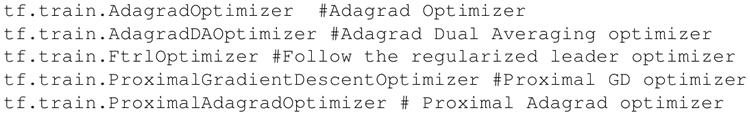
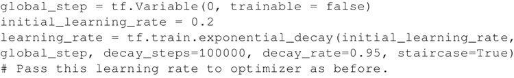

# TensorFlow 优化器种类及其用法详解

高中数学学过，函数在一阶导数为零的地方达到其最大值和最小值。梯度下降算法基于相同的原理，即调整系数（权重和偏置）使损失函数的梯度下降。

在回归中，使用梯度下降来优化损失函数并获得系数。本节将介绍如何使用 TensorFlow 的梯度下降优化器及其变体。

按照损失函数的负梯度成比例地对系数（W 和 b）进行更新。根据训练样本的大小，有三种梯度下降的变体：

1.  Vanilla 梯度下降：在 Vanilla 梯度下降（也称作批梯度下降）中，在每个循环中计算整个训练集的损失函数的梯度。该方法可能很慢并且难以处理非常大的数据集。该方法能保证收敛到凸损失函数的全局最小值，但对于非凸损失函数可能会稳定在局部极小值处。
2.  随机梯度下降：在随机梯度下降中，一次提供一个训练样本用于更新权重和偏置，从而使损失函数的梯度减小，然后再转向下一个训练样本。整个过程重复了若干个循环。由于每次更新一次，所以它比 Vanilla 快，但由于频繁更新，所以损失函数值的方差会比较大。
3.  小批量梯度下降：该方法结合了前两者的优点，利用一批训练样本来更新参数。

## TensorFlow 优化器的使用

首先确定想用的优化器。TensorFlow 为你提供了各种各样的优化器：

*   这里从最流行、最简单的梯度下降优化器开始：
    
    GradientDescentOptimizer 中的 learning_rate 参数可以是一个常数或张量。它的值介于 0 和 1 之间。

    必须为优化器给定要优化的函数。使用它的方法实现最小化。该方法计算梯度并将梯度应用于系数的学习。该函数在 TensorFlow 文档中的定义如下：

    
    综上所述，这里定义计算图：

    
    馈送给 feed_dict 的 X 和 Y 数据可以是 X 和 Y 个点（随机梯度）、整个训练集（Vanilla）或成批次的。
*   梯度下降中的另一个变化是增加了动量项。为此，使用优化器 tf.train.MomentumOptimizer()。它可以把 learning_rate 和 momentum 作为初始化参数：
    

*   可以使用 tf.train.AdadeltaOptimizer() 来实现一个自适应的、单调递减的学习率，它使用两个初始化参数 learning_rate 和衰减因子 rho：
    

*   TensorFlow 也支持 Hinton 的 RMSprop，其工作方式类似于 Adadelta 的 tf.train.RMSpropOptimizer()：
    

    Adadelta 和 RMSprop 之间的细微不同可参考 [`www.cs.toronto.edu/~tijmen/csc321/slides/lecture_slides_lec6.pdf`](http://www.cs.toronto.edu/~tijmen/csc321/slides/lecture_slides_lec6.pdf) 和 [`arxiv.org/pdf/1212.5701.pdf`](https://arxiv.org/pdf/1212.5701.pdf)。

*   另一种 TensorFlow 支持的常用优化器是 Adam 优化器。该方法利用梯度的一阶和二阶矩对不同的系数计算不同的自适应学习率：
    

*   除此之外，TensorFlow 还提供了以下优化器：
    

通常建议你从较大学习率开始，并在学习过程中将其降低。这有助于对训练进行微调。可以使用 TensorFlow 中的 tf.train.exponential_decay 方法来实现这一点。

根据 TensorFlow 文档，在训练模型时，通常建议在训练过程中降低学习率。该函数利用指数衰减函数初始化学习率。需要一个 global_step 值来计算衰减的学习率。可以传递一个在每个训练步骤中递增的 TensorFlow 变量。函数返回衰减的学习率。

变量：

*   learning_rate：标量 float32 或 float64 张量或者 Python 数字。初始学习率。
*   global_step：标量 int32 或 int64 张量或者 Python 数字。用于衰减计算的全局步数，非负。
*   decay_steps：标量 int32 或 int64 张量或者 Python 数字。正数，参考之前所述的衰减计算。
*   decay_rate：标量 float32 或 float64 张量或者 Python 数字。衰减率。
*   staircase：布尔值。若为真则以离散的间隔衰减学习率。
*   name：字符串。可选的操作名。默认为 ExponentialDecay。

返回：

*   与 learning_rate 类型相同的标量张量。衰减的学习率。

实现指数衰减学习率的代码如下：

#### 推荐阅读

下面是讲解不同优化器的链接：

*   [`arxiv.org/pdf/1609.04747.pdf`](https://arxiv.org/pdf/1609.04747.pdf)：该文章提供了不同优化器算法的综述。
*   [`www.tensorflow.org/api_guides/python/train#Optimizers`](https://www.tensorflow.org/api_guides/python/train#Optimizers)：这是 TensorFlow.org 链接，详述了 TensorFlow 中优化器的使用方法。
*   [`arxiv.org/pdf/1412.6980.pdf`](https://arxiv.org/pdf/1412.6980.pdf)：关于 Adam 优化器的论文。