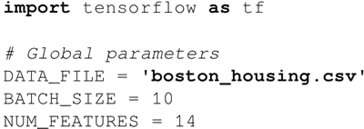
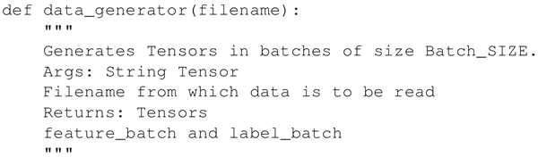
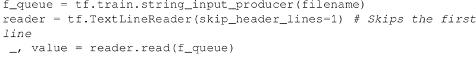
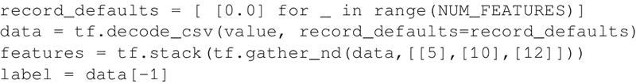
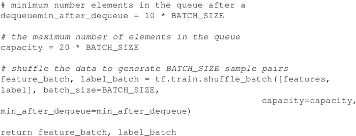
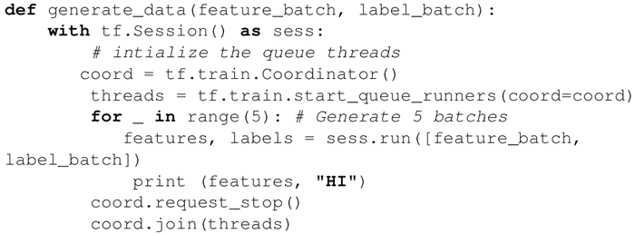
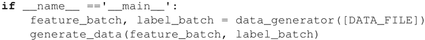
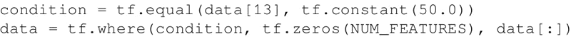

# TensorFlow csv 文件读取数据（代码实现）详解

大多数人了解 Pandas 及其在处理大数据文件方面的实用性。TensorFlow 提供了读取这种文件的方法。

前面章节中，介绍了如何在 TensorFlow 中读取文件，本节将重点介绍如何从 CSV 文件中读取数据并在训练之前对数据进行预处理。

本节将采用哈里森和鲁宾菲尔德于 1978 年收集的波士顿房价数据集（[`lib.stat.cmu.edu/datasets/boston`](http://lib.stat.cmu.edu/datasets/boston)），该数据集包括 506 个样本场景，每个房屋含 14 个特征：

1.  CRIM：城镇人均犯罪率
2.  ZN：占地 25000 平方英尺（1 英尺=0.3048 米）以上的住宅用地比例
3.  INDUS：每个城镇的非零售商业用地比例
4.  CHAS：查尔斯河（Charles River）变量（若土地位于河流边界，则为 1；否则为 0）
5.  NOX：一氧化氮浓度（每千万）
6.  RM：每个寓所的平均房间数量
7.  AGE：1940 年以前建成的自住单元比例
8.  DIS：到 5 个波士顿就业中心的加权距离
9.  RAD：径向高速公路可达性指数
10.  TAX：每万美元的全价值物业税税率
11.  PTRATIO：镇小学老师比例
12.  B：1000(Bk-0.63)²，其中 Bk 是城镇黑人的比例
13.  LSTAT：低地位人口的百分比
14.  MEDV：1000 美元自有住房的中位值

## TensorFlow 读取 csv 文件过程

1.  导入所需的模块并声明全局变量：
    

2.  定义一个将文件名作为参数的函数，并返回大小等于 BATCH_SIZE 的张量：
    

3.  定义 f_queue 和 reader 为文件名：
    

4.  这里指定要使用的数据以防数据丢失。对 .csv 解码并选择需要的特征。例如，选择 RM、PTRATIO 和 LSTAT 特征：
    

5.  定义参数来生成批并使用 tf.train.shuffle_batch() 来随机重新排列张量。该函数返回张量 feature_batch 和 label_batch：
    

6.  这里定义了另一个函数在会话中生成批：
    

7.  使用这两个函数得到批中的数据。这里，仅打印数据；在学习训练时，将在这里执行优化步骤：
    

## TensorFlow csv 数据预处理

用前面章节提到的 TensorFlow 控制操作和张量来对数据进行预处理。例如，对于波士顿房价的情况，大约有 16 个数据行的 MEDV 是 50.0。在大多数情况下，这些数据点包含缺失或删减的值，因此建议不要考虑用这些数据训练。可以使用下面的代码在训练数据集中删除它们：

这里定义了一个张量布尔条件，若 MEDV 等于 50.0 则为真。如果条件为真则可使用 TensorFlow tf.where() 操作赋为零值。