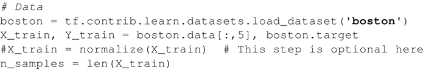

# TensorFlow 实现简单线性回归

本节将针对波士顿房价数据集的房间数量（RM）采用简单线性回归，目标是预测在最后一列（MEDV）给出的房价。

波士顿房价数据集可从[`lib.stat.cmu.edu/datasets/boston`](http://lib.stat.cmu.edu/datasets/boston)处获取。

本小节直接从 TensorFlow contrib 数据集加载数据。使用随机梯度下降优化器优化单个训练样本的系数。

## 实现简单线性回归的具体做法

1.  导入需要的所有软件包：

    

2.  在神经网络中，所有的输入都线性增加。为了使训练有效，输入应该被归一化，所以这里定义一个函数来归一化输入数据：

    

3.  现在使用 TensorFlow contrib 数据集加载波士顿房价数据集，并将其分解为 X_train 和 Y_train。可以对数据进行归一化处理：

    

4.  为训练数据声明 TensorFlow 占位符：

    

5.  创建 TensorFlow 的权重和偏置变量且初始值为零：

    

6.  定义用于预测的线性回归模型：

    

7.  定义损失函数：

    

8.  选择梯度下降优化器：

    

9.  声明初始化操作符：

    

10.  现在，开始计算图，训练 100 次：

    

11.  查看结果：

    

## 解读分析

从下图中可以看到，简单线性回归器试图拟合给定数据集的线性线：

 在下图中可以看到，随着模型不断学习数据，损失函数不断下降：

 下图是简单线性回归器的 TensorBoard 图：

 该图有两个名称范围节点 Variable 和 Variable_1，它们分别是表示偏置和权重的高级节点。以梯度命名的节点也是一个高级节点，展开节点，可以看到它需要 7 个输入并使用 GradientDescentOptimizer 计算梯度，对权重和偏置进行更新：

（[点此查看高清大图](http://c.biancheng.net/uploads/allimg/190108/2-1Z10Q31A3336.gif)）

## 总结

本节进行了简单的线性回归，但是如何定义模型的性能呢？

有多种方法可以做到这一点。统计上来说，可以计算 R² 或将数据分为训练集和交叉验证集，并检查验证集的准确性（损失项）。