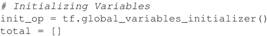

# TensorFlow 实现多元线性回归（超详细）

在 TensorFlow 实现简单线性回归的基础上，可通过在权重和占位符的声明中稍作修改来对相同的数据进行多元线性回归。

在多元线性回归的情况下，由于每个特征具有不同的值范围，归一化变得至关重要。这里是波士顿房价数据集的多重线性回归的代码，使用 13 个输入特征。

波士顿房价数据集可从[`lib.stat.cmu.edu/datasets/boston`](http://lib.stat.cmu.edu/datasets/boston)处获取。

## 多元线性回归的具体实现

1.  导入需要的所有软件包：
    

2.  因为各特征的数据范围不同，需要归一化特征数据。为此定义一个归一化函数。另外，这里添加一个额外的固定输入值将权重和偏置结合起来。为此定义函数 append_bias_reshape()。该技巧有时可有效简化编程：
    

3.  现在使用 TensorFlow contrib 数据集加载波士顿房价数据集，并将其划分为 X_train 和 Y_train。注意到 X_train 包含所需要的特征。可以选择在这里对数据进行归一化处理，也可以添加偏置并对网络数据重构：

    

4.  为训练数据声明 TensorFlow 占位符。观测占位符 X 的形状变化：
    

5.  为权重和偏置创建 TensorFlow 变量。通过随机数初始化权重：
    

6.  定义要用于预测的线性回归模型。现在需要矩阵乘法来完成这个任务：
    

7.  为了更好地求微分，定义损失函数：
    

8.  选择正确的优化器：
    

9.  定义初始化操作符：
    

10.  开始计算图：
    

11.  绘制损失函数：
    

在这里，我们发现损失随着训练过程的进行而减少：

 本节使用了 13 个特征来训练模型。简单线性回归和多元线性回归的主要不同在于权重，且系数的数量始终等于输入特征的数量。下图为所构建的多元线性回归模型的 TensorBoard 图：

（[点此查看高清大图](http://c.biancheng.net/uploads/allimg/190108/2-1Z10Q40PIM.gif)）
现在可以使用从模型中学到的系数来预测房价：

