# TensorFlow 逻辑回归处理 MNIST 数据集

本节基于回归学习对 MNIST 数据集进行处理，但将添加一些 TensorBoard 总结以便更好地理解 MNIST 数据集。

MNIST 由[`www.tensorflow.org/get_started/mnist/beginners`](https://www.tensorflow.org/get_started/mnist/beginners)提供。

大部分人已经对 MNIST 数据集很熟悉了，它是机器学习的基础，包含手写数字的图像及其标签来说明它是哪个数字。

对于逻辑回归，对输出 y 使用独热（one-hot）编码。因此，有 10 位表示输出，每位的值为 1 或 0，独热意味着对于每个图片的标签 y，10 位中仅有一位的值为 1，其余的为 0。

因此，对于手写数字 8 的图像，其编码值为 [0000000010]：
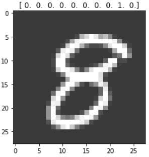

## 具体做法

1.  导入所需的模块：
    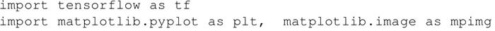

2.  可以从模块 input_data 给出的 TensorFlow 示例中获取 MNIST 的输入数据。该 one_hot 标志设置为真，以使用标签的 one_hot 编码。这产生了两个张量，大小为 [55000，784] 的 mnist.train.images 和大小为 [55000，10] 的 mnist.train.labels。mnist.train.images 的每项都是一个范围介于 0 到 1 的像素强度：
    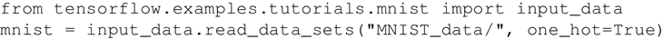

3.  在 TensorFlow 图中为训练数据集的输入 x 和标签 y 创建占位符：
    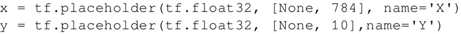

4.  创建学习变量、权重和偏置：
    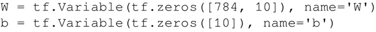

5.  创建逻辑回归模型。TensorFlow OP 给出了 name_scope（"wx_b"）：
    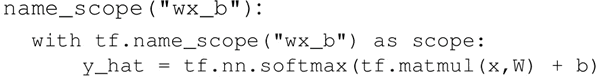

6.  训练时添加 summary 操作来收集数据。使用直方图以便看到权重和偏置随时间相对于彼此值的变化关系。可以通过 TensorBoard Histogtam 选项卡看到：
    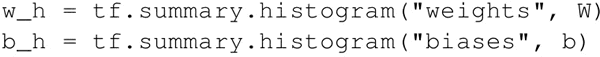

7.  定义交叉熵（cross-entropy）和损失（loss）函数，并添加 name scope 和 summary 以实现更好的可视化。使用 scalar summary 来获得随时间变化的损失函数。scalar summary 在 Events 选项卡下可见：
    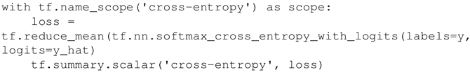

8.  采用 TensorFlow GradientDescentOptimizer，学习率为 0.01。为了更好地可视化，定义一个 name_scope：
    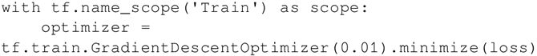

9.  为变量进行初始化：
    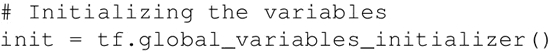

10.  组合所有的 summary 操作：
    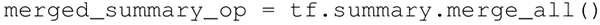

11.  现在，可以定义会话并将所有的 summary 存储在定义的文件夹中：
    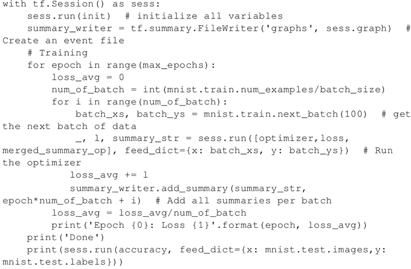

12.  经过 30 个周期，准确率达到了 86.5%；经过 50 个周期，准确率达到了 89.36%；经过 100 个周期，准确率提高到了 90.91 %。

## 解读分析

这里使用张量 tensorboard--logdir=garphs 运行 TensorBoard。在浏览器中，导航到网址 localhost：6006 查看 TensorBoard。该模型图如下：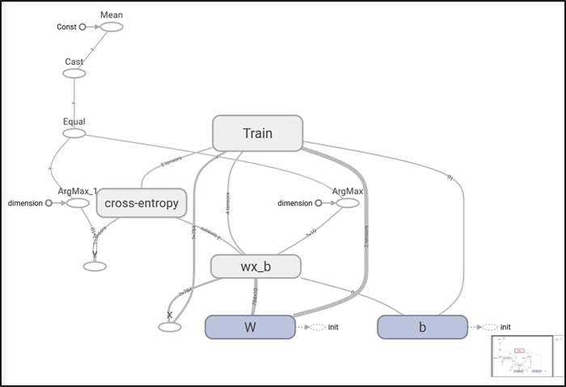
 在 Histogram 选项卡下，可以看到权重（weights）和偏置（biases）的直方图：
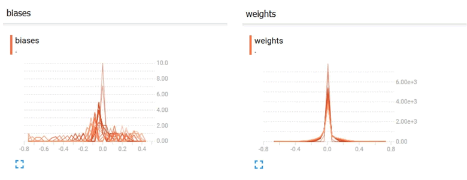
 权重和偏置的分布如下：
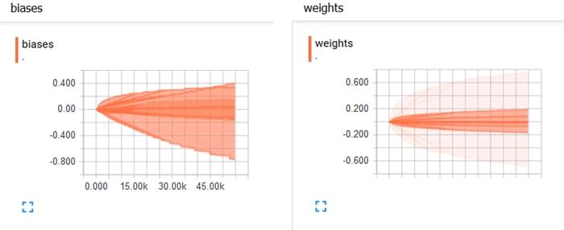
 可以看到，随着时间的推移，偏置和权重都发生了变化。在该示例中，根据 TensorBoard 中的分布可知偏置变化的范围更大。在 Events 选项卡下，可以看到 scalar summary，即本示例中的交叉熵。下图显示交叉熵损失随时间不断减少：
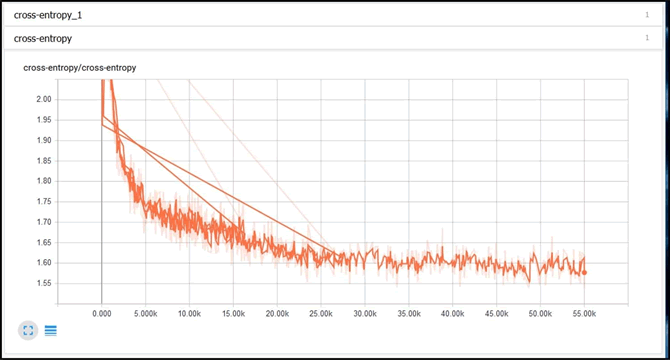

#### 推荐阅读

如果你有兴趣了解更多相关知识，可以查看下面这些资源：
关于 TensorBoard 与可视化：[`www.tensorflow.org/get_started/summaries_and_tensorboard`](https://www.tensorflow.org/get_started/summaries_and_tensorboard)
关于统计与概率的课程：[`www.khanacademy.org/math/statistics-probability/describing-relationships-quantitative-data`](https://www.khanacademy.org/math/statistics-probability/describing-relationships-quantitative-data)
更多关于回归的细节：[`onlinecourses.science.psu.edu/stat501/node/250`](https://onlinecourses.science.psu.edu/stat501/node/250)