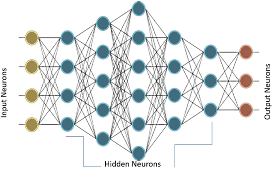

# 浅谈感知机与神经网络（无师自通）

最近十年以来，神经网络一直处于机器学习研究和应用的前沿。深度神经网络（DNN）、迁移学习以及计算高效的图形处理器（GPU）的普及使得图像识别、语音识别甚至文本生成领域取得了重大进展。

神经网络受人类大脑的启发，也被称为连接模型。像人脑一样，神经网络是大量被称为权重的突触相互连接的人造神经元的集合。

就像我们通过年长者提供的例子来学习一样，人造神经网络通过向它们提供的例子来学习，这些例子被称为训练数据集。有了足够数量的训练数据集，人造神经网络可以提取信息，并用于它们没有见过的数据。

神经网络并不是最近才出现的。第一个神经网络模型 McCulloch Pitts（MCP）（[`vordenker.de/ggphilosophy/mcculloch_a-logical-calculus.pdf`](http://vordenker.de/ggphilosophy/mcculloch_a-logical-calculus.pdf)）早在 1943 年就被提出来了，该模型可以执行类似与、或、非的逻辑操作。

MCP 模型的权重和偏置是固定的，因此不具备学习的可能。这个问题在若干年后的 1958 年由 Frank Rosenblatt 解决（[`blogs.umass.edu/brain-wars/files/2016/03/rosenblatt-1957.pdf`](https://blogs.umass.edu/brain-wars/files/2016/03/rosenblatt-1957.pdf)）。他提出了第一个具有学习能力的神经网络，称之为感知机（perceptron）。

从那时起，人们就知道添加多层神经元并建立一个深的、稠密的网络将有助于神经网络解决复杂的任务。就像母亲为孩子的成就感到自豪一样，科学家和工程师对使用神经网络（[`www.youtube.com/watch?v=jPHUlQiwD9Y`](https://www.youtube.com/watch?v=jPHUlQiwD9Y)）所能实现的功能做出了高度的评价。

这些评价并不是虚假的，但是由于硬件计算的限制和网络结构的复杂，当时根本无法实现。这导致了在 20 世纪 70 年代和 80 年代出现了被称为 AI 寒冬的时期。在这段时期，由于人工智能项目得不到资助，导致这一领域的进展放缓。

随着 DNN 和 GPU 的出现，情况发生了变化。今天，可以利用一些技术通过微调参数来获得表现更好的网络，比如 dropout 和迁移学习等技术，这缩短了训练时间。最后，硬件公司提出了使用专门的硬件芯片快速地执行基于神经网络的计算。

人造神经元是所有神经网络的核心。它由两个主要部分构成：一个加法器，将所有输入加权求和到神经元上；一个处理单元，根据预定义函数产生一个输出，这个函数被称为激活函数。每个神经元都有自己的一组权重和阈值（偏置），它通过不同的学习算法学习这些权重和阈值：

 当只有一层这样的神经元存在时，它被称为感知机。输入层被称为第零层，因为它只是缓冲输入。存在的唯一一层神经元形成输出层。输出层的每个神经元都有自己的权重和阈值。

当存在许多这样的层时，网络被称为多层感知机（MLP）。MLP 有一个或多个隐藏层。这些隐藏层具有不同数量的隐藏神经元。每个隐藏层的神经元具有相同的激活函数：

上图的 MLP 具有一个有 4 个输入的输入层，5 个分别有 4、5、6、4 和 3 个神经元的隐藏层，以及一个有 3 个神经元的输出层。在该 MLP 中，下层的所有神经元都连接到其相邻的上层的所有神经元。因此，MLP 也被称为全连接层。MLP 中的信息流通常是从输入到输出，目前没有反馈或跳转，因此这些网络也被称为前馈网络。

感知机使用梯度下降算法进行训练。前面章节已经介绍了梯度下降，在这里再深入一点。感知机通过监督学习算法进行学习，也就是给网络提供训练数据集的理想输出。在输出端，定义了一个误差函数或目标函数 J(W)，这样当网络完全学习了所有的训练数据后，目标函数将是最小的。

输出层和隐藏层的权重被更新，使得目标函数的梯度减小：

 为了更好地理解它，想象一个充满山丘、高原和凹坑的地形。目标是走到地面（目标函数的全局最小值）。如果你站在最上面，必须往下走，那么很明显你将会选择下山，即向负坡度（或负梯度）方向移动。相同的道理，感知机的权重与目标函数梯度的负值成比例地变化。

梯度的值越大，权值的变化越大，反之亦然。现在，这一切都很好，但是当到达高原时，可能会遇到问题，因为梯度是零，所以权重没有变化。当进入一个小坑（局部最小值）时，也会遇到问题，因为尝试移动到任何一边，梯度都会增加，迫使网络停留在坑中。

正如前面所述，针对增加网络的收敛性提出了梯度下降的各种变种使得网络避免陷入局部最小值或高原的问题，比如添加动量、可变学习率。

TensorFlow 会在不同的优化器的帮助下自动计算这些梯度。然而，需要注意的重要一点是，由于 TensorFlow 将计算梯度，这也将涉及激活函数的导数，所以你选择的激活函数必须是可微分的，并且在整个训练场景中具有非零梯度。

感知机中的梯度下降与梯度下降的一个主要不同是，输出层的目标函数已经被定义好了，但它也用于隐藏层神经元的权值更新。这是使用反向传播（BPN）算法完成的，输出中的误差向后传播到隐藏层并用于确定权重变化。