# TensorFlow 常用激活函数及其特点和用法（6 种）详解

每个神经元都必须有激活函数。它们为神经元提供了模拟复杂非线性数据集所必需的非线性特性。该函数取所有输入的加权和，进而生成一个输出信号。你可以把它看作输入和输出之间的转换。使用适当的激活函数，可以将输出值限定在一个定义的范围内。

如果 x[i] 是第 j 个输入，W[j] 是连接第 j 个输入到神经元的权重，b 是神经元的偏置，神经元的输出（在生物学术语中，神经元的激活）由激活函数决定，并且在数学上表示如下：
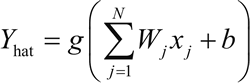
 这里，g 表示激活函数。激活函数的参数 ΣW[j]x[j]​+b 被称为神经元的活动。

这里对给定输入刺激的反应是由神经元的激活函数决定的。有时回答是二元的（是或不是）。例如，当有人开玩笑的时候...要么不笑。在其他时候，反应似乎是线性的，例如，由于疼痛而哭泣。有时，答复似乎是在一个范围内。

模仿类似的行为，人造神经元使用许多不同的激活函数。在这里，你将学习如何定义和使用 TensorFlow 中的一些常用激活函数。

下面认识几种常见的激活函数：

1.  阈值激活函数：这是最简单的激活函数。在这里，如果神经元的激活值大于零，那么神经元就会被激活；否则，它还是处于抑制状态。下面绘制阈值激活函数的图，随着神经元的激活值的改变在 TensorFlow 中实现阈值激活函数：
    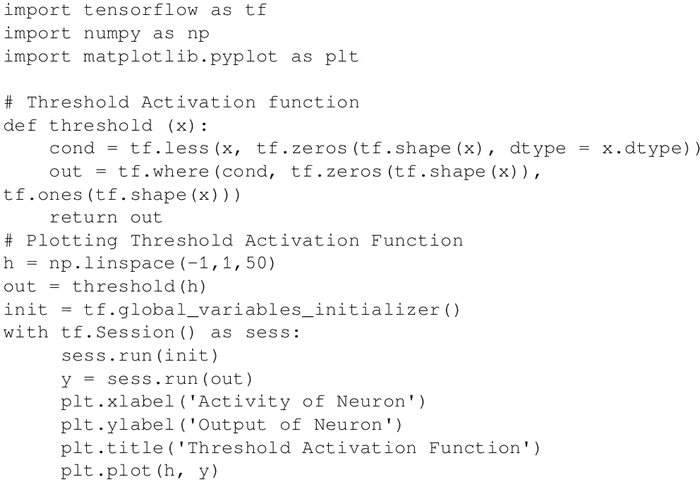
     上述代码的输出如下图所示：
    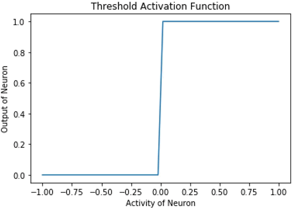

2.  Sigmoid 激活函数：在这种情况下，神经元的输出由函数 g(x)=1/(1+exp(-x)) 确定。在 TensorFlow 中，方法是 tf.sigmoid，它提供了 Sigmoid 激活函数。这个函数的范围在 0 到 1 之间：
    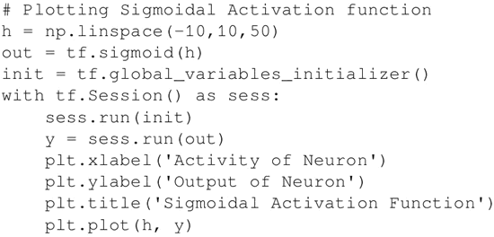
    在形状上，它看起来像字母 S，因此名字叫 Sigmoid：
    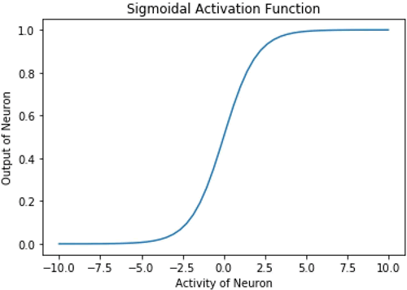

3.  双曲正切激活函数：在数学上，它表示为 (1-exp(-2x)/(1+exp(-2x)))。在形状上，它类似于 Sigmoid 函数，但是它的中心位置是 0，其范围是从 -1 到 1。TensorFlow 有一个内置函数 tf.tanh，用来实现双曲正切激活函数：

    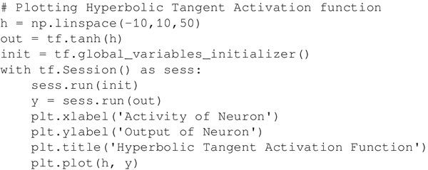
     以下是上述代码的输出：
    

4.  线性激活函数：在这种情况下，神经元的输出与神经元的输入值相同。这个函数的任何一边都不受限制：
    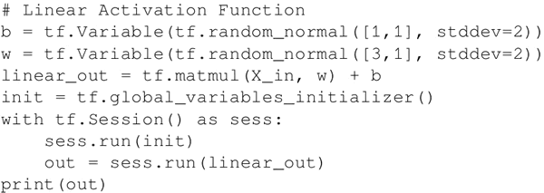

5.  整流线性单元（ReLU）激活函数也被内置在 TensorFlow 库中。这个激活函数类似于线性激活函数，但有一个大的改变：对于负的输入值，神经元不会激活（输出为零），对于正的输入值，神经元的输出与输入值相同：

    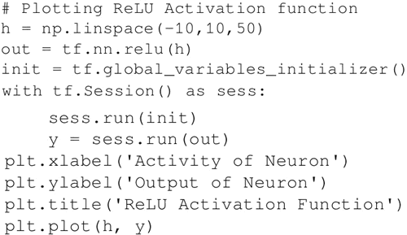
     以下是 ReLU 激活函数的输出：

    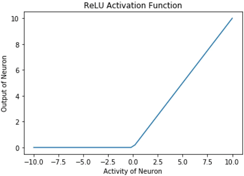

6.  Softmax 激活函数是一个归一化的指数函数。一个神经元的输出不仅取决于其自身的输入值，还取决于该层中存在的所有其他神经元的输入的总和。这样做的一个优点是使得神经元的输出小，因此梯度不会过大。数学表达式为 yi =exp(x[i]​)/Σ[j]exp(x[j])：

    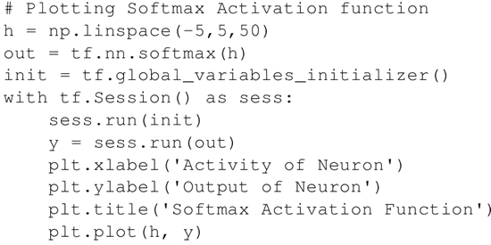
     以下是上述代码的输出：
    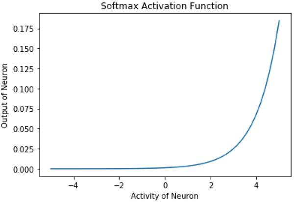

下面我们逐个对上述函数进行解释：

*   阈值激活函数用于 McCulloch Pitts 神经元和原始的感知机。这是不可微的，在 x=0 时是不连续的。因此，使用这个激活函数来进行基于梯度下降或其变体的训练是不可能的。
*   Sigmoid 激活函数一度很受欢迎，从曲线来看，它像一个连续版的阈值激活函数。它受到梯度消失问题的困扰，即函数的梯度在两个边缘附近变为零。这使得训练和优化变得困难。
*   双曲正切激活函数在形状上也是 S 形并具有非线性特性。该函数以 0 为中心，与 Sigmoid 函数相比具有更陡峭的导数。与 Sigmoid 函数一样，它也受到梯度消失问题的影响。
*   线性激活函数是线性的。该函数是双边都趋于无穷的 [-inf，inf]。它的线性是主要问题。线性函数之和是线性函数，线性函数的线性函数也是线性函数。因此，使用这个函数，不能表示复杂数据集中存在的非线性。
*   ReLU 激活函数是线性激活功能的整流版本，这种整流功能允许其用于多层时捕获非线性。
    使用 ReLU 的主要优点之一是导致稀疏激活。在任何时刻，所有神经元的负的输入值都不会激活神经元。就计算量来说，这使得网络在计算方面更轻便。

    ReLU 神经元存在死亡 ReLU 的问题，也就是说，那些没有激活的神经元的梯度为零，因此将无法进行任何训练，并停留在死亡状态。尽管存在这个问题，但 ReLU 仍是隐藏层最常用的激活函数之一。
*   Softmax 激活函数被广泛用作输出层的激活函数，该函数的范围是 [0，1]。在多类分类问题中，它被用来表示一个类的概率。所有单位输出和总是 1。

## 总结

神经网络已被用于各种任务。这些任务可以大致分为两类：函数逼近（回归）和分类。根据手头的任务，一个激活函数可能比另一个更好。一般来说，隐藏层最好使用 ReLU 神经元。对于分类任务，Softmax 通常是更好的选择；对于回归问题，最好使用 Sigmoid 函数或双曲正切函数。

#### 推荐阅读

*   [`www.tensorflow.org/versions/r0.12/api_docs/python/nn/activation_functions`](https://www.tensorflow.org/versions/r0.12/api_docs/python/nn/activation_functions)提供了在 TensorFlow 中定义的激活函数的详细信息以及如何使用它们。
*   [`en.wikipedia.org/wiki/Activation_function`](https://en.wikipedia.org/wiki/Activation_function)是对激活函数的一个很好的总结。