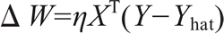
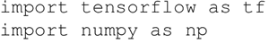
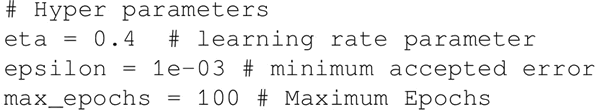
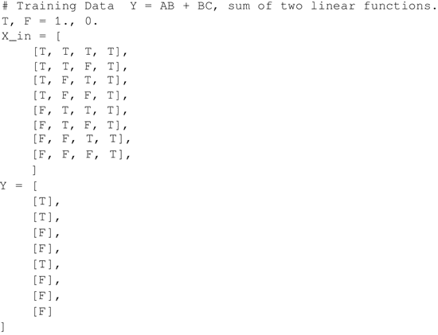
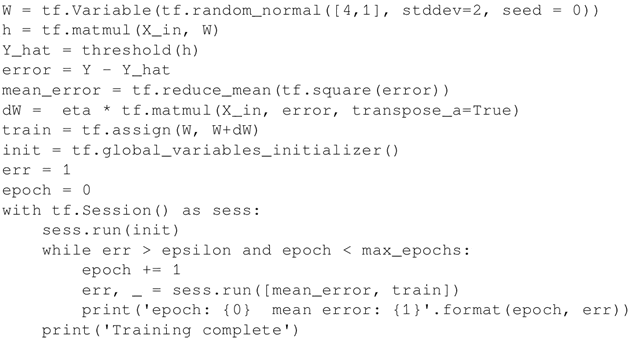
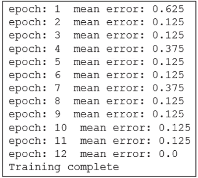

# TensorFlow 实现单层感知机详解

简单感知机是一个单层神经网络。它使用阈值激活函数，正如 Marvin Minsky 在论文中所证明的，它只能解决线性可分的问题。虽然这限制了单层感知机只能应用于线性可分问题，但它具有学习能力已经很好了。

当感知机使用阈值激活函数时，不能使用 TensorFlow 优化器来更新权重。我们将不得不使用权重更新规则：

 η 是学习率。为了简化编程，当输入固定为 +1 时，偏置可以作为一个额外的权重。那么，上面的公式可以用来同时更新权重和偏置。

下面讨论如何实现单层感知机：

1.  导入所需的模块：
    

2.  定义要使用的超参数：
    

3.  指定训练数据。在这个例子中，取三个输入神经元（A，B，C）并训练它学习逻辑 AB+BC：
    

4.  定义要用到的变量和用于计算更新的计算图，最后执行计算图：
    

5.  以下是上述代码的输出：
    

那么，如果使用 Sigmoid 激活函数，而不是阈值激活函数，会发生什么？你猜对了，首先，可以使用 TensorFlow 优化器来更新权重。其次，网络将表现得像逻辑回归。