# TensorFlow 实现反向传播算法详解

反向传播（BPN）算法是神经网络中研究最多、使用最多的算法之一，它用于将输出层中的误差传播到隐藏层的神经元，然后用于更新权重。

学习 BPN 算法可以分成以下两个过程：

1.  正向传播：输入被馈送到网络，信号从输入层通过隐藏层传播到输出层。在输出层，计算误差和损失函数。
2.  反向传播：在反向传播中，首先计算输出层神经元损失函数的梯度，然后计算隐藏层神经元损失函数的梯度。接下来用梯度更新权重。

这两个过程重复迭代直到收敛。

## 前期准备

首先给网络提供 M 个训练对（X，Y），X 为输入，Y 为期望的输出。输入通过激活函数 g(h) 和隐藏层传播到输出层。输出 Y[hat] 是网络的输出，得到 error=Y-Y[hat]。其损失函数 J(W) 如下：
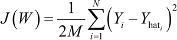
 其中，i 取遍所有输出层的神经元（1 到 N）。然后可以使用 J(W) 的梯度并使用链式法则求导，来计算连接第 i 个输出层神经元到第 j 个隐藏层神经元的权重 W[ij] 的变化：
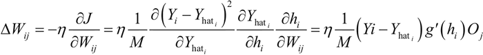
这里，O[j] 是隐藏层神经元的输出，h 表示隐藏层的输入值。这很容易理解，但现在怎么更新连接第 n 个隐藏层的神经元 k 到第 n+1 个隐藏层的神经元 j 的权值 W[jk]？过程是相同的：将使用损失函数的梯度和链式法则求导，但这次计算 W[jk]：
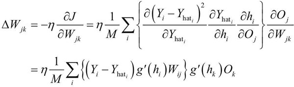
现在已经有方程了，看看如何在 TensorFlow 中做到这一点。在这里，还是使用 MNIST 数据集（[`yann.lecun.com/exdb/MNIST/`](http://yann.lecun.com/exdb/MNIST/)）。

## 具体实现过程

现在开始使用反向传播算法：

1.  导入模块：
    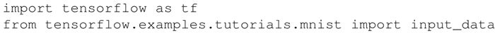

2.  加载数据集，通过设置 one_hot=True 来使用独热编码标签：
    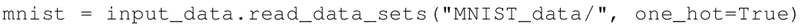

3.  定义超参数和其他常量。这里，每个手写数字的尺寸是 28×28=784 像素。数据集被分为 10 类，以 0 到 9 之间的数字表示。这两点是固定的。学习率、最大迭代周期数、每次批量训练的批量大小以及隐藏层中的神经元数量都是超参数。可以通过调整这些超参数，看看它们是如何影响网络表现的：
    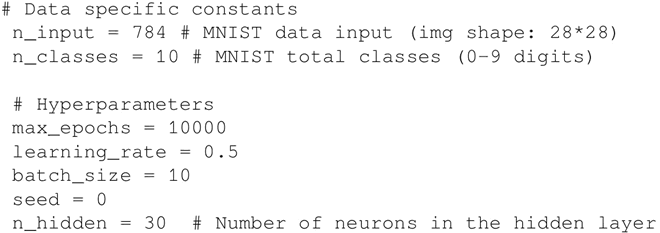

4.  需要 Sigmoid 函数的导数来进行权重更新，所以定义它：
    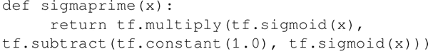

5.  为训练数据创建占位符：
    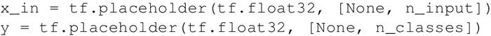

6.  创建模型：
    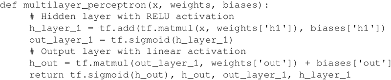

7.  定义权重和偏置变量：
    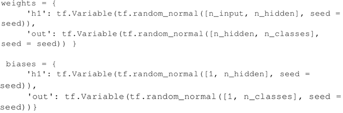

8.  为正向传播、误差、梯度和更新计算创建计算图：
    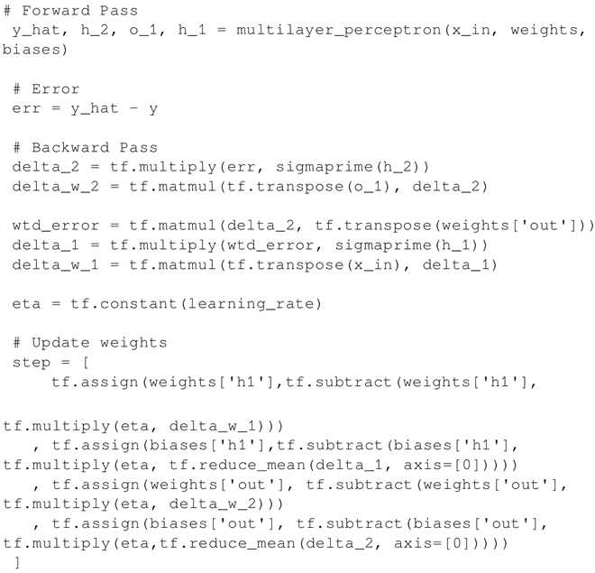

9.  定义计算精度 accuracy 的操作：
    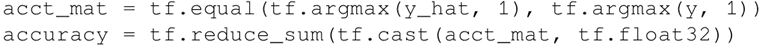

10.  初始化变量：
    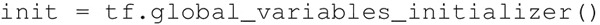

11.  执行图：
    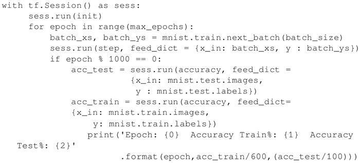

12.  结果如下：
    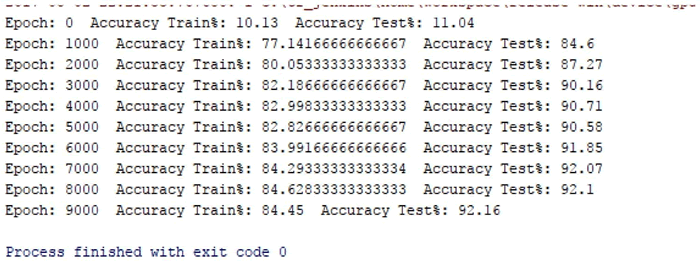

## 解读分析

在这里，训练网络时的批量大小为 10，如果增加批量的值，网络性能就会下降。另外，需要在测试数据集上检测训练好的网络的精度，这里测试数据集的大小是 1000。

单隐藏层多层感知机在训练数据集上的准确率为 84.45，在测试数据集上的准确率为 92.1。这是好的，但不够好。MNIST 数据集被用作机器学习中分类问题的基准。接下来，看一下如何使用 TensorFlow 的内置优化器影响网络性能。

#### 推荐阅读

*   MNIST 数据集：[`yann.lecun.com/exdb/mnist/`](http://yann.lecun.com/exdb/mnist/)
*   反向传播算法的简化讲解：[`neuralnetworksanddeeplearning.com/chap2.html`](http://neuralnetworksanddeeplearning.com/chap2.html)
*   反向传播算法的另一个直观解释：[`cs231n.github.io/optimization-2/`](http://cs231n.github.io/optimization-2/)
*   反向传播算法的详细信息，以及如何将它应用于不同的网络：[`page.mi.fu-berlin.de/rojas/neural/chapter/K7.pdf`](https://page.mi.fu-berlin.de/rojas/neural/chapter/K7.pdf)