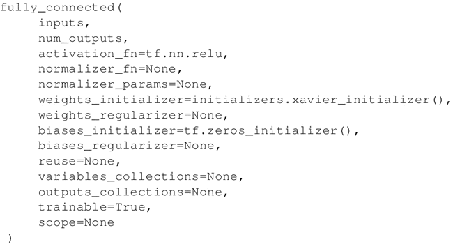
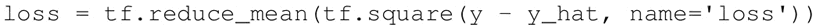
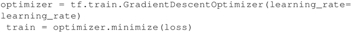
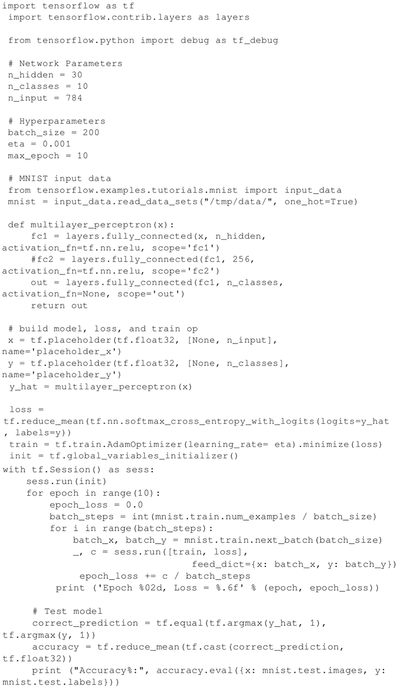
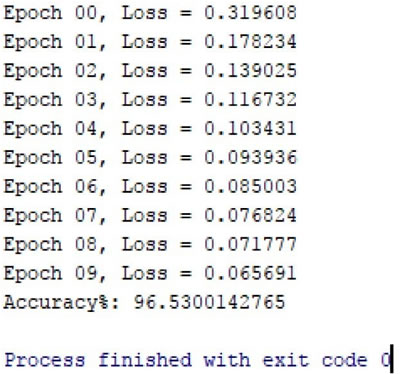

# TensorFlow 多层感知机实现 MINIST 分类（详解版）

TensorFlow 支持自动求导，可以使用 TensorFlow 优化器来计算和使用梯度。它使用梯度自动更新用变量定义的张量。本节将使用 TensorFlow 优化器来训练网络。

前面章节中，我们定义了层、权重、损失、梯度以及通过梯度更新权重。用公式实现可以帮助我们更好地理解，但随着网络层数的增加，这可能非常麻烦。

本节将使用 TensorFlow 的一些强大功能，如 Contrib（层）来定义神经网络层及使用 TensorFlow 自带的优化器来计算和使用梯度。

通过前面的学习，我们已经知道如何使用 TensorFlow 的优化器。Contrib 可以用来添加各种层到神经网络模型，如添加构建块。这里使用的一个方法是 tf.contrib.layers.fully_connected，在 TensorFlow 文档中定义如下：

这样就添加了一个全连接层。

提示：上面那段代码创建了一个称为权重的变量，表示全连接的权重矩阵，该矩阵与输入相乘产生隐藏层单元的张量。如果提供了 normalizer_fn（比如 batch_norm），那么就会归一化。否则，如果 normalizer_fn 是 None，并且设置了 biases_initializer，则会创建一个偏置变量并将其添加到隐藏层单元中。最后，如果 activation_fn 不是 None，它也会被应用到隐藏层单元。

## 具体做法

第一步是改变损失函数，尽管对于分类任务，最好使用交叉熵损失函数。这里继续使用均方误差（MSE）：

接下来，使用 GradientDescentOptimizer：

对于同一组超参数，只有这两处改变，在测试数据集上的准确率只有 61.3%。增加 max_epoch，可以提高准确性，但不能有效地发挥 TensorFlow 的能力。

这是一个分类问题，所以最好使用交叉熵损失，隐藏层使用 ReLU 激活函数，输出层使用 softmax 函数。做些必要的修改，完整代码如下所示：

## 解读分析

修改后的 MNIST MLP 分类器在测试数据集上只用了一个隐藏层，并且在 10 个 epoch 内，只需要几行代码，就可以得到 96% 的精度：

由此可见 TensorFlow 的强大之处。