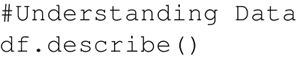
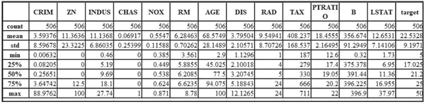

# TensorFlow 多层感知机函数逼近过程详解

Hornik 等人的工作（[`www.cs.cmu.edu/~bhiksha/courses/deeplearning/Fall.2016/notes/Sonia_Hornik.pdf`](http://www.cs.cmu.edu/~bhiksha/courses/deeplearning/Fall.2016/notes/Sonia_Hornik.pdf)）证明了一句话，“只有一个隐藏层的多层前馈网络足以逼近任何函数，同时还可以保证很高的精度和令人满意的效果。”

本节将展示如何使用多层感知机（MLP）进行函数逼近，具体来说，是预测波士顿的房价。第二章使用回归技术对房价进行预测，现在使用 MLP 完成相同的任务。

## 准备工作

对于函数逼近，这里的损失函数是 MSE。输入应该归一化，隐藏层是 ReLU，输出层最好是 Sigmoid。

下面是如何使用 MLP 进行函数逼近的示例：

1.  导入需要用到的模块：sklearn，该模块可以用来获取数据集，预处理数据，并将其分成训练集和测试集；pandas，可以用来分析数据集；matplotlib 和 seaborn 可以用来可视化：
    

2.  加载数据集并创建 Pandas 数据帧来分析数据：
    

3.  了解一些关于数据的细节：
    
     下表很好地描述了数据：
    
    （[点此查看高清大图](http://c.biancheng.net/uploads/allimg/190109/2-1Z109104625527.gif)）

4.  找到输入的不同特征与输出之间的关联：
    
     以下是上述代码的输出：
    
    （[点此查看高清大图](http://c.biancheng.net/uploads/allimg/190109/2-1Z109104I53N.gif)）

5.  从前面的代码中，可以看到三个参数 RM、PTRATIO 和 LSTAT 在幅度上与输出之间具有大于 0.5 的相关性。选择它们进行训练。将数据集分解为训练数据集和测试数据集。使用 MinMaxScaler 来规范数据集。
    需要注意的一个重要变化是，由于神经网络使用 Sigmoid 激活函数（Sigmoid 的输出只能在 0～1 之间），所以还必须对目标值 Y 进行归一化：
    

6.  定义常量和超参数：
    

7.  创建一个单隐藏层的多层感知机模型：
    

8.  声明训练数据的占位符并定义损失和优化器：
    

9.  执行计算图：
    

## 解读分析

在只有一个隐藏层的情况下，该模型在训练数据集上预测房价的平均误差为 0.0071。下图显示了房屋估价与实际价格的关系：

在这里，使用 TensorFlow 操作层（Contrib）来构建神经网络层。这使得工作稍微容易一些，因为避免了分别为每层声明权重和偏置。如果使用像 Keras 这样的 API，工作可以进一步简化。

下面是 Keras 中以 TensorFlow 作为后端的代码：

前面的代码给出了预测值和实际值之间的结果。可以看到，通过去除异常值（一些房屋价格与其他参数无关，比如最右边的点），可以改善结果：
