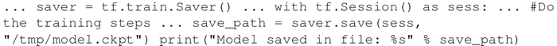
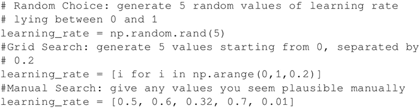
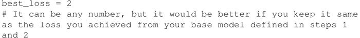
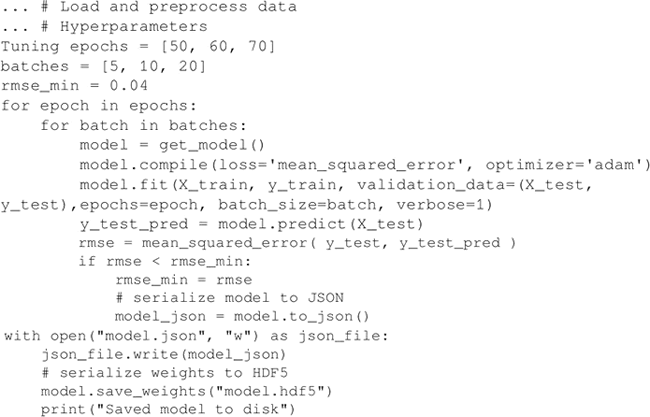

# TensorFlow 超参数及其调整（超详细）

正如你目前所看到的，神经网络的性能非常依赖超参数。因此，了解这些参数如何影响网络变得至关重要。

常见的超参数是学习率、正则化器、正则化系数、隐藏层的维数、初始权重值，甚至选择什么样的优化器优化权重和偏置。

## 超参数调整过程

1.  调整超参数的第一步是构建模型。与之前一样，在 TensorFlow 中构建模型。
2.  添加一种方法将模型保存在 model_file 中。在 TensorFlow 中，可以使用 Saver 对象来完成。然后保存在会话中：
    

3.  确定要调整的超参数，并为超参数选择可能的值。在这里，你可以做随机的选择、固定间隔值或手动选择。三者分别称为随机搜索、网格搜索和手动搜索。例如，下面是用来调节学习率的代码：
    

4.  选择对损失函数给出最佳响应的参数。所以，可以在开始时将损失函数的最大值定义为 best_loss（如果是精度，可以选择将自己期望得到的准确率设为模型的最低精度）：
    

5.  把你的模型放在 for 循环中，然后保存任何能更好估计损失的模型：
    

除此之外，贝叶斯优化也可以用来调整超参数。其中，用高斯过程定义了一个采集函数。高斯过程使用一组先前评估的参数和得出的精度来假定未观察到的参数。采集函数使用这一信息来推测下一组参数。[`github.com/lucfra/RFHO`](https://github.com/lucfra/RFHO)上有一个包装器用于基于梯度的超参数优化。

#### 拓展阅读

*   关于超参数优化的另一个资源：[`fastml.com/optimizing-hyperparams-with-hyperopt/`](http://fastml.com/optimizing-hyperparams-with-hyperopt/)。
*   Bengio 和其他人关于超参数优化的各种算法的详细论文：[`papers.nips.cc/paper/4443-algorithms-for-hyper-parameter-optimization.pdf`](https://papers.nips.cc/paper/4443-algorithms-for-hyper-parameter-optimization.pdf)