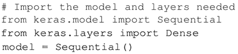
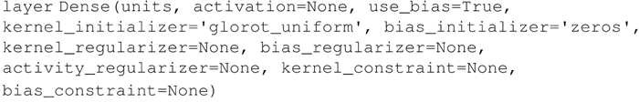
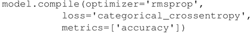
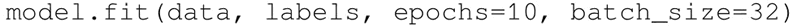
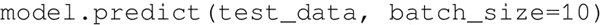

# TensorFlow Keras 及其用法（无师自通）

Keras 是与 TensorFlow 一起使用的更高级别的作为后端的 API。添加层就像添加一行代码一样简单。在模型架构之后，使用一行代码，你可以编译和拟合模型。之后，它可以用于预测。变量声明、占位符甚至会话都由 API 管理。

## 具体做法

1.  定义模型的类型。Keras 提供了两种类型的模型：序列和模型类 API。Keras 提供各种类型的神经网络层：
    

2.  在 model.add() 的帮助下将层添加到模型中。依照 Keras 文档描述，Keras 提供全连接层的选项（针对密集连接的神经网络）：
    

    注意，密集层实现的操作：output=activation(dot(input，kernel)+bias)，其中 activation 是元素激活函数，是作为激活参数传递的，kernel 是由该层创建的权重矩阵，bias 是由该层创建的偏置向量（仅在 use_bias 为 True 时适用）。

3.  可以使用它来添加尽可能多的层，每个隐藏层都由前一层提供输入。只需要为第一层指定输入维度：
    

4.  一旦模型被定义，需要选择一个损失函数和优化器。Keras 提供了多种损失函数（mean_squared_error、mean_absolute_error、mean_absolute_percentage_error、categorical_crossentropy 和优化器（sgd、RMSprop、Adagrad、Adadelta、Adam 等）。损失函数和优化器确定后，可以使用 compile（self，optimizer，loss，metrics=None，sample_weight_mode=None）来配置学习过程：
    

5.  使用 fit 方法训练模型：
    

6.  可以在 predict 方法 predict(self，x，batch_size=32，verbose=0) 的帮助下进行预测：
    

Keras 提供选项来添加卷积层、池化层、循环层，甚至是局部连接层。每种方法的详细描述在 Keras 的官方文档中可以找到：[`keras.io/models/sequential/`](https://keras.io/models/sequential/)。