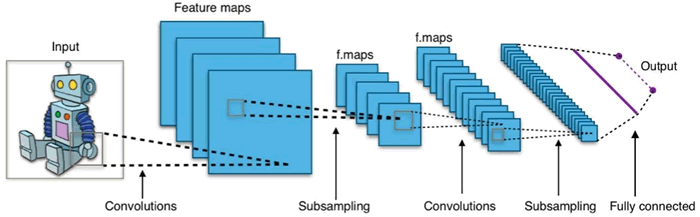
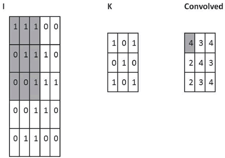
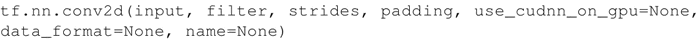
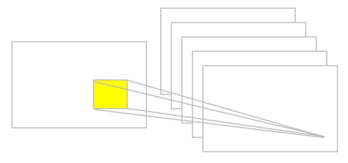
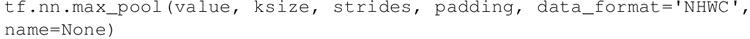
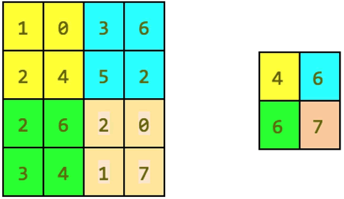

# 卷积神经网络(CNN,ConvNet)及其原理详解

卷积神经网络（CNN，有时被称为 ConvNet）是很吸引人的。在短时间内，它们变成了一种颠覆性的技术，打破了从文本、视频到语音等多个领域所有最先进的算法，远远超出了其最初在图像处理的应用范围。

CNN 由许多神经网络层组成。卷积和池化这两种不同类型的层通常是交替的。网络中每个滤波器的深度从左到右增加。最后通常由一个或多个全连接的层组成：

图 1 卷积神经网络的一个例子
Convnets 背后有三个关键动机：局部感受野、共享权重和池化。让我们一起看一下。

## 局部感受野

如果想保留图像中的空间信息，那么用像素矩阵表示每个图像是很方便的。然后，编码局部结构的简单方法是将相邻输入神经元的子矩阵连接成属于下一层的单隐藏层神经元。这个单隐藏层神经元代表一个局部感受野。请注意，此操作名为“卷积”，此类网络也因此而得名。

当然，可以通过重叠的子矩阵来编码更多的信息。例如，假设每个子矩阵的大小是 5×5，并且将这些子矩阵应用到 28×28 像素的 MNIST 图像。然后，就能够在下一隐藏层中生成 23×23 的局部感受野。事实上，在触及图像的边界之前，只需要滑动子矩阵 23 个位置。

定义从一层到另一层的特征图。当然，可以有多个独立从每个隐藏层学习的特征映射。例如，可以从 28×28 输入神经元开始处理 MNIST 图像，然后（还是以 5×5 的步幅）在下一个隐藏层中得到每个大小为 23×23 的神经元的 k 个特征图。

## 共享权重和偏置

假设想要从原始像素表示中获得移除与输入图像中位置信息无关的相同特征的能力。一个简单的直觉就是对隐藏层中的所有神经元使用相同的权重和偏置。通过这种方式，每层将从图像中学习到独立于位置信息的潜在特征。

理解卷积的一个简单方法是考虑作用于矩阵的滑动窗函数。在下面的例子中，给定输入矩阵 I 和核 K，得到卷积输出。将 3×3 核 K（有时称为滤波器或特征检测器）与输入矩阵逐元素地相乘以得到输出卷积矩阵中的一个元素。所有其他元素都是通过在 I 上滑动窗口获得的：
图 2 卷积运算的一个例子：用粗体表示参与计算的单元
在这个例子中，一触及 I 的边界就停止滑动窗口（所以输出是 3×3）。或者，可以选择用零填充输入（以便输出为 5×5），这是有关填充的选择。

另一个选择是关于滑窗所采用的滑动方式的步幅。步幅可以是 1 或大于 1。大步幅意味着核的应用更少以及更小的输出尺寸，而小步幅产生更多的输出并保留更多的信息。

滤波器的大小、步幅和填充类型是超参数，可以在训练网络时进行微调。

#### TensorFlow 中的 ConvNet

在 TensorFlow 中，如果想添加一个卷积层，可以这样写：

参数说明如下：

*   input：张量，必须是 half、float32、float64 三种类型之一。
*   filter：张量必须具有与输入相同的类型。
*   strides：整数列表。长度是 4 的一维向量。输入的每一维度的滑动窗口步幅。必须与指定格式维度的顺序相同。
*   padding：可选字符串为 SAME、VALID。要使用的填充算法的类型。
*   use_cudnn_on_gpu：一个可选的布尔值，默认为 True。
*   data_format：可选字符串为 NHWC、NCHW，默认为 NHWC。指定输入和输出数据的数据格式。使用默认格式 NHWC，数据按照以下顺序存储：[batch，in_height，in_width，in_channels]。或者，格式可以是 NCHW，数据存储顺序为：[batch，in_channels，in_height，in_width]。
*   name：操作的名称（可选）。

下图提供了一个卷积的例子：图 3 卷积运算的例子

## 池化层

假设我们要总结一个特征映射的输出。我们可以使用从单个特征映射产生的输出的空间邻接性，并将子矩阵的值聚合成单个输出值，从而合成地描述与该物理区域相关联的含义。

#### 最大池化

一个简单而通用的选择是所谓的最大池化算子，它只是输出在区域中观察到的最大输入值。在 TensorFlow 中，如果想要定义一个大小为 2×2 的最大池化层，可以这样写：

参数说明如下：

*   value：形状为 [batch，height，width，channels] 和类型是 tf.float32 的四维张量。
*   ksize：长度 >=4 的整数列表。输入张量的每个维度的窗口大小。
*   strides：长度 >=4 的整数列表。输入张量的每个维度的滑动窗口的步幅。
*   padding：一个字符串，可以是 VALID 或 SAME。
*   data_format：一个字符串，支持 NHWC 和 NCHW。
*   name：操作的可选名称。

下图给出了最大池化操作的示例：

图 4 池化操作的一个例子

#### 平均池化

另一个选择是平均池化，它简单地将一个区域聚合成在该区域观察到的输入值的平均值。

TensorFlow 可以实现大量的池化层，并在线提供了一个完整的列表（[`www.tensorflow.org/api_guides/python/nn#Pooling`](https://www.tensorflow.org/api_guides/python/nn#Pooling)）。简而言之，所有池化操作只不过是给定区域的汇总操作。

## ConvNet 总结

CNN 基本上是几层具有非线性激活函数的卷积，以及将池化层应用于卷积的结果。每层应用不同的滤波器（成百上千个）。理解的关键是滤波器不是预先设定好的，而是在训练阶段学习的，以使得恰当的损失函数被最小化。已经观察到，较低层会学习检测基本特征，而较高层检测更复杂的特征，例如形状或面部。

请注意，由于有池化层，靠后的层中的神经元看到的更多的是原始图像，因此它们能够编辑前几层中学习的基本特征。

到目前为止，描述了 ConvNet 的基本概念。CNN 在时间维度上对音频和文本数据进行一维卷积和池化操作，沿（高度×宽度）维度对图像进行二维处理，沿（高度×宽度×时间）维度对视频进行三维处理。对于图像，在输入上滑动滤波器会生成一个特征图，为每个空间位置提供滤波器的响应。

换句话说，一个 ConvNet 由多个滤波器堆叠在一起，学习识别在图像中独立于位置信息的具体视觉特征。这些视觉特征在网络的前面几层很简单，然后随着网络的加深，组合成更加复杂的全局特征。