# 三维卷积神经网络预测 MNIST 数字详解

在这一节中，你将学习如何创建一个简单的三层卷积网络来预测 MNIST 数字。这个深层网络由两个带有 ReLU 和 maxpool 的卷积层以及两个全连接层组成。

MNIST 由 60000 个手写体数字的图片组成。本节的目标是高精度地识别这些数字。

## 具体实现过程

1.  导入 tensorflow、matplotlib、random 和 numpy。然后，导入 mnist 数据集并进行独热编码。请注意，TensorFlow 有一些内置的库来处理 MNIST，我们也会用到它们：
    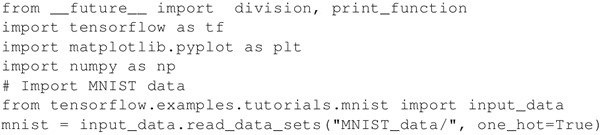

2.  仔细观察一些数据有助于理解 MNIST 数据集。了解训练数据集中有多少张图片，测试数据集中有多少张图片。可视化一些数字，以便了解它们是如何表示的。这种输出可以对于识别手写体数字的难度有一种视觉感知，即使是对于人类来说也是如此。
    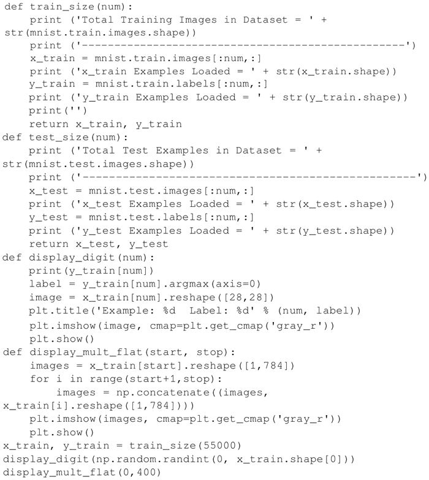
     上述代码的输出：
    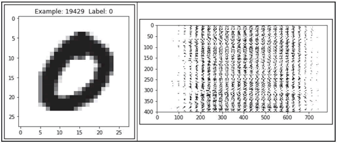图 1 MNIST 手写数字的一个例子

3.  设置学习参数 batch_size 和 display_step。另外，MNIST 图片都是 28×28 像素，因此设置 n_input=784，n_classes=10 代表输出数字 [0-9]，并且 dropout 概率是 0.85，则：
    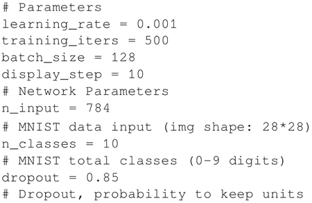

4.  设置 TensorFlow 计算图的输入。定义两个占位符来存储预测值和真实标签：
    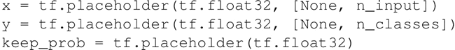

5.  定义一个输入为 x，权值为 W，偏置为 b，给定步幅的卷积层。激活函数是 ReLU，padding 设定为 SAME 模式：
    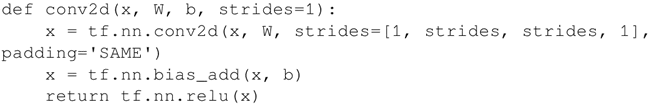

6.  定义一个输入是 x 的 maxpool 层，卷积核为 ksize 并且 padding 为 SAME：
    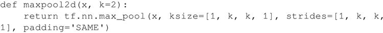

7.  定义 convnet，其构成是两个卷积层，然后是全连接层，一个 dropout 层，最后是输出层：
    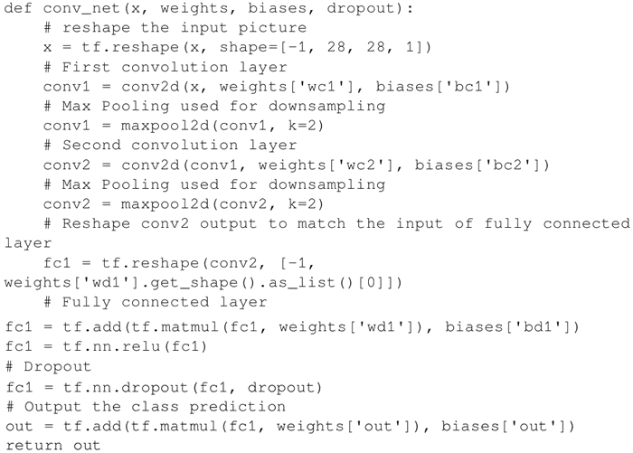

8.  定义网络层的权重和偏置。第一个 conv 层有一个 5×5 的卷积核，1 个输入和 32 个输出。第二个 conv 层有一个 5×5 的卷积核，32 个输入和 64 个输出。全连接层有 7×7×64 个输入和 1024 个输出，而第二层有 1024 个输入和 10 个输出对应于最后的数字数目。所有的权重和偏置用 randon_normal 分布完成初始化：
    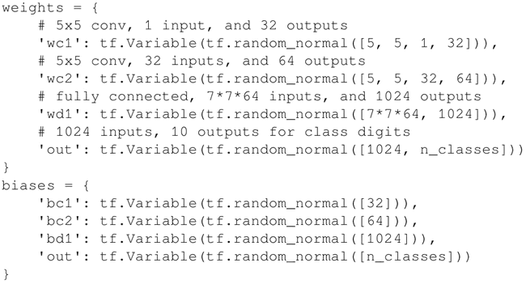

9.  建立一个给定权重和偏置的 convnet。定义基于 cross_entropy_with_logits 的损失函数，并使用 Adam 优化器进行损失最小化。优化后，计算精度：
    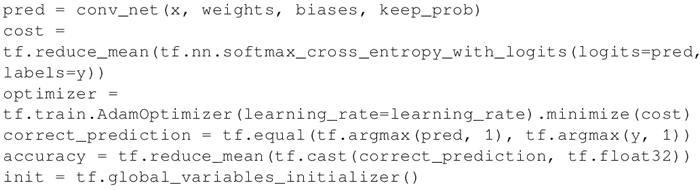

10.  启动计算图并迭代 training_iterats 次，其中每次输入 batch_size 个数据进行优化。请注意，用从 mnist 数据集分离出的 mnist.train 数据进行训练。每进行 display_step 次迭代，会计算当前的精度。最后，在 2048 个测试图片上计算精度，此时无 dropout。
    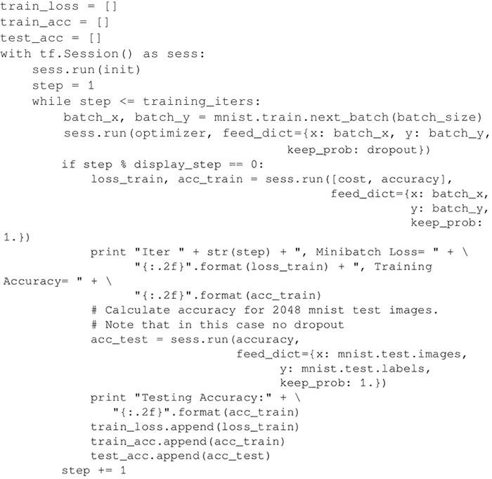

11.  画出每次迭代的 Softmax 损失以及训练和测试的精度：
    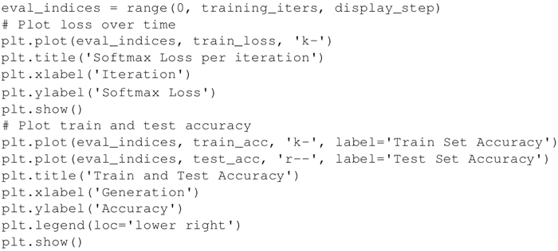
     以下是上述代码的输出。首先看一下每次迭代的 Softmax 损失：
    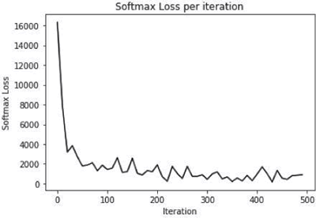
    图 2 减少损失的一个例子

再来看一下训练和测试的精度：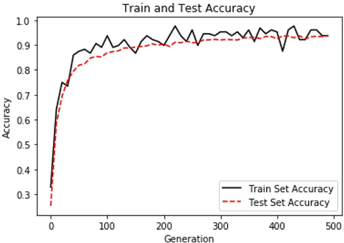图 3 训练和测试精度上升的一个例子

## 解读分析

使用 ConvNet，在 MNIST 数据集上的表现提高到了近 95% 的精度。ConvNet 的前两层网络由卷积、ReLU 激活函数和最大池化部分组成，然后是两层全连接层（含 dropout）。训练的 batch 大小为 128，使用 Adam 优化器，学习率为 0.001，最大迭代次数为 500 次。