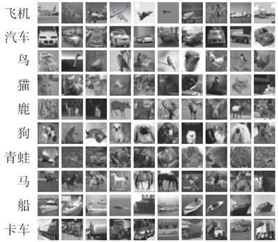
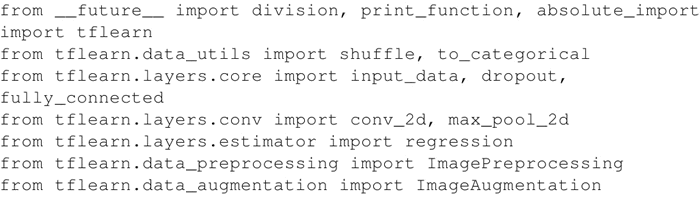
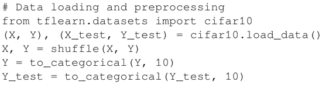
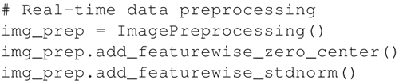
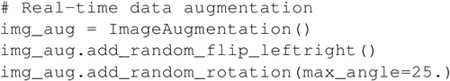
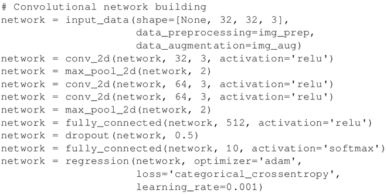
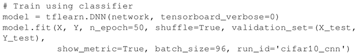
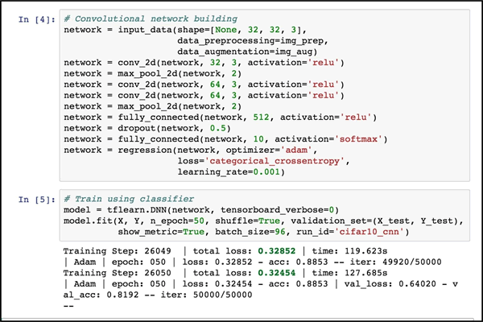

# 卷积神经网络分类图片过程详解

在这一节中，你将学习如何对 CIFAR-10 中的图片进行分类。

CIFAR-10 数据集由 10 类 60000 张 32×3 2 像素的彩色图片组成，每类有 6000 张图片。有 50000 张训练图片和 10000 张测试图片。下面的图片取自[`www.cs.toronto.edu/~kriz/cifar.html`](https://www.cs.toronto.edu/~kriz/cifar.html)：

图 1 CIFAR 图像的例子
在这一节，将使用 TFLearn（一个更高层次的框架），它抽象了一些 TensorFlow 的内部细节，能够专注于深度网络的定义。可以在 [`tflearn.org/`](http://tflearn.org/) 上了解 TFLearn 的信息，这里的代码是标准发布的一部分，网址为[`github.com/tflearn/tflearn/tree/master/examples`](https://github.com/tflearn/tflearn/tree/master/examples)。

## 具体操作过程

1.  导入几个 utils 和核心层用于实现 ConvNet、dropout、fully_connected 和 max_pool。另外，导入一些对图像处理和图像增强有用的模块。请注意，TFLearn 为 ConvNet 提供了一些已定义的更高级别的层，这能够专注于代码的定义：
    

2.  加载 CIFAR-10 数据，并将其分为 X_train 和 Y_train，X_test 用于测试，Y_test 是测试集的标签。对 X 和 Y 进行混洗可能是有用的，因为这样能避免训练依赖于特定的数据配置。最后一步是对 X 和 Y 进行独热编码：
    

3.  使用 ImagePreprocessing() 对数据集进行零中心化（即对整个数据集计算平均值），同时进行 STD 标准化（即对整个数据集计算标准差）。TFLearn 数据流旨在通过 CPU 先对数据进行预处理，然后在 GPU 上加速模型训练：
    

4.  通过随机左右翻转和随机旋转来增强数据集。这一步是一个简单的技巧，用于增加可用于训练的数据：
    

5.  使用之前定义的图片预处理和图片增强操作创建卷积网络。网络由三个卷积层组成。第一层有 32 个卷积核，尺寸是 3×3，激活函数用 ReLU，这一层后使用 max_pool 层用于缩小尺寸。然后是两个卷积核级联，卷积核的个数是 64，尺寸是 3×3，激活函数是 ReLU。之后依次是 max_pool 层，具有 512 个神经元、激活函数为 ReLU 的全连接的网络，设置 dropout 概率为 50%。最后一层是全连接层，利用 10 个神经元和激活函数 softmax 对 10 个手写数字进行分类。请注意，这种特殊类型的 ConvNet 在 CIFAR-10 中非常有效。其中，使用 Adam 优化器（categorical_crossentropy）学习率是 0.001：
    

6.  实例化 ConvNet 并以 batch_size=96 训练 50 个 epoch：
    

## 解读分析

TFLearn 隐藏了许多 TensorFlow 的实现细节，在许多情况下，它可专注于具有更高抽象级别的 ConvNet 的定义。我们的设计在 50 次迭代中达到了 88% 的准确度。以下图片是在 Jupyter notebook 中执行的快照：图 2 Jupyter 执行 CIFAR10 分类的一个例子

要安装 TFLearn，请参阅“安装指南”（[`tflearn.org/installation`](http://tflearn.org/installation)），如果你想查看更多示例，可以在网上找到已经很成熟的解决方案列表（[`tflearn.org/examples/`](http://tflearn.org/examples/)）。