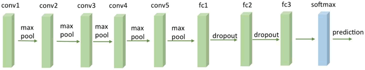
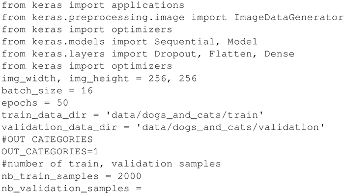
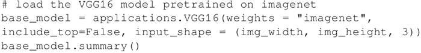
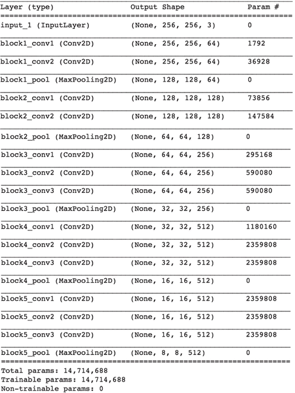
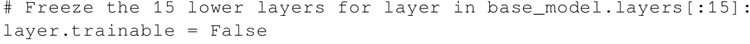
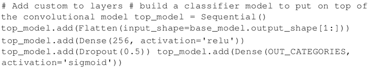
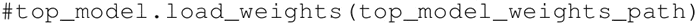
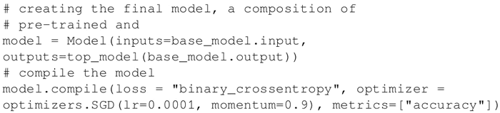
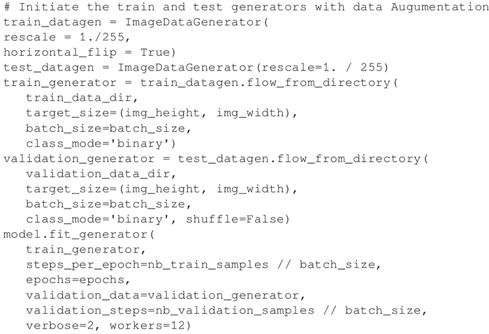
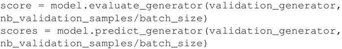

# 迁移学习及实操（使用预训练的 VGG16 网络）详解

本节讨论迁移学习，它是一个非常强大的深度学习技术，在不同领域有很多应用。动机很简单，可以打个比方来解释。假设你想学习一种新的语言，比如西班牙语，那么从你已经掌握的另一种语言（比如英语）学起，可能是有用的。

按照这种思路，计算机视觉研究人员通常使用预训练 CNN 来生成新任务的表示，其中数据集可能不够大，无法从头开始训练整个 CNN。另一个常见的策略是采用在 ImageNet 上预训练好的网络，然后通过微调整个网络来适应新任务。

这里提出的例子受启于 Francois Chollet 写的关于 Keras 的一个非常有名的博客（[`blog.keras.io/building-powerful-image-classification-models-using-very-little-data.html`](https://blog.keras.io/building-powerful-image-classification-models-using-very-little-data.html)）。

这个想法是使用在像 ImageNet 这样的大型数据集上预先训练的 VGG16 网络。注意，训练的计算量可能相当大，因此使用已经预训练的网络是有意义的：

图 1 一个 VGG16 网络
那么，如何使用 VGG16 呢？Keras 使其变得容易，因为有一个标准的 VGG16 模型可以作为一个库来使用，预先计算好的权重会自动下载。请注意，这里省略了最后一层，并将其替换为自定义层，该层将在预定义的 VGG16 的顶部进行微调。

例如，下面你将学习如何分类 Kaggle 提供的狗和猫的图片：

1.  从 Kaggle（[`www.kaggle.com/c/dogs-vs-cats/data`](https://www.kaggle.com/c/dogs-vs-cats/data)）下载狗和猫的数据，并创建一个包含两个子目录（train 和 validation）的数据目录，每个子目录有两个额外的子目录，分别是 dogs 和 cats。
2.  导入稍后将用于计算的 Keras 模块，并保存一些有用的常量：
    

3.  加载 ImageNet 上预训练的 VGG16 网络，省略最后一层，因为这里将在预建的 VGG16 网络的顶部添加自定义分类网络，并替换原来 VGG16 的分类层：
    
     上述代码的输出如下：
    

4.  冻结预训练的 VGG16 网络的一定数量的较低层。在这里决定冻结最前面的 15 层：
    

5.  为了分类，添加一组自定义的顶层：
    

6.  自定义网络应该单独进行预训练，为了简单起见，这里省略了这部分，将此任务交给读者：
    

7.  创建一个新的网络，这是预训练的 VGG16 网络和预训练的定制网络的组合体：
    

8.  重新训练组合的新模型，仍然保持 VGG16 的 15 个最低层处于冻结状态。在这个特定的例子中，也使用 Image Augumentator 来增强训练集：
    

9.  在组合网络上评估结果：
    

## 解读分析

一个标准的 VGG16 网络已经在整个 ImageNet 上进行了预训练，并且使用了预先计算好的从网上下载的权值。这个网络和一个已经被单独训练的定制网络并置在一起。然后，并置的网络作为一个整体被重新训练，同时保持 VGG16 的 15 个低层的参数不变。

这个组合非常有效。它可以节省大量的计算能力，重新利用已经工作的 VGG16 网络进行迁移学习，该网络已经在 ImageNet 上完成了学习，可以将此学习应用到新的特定领域，通过微调去完成分类任务。

根据具体的分类任务，有几条经验法则需要考虑：

*   如果新的数据集很小，并且与 ImageNet 数据集相似，那么可以冻结所有的 VGG16 网络并仅重新训练定制网络。这样，也可以最小化组合网络过度拟合的风险。

    可运行代码 base_model.layers：layer.trainable=False 冻结所有低层参数。

*   如果新数据集很大并且与 ImageNet 数据集相似，那么可以重新训练整个并置网络。仍然保持预先计算的权重作为训练起点，并通过几次迭代进行微调：

    可运行代码 model.layers：layer.trainable=True 取消冻结所有低层的参数。

*   如果新数据集与 ImageNet 数据集有很大的不同，实际上仍然可以使用预训练模型的权值进行初始化。在这种情况下，将有足够的数据和信心通过整个网络进行微调。更多信息请访问[`cs231n.github.io/transfer-learning/`](http://cs231n.github.io/transfer-learning/)。