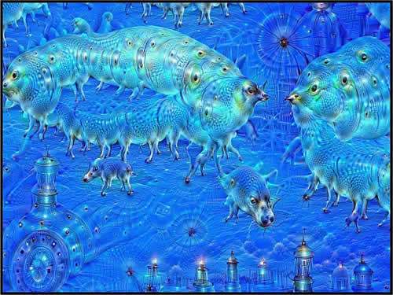
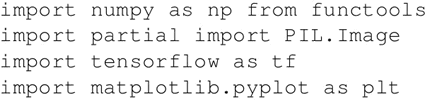
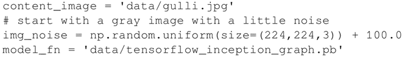
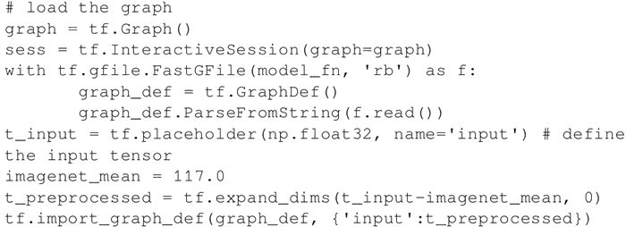
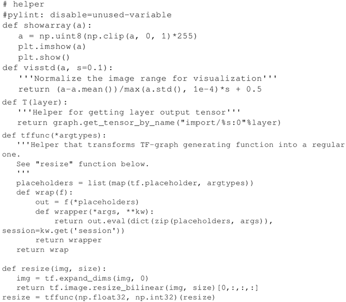
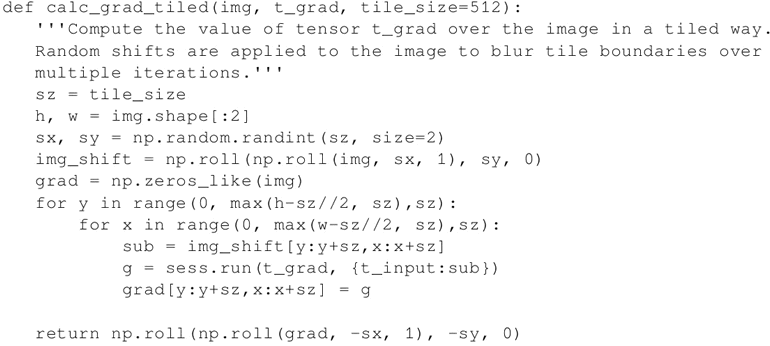
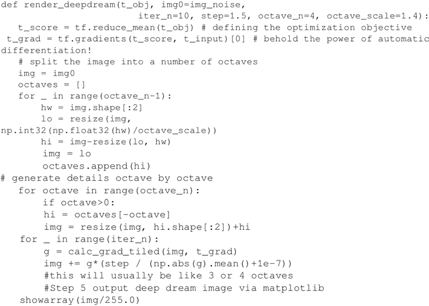
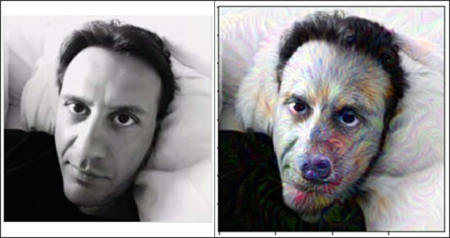

# DeepDream 网络（TensorFlow 创建）详解

Google 于 2014 年在 ImageNet 大型视觉识别竞赛（ILSVRC）训练了一个神经网络，并于 2015 年 7 月开放源代码。

该网络学习了每张图片的表示。低层学习低级特征，比如线条和边缘，而高层学习更复杂的模式，比如眼睛、鼻子、嘴巴等。因此，如果试图在网络中表示更高层次的特征，我们会看到从原始 ImageNet 中提取的不同特征的组合，例如鸟的眼睛和狗的嘴巴。

考虑到这一点，如果拍摄一张新的图片，并尝试最大化与网络高层的相似性，那么结果会得到一张新的视觉体验的图片。在这张新视觉体验的图片中，由高层学习的一些模式如同是原始图像的梦境一般。下图是一张想象图片的例子：

图 1 Google Deep Dreams 的示例

## 准备工作

从网上下载预训练的 Inception 模型（[`github.com/martinwicke/tensorflow-tutorial/blob/master/tensorflow_inception_graph.pb`](https://github.com/martinwicke/tensorflow-tutorial/blob/master/tensorflow_inception_graph.pb)）。

## 具体做法

1.  导入 numpy 进行数值计算，functools 定义一个或多个参数已经填充的偏函数，Pillow 用于图像处理，matplotlib 用于产生图像：
    

2.  设置内容图像和预训练模型的路径。从随机噪声的种子图像开始：
    

3.  以 graph 的形式加载从网上下载的 Inception 网络。初始化一个 TensorFlow 会话，用 FastGFile(..) 加载这个 graph，并用 ParseFromstring(..) 解析该 graph。之后，使用 placeholder(..) 方法创建一个占位符作为输入。 imagenet_mean 是预先计算的常数，这里的内容图像减去该值以实现数据标准化。事实上，这是训练得到的平均值，规范化使得收敛更快。该值将从输入中减去并存储在 t_preprocessed 变量中，然后用于加载 graph 定义：
    

4.  定义一些 util 函数来可视化图像，并将 TF-graph 生成函数转换为常规 Python 函数（请参阅下面的示例）：
    

5.  计算图像的梯度上升值。为了提高效率，应用平铺计算，其中在不同的图块上计算单独的梯度上升。通过多次迭代对图像应用随机偏移以模糊图块的边界：
    

6.  定义用来减少输入层均值的优化对象。通过考虑输入张量，该梯度函数可以计算优化张量的符号梯度。为了提高效率，图像被分割成几块，然后调整大小并添加到块数组中。对于每个块，使用 calc_grad_tiled 函数：
    

7.  加载特定的内容图像，并开始想象。在这个例子中，作者的脸被转化成类似于狼的模样：
    图 2 深度转换的例子，其中一个作者变成了狼

## 解读分析

神经网络存储训练图像的抽象描述：较低层存储线条和边缘等特征，较高层存储较复杂的图像特征，如眼睛、脸部和鼻子。通过应用梯度上升过程，这里使损失函数最大化并促使发现类似于由较高层记忆的图案的内容图片模式。这样网络就生成了令人致幻的图片。