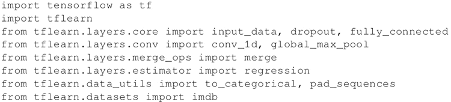
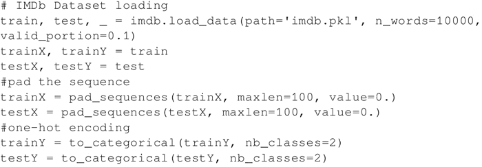
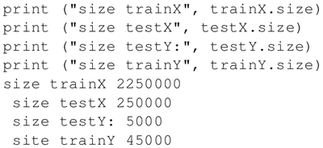
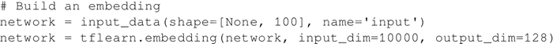
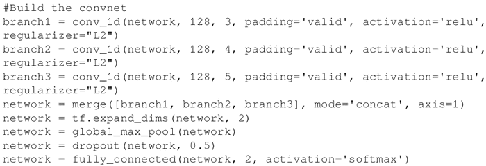
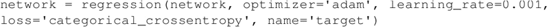
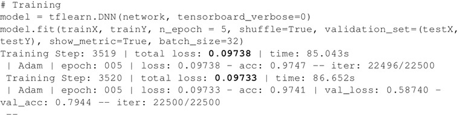
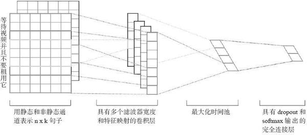

# TensorFlow 实现文本情感分析详解

前面我们介绍了如何将卷积网络应用于图像。本节将把相似的想法应用于文本。

文本和图像有什么共同之处？乍一看很少。但是，如果将句子或文档表示为矩阵，则该矩阵与其中每个单元是像素的图像矩阵没有什么区别。

接下来的问题是，如何能够将文本表示为矩阵？好吧，这很简单：矩阵的每一行都是一个表示文本的向量。当然，现在需要定义一个基本单位。一个简单方法是将基本单位表示为字符。另一种做法是将一个单词看作基本单位，将相似的单词聚合在一起，然后用表示符号表示每个聚合（有时称为聚类或嵌入）。

请注意，无论如何选择基本单位，都需要完成一个从基本单位到整数值地址的一一映射，以便可以将文本视为矩阵。例如，有 10 行文字，每行都是一个 100 维的嵌入，那么将其表示为 10×100 的矩阵。在这个特别的文本图像中，一个像素表示该句子 x 在位置 y 处有相应的嵌入。

你也许会注意到，文本并不是一个真正的矩阵，而是一个矢量，因为位于相邻行中的两个单词几乎没有什么关联。实际上，位于相邻列中的两个单词最有可能具有某种相关性，这是文本矩阵与图像的主要差异。

现在你可能想问：我明白你是想把文本当成一个向量，但是这样做就失去了这个词的位置信息，这个位置信息应该是很重要的，不是吗？

其实，事实证明，在很多真实的应用程序中，知道一个句子是否包含一个特定的基本单位（一个字符、一个单词或一个聚合体）是非常准确的信息，即使不去记住其在句子中的确切位置。

本节将使用 TFLearn 创建一个基于 CNN 的情感分析深度学习网络。正如前一节所讨论的，这里的 CNN 是一维的。

这里将使用 IMDb 数据集，收集 45000 个高度受欢迎的电影评论样本进行训练，并用 5000 个样本进行测试。TFLearn 有从网络自动下载数据集的库，便于创建卷积网络，所以可以直接编写代码。

## 文本情感分析实现过程

1.  导入 TensorFlow、tflearn 以及构建网络所需要的模块。然后导入 IMDb 库并执行独热编码和填充：
    

2.  加载数据集，用 0 填充整个句子至句子的最大长度，然后在标签上进行独热编码，其中两个数值分别对应 true 和 false 值。请注意，参数 n_words 是词汇表中单词的个数。表外的单词均设为未知。此外，请注意 trainX 和 trainY 是稀疏向量，因为每个评论可能仅包含整个单词集的一个子集。
    

3.  显示几个维度来检查刚刚处理的数据，并理解数据维度的含义：
    

4.  为数据集中包含的文本构建一个嵌入。就目前而言，考虑这个步骤是一个黑盒子，它把这些词汇映射聚类，以便类似的词汇可能出现在同一个聚类中。请注意，在之前的步骤中，词汇是离散和稀疏的。通过嵌入操作，这里将创建一个将每个单词嵌入连续密集向量空间的映射。使用这个向量空间表示将给出一个连续的、分布式的词汇表示。如何构建嵌入，将在讨论 RNN 时详细讲解：
    

5.  创建合适的卷积网络。这里有三个卷积层。由于正在处理文本，这里将使用一维卷积网络，这些图层将并行执行。每一层需要一个 128 维的张量（即嵌入输出），并应用多个具有有效填充的滤波器（分别为 3、4、5）、激活函数 ReLU 和 L2 regularizer。然后将每个图层的输出通过合并操作连接起来。接下来添加最大池层，以 50% 的概率丢弃参数的 dropout 层。最后一层是使用 softmax 激活的全连接层：
    

6.  学习阶段使用 Adam 优化器以及 categorical_crossentropy 作为损失函数：
    

7.  在训练中，采用 batch_size=32，观察在训练和验证集上达到的准确度。正如你所看到的，在通过电影评论预测情感表达时能够获得 79% 的准确性：
    

## 解读分析

论文“[Convolutional Neural Networks for Sentence Classification](https://arxiv.org/abs/1408.5882)”详细阐述了用于情感分析的一维卷积网络。请注意，得益于滤波器窗口在连续单词上的操作，文章提出的模型保留了一些位置信息。文中配图给出了网络中的关键点。在开始时，文本被表示为基于标准嵌入的向量，在一维密集空间中提供了紧凑的表示，然后用多个标准的一维卷积层处理这些矩阵。

请注意，该模型使用了多个具有不同窗口大小的滤波器来获取多个特征。之后，用一个最大池化操作来保留最重要的特征，即每个特征图中具有最高值的特征。为防止过度拟合，文章提出在倒数第二层采用一个 dropout 和用权向量的 L2 范数进行约束。最后一层输出情感为正面或者负面。

为了更好地理解模型，有几个观察结果展示如下：

*   滤波器通常在连续的空间上进行卷积。对于图像来说，这个空间是指高度和宽度上连续的像素矩阵表示。对于文本来说，连续的空间不过是连续词汇自然产生的连续维度。如果只使用独热编码来表示单词，那么空间是稀疏的，如果使用嵌入，则结果空间是密集的，因为相似的单词被聚合。
*   图像通常有三个颜色通道（RGB），而文本自然只有一个通道，因为不需要表示颜色。

论文“Convolutional Neural Networks for Sentence Classification”针对句子分类开展了一系列的实验。除了对超参数的微调，具有一层卷积的简单 CNN 在句子分类中表现出色。文章还表明采用一套静态嵌入。（这将在讨论 RNN 时讨论），并在其上构建一个非常简单的 CNN，可以显著提升情感分析的性能：

图 1 例句的两通道模型结构示例图

一个模型结构的示例的链接：[`arxiv.org/pdf/1408.5882.pdf`](https://arxiv.org/pdf/1408.5882.pdf)

使用 CNN 进行文本分析是一个活跃的研究领域。我建议看[Text Understanding from Scratch，Xiang Zhang，Yann LeCun](https://arxiv.org/abs/1502.01710) 。这篇文章证明可以使用 CNN 将深度学习应用到从字符级输入一直到抽象文本概念的文本理解。作者将 CNN 应用到包括本体分类、情感分析和文本分类在内的各种大规模数据集中，并表明它们不需要人类语言中关于词语、短语、句子或任何其他句法或语义结构的先验知识就可以达到让人惊艳的效果，模型适用于英文和中文。