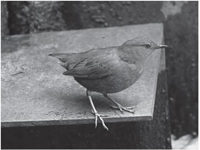
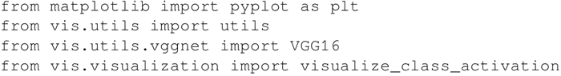
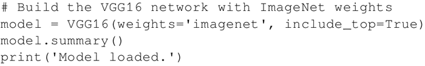
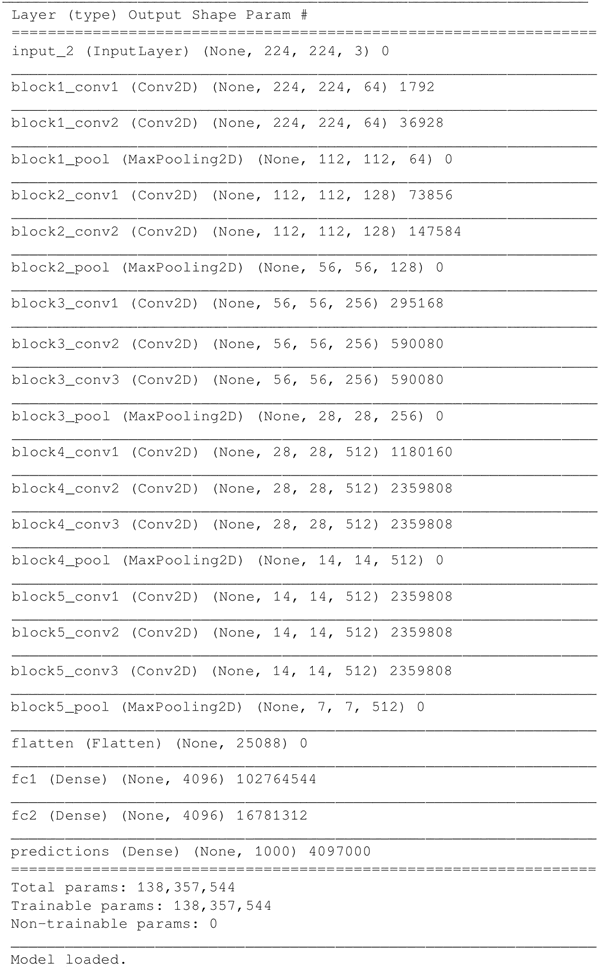
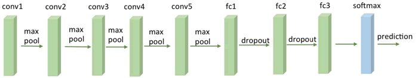
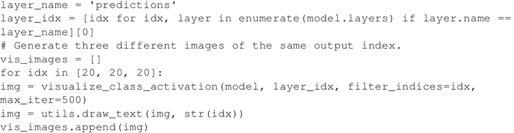
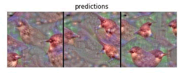
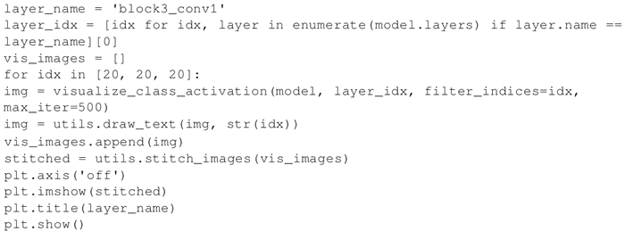
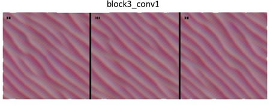
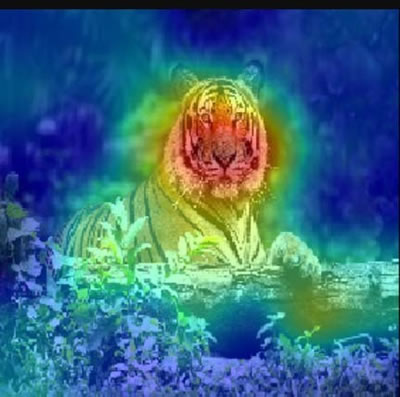

# 深入了解 VGG 卷积神经网络滤波器

本节将使用 [keras-vis](https://raghakot.github.io/keras-vis/)，一个用于可视化 VGG 预建网络学到的不同滤波器的 Keras 软件包。基本思路是选择一个特定的 ImageNet 类别并理解 VGG16 网络如何来学习表示它。

第一步是选择 ImageNet 上的一个特定类别来训练 VGG16 网络。比如，将下图中的美国北斗鸟类别设定为 20：

图 1 北斗鸟示意图
 ImageNet 类别在网站 [`gist.github.com/yrevar/6135f1bd8dcf2e0cc683`](https://gist.github.com/yrevar/6135f1bd8dcf2e0cc683) 中可以找到，作为一个 Python 字典包，ImageNet 的 1000 个类别 ID 被处理为人类可读的标签。

## 具体过程

1.  导入 matplotlib 和 keras-vis 使用的模块。另外还需要载入预建的 VGG16 模块。Keras 可以轻松处理这个预建网络：
    

2.  通过使用 Keras 中包含的预构建图层获取 VGG16 网络，并使用 ImageNet 权重进行训练：
    

3.  这是 VGG16 网络的内部结构。许多卷积层与最大池化层交替。一个平坦（flatten）层连接着三个密集层。其中最后一层被称为预测层，这个图层应该能够检测高级特征，比如面部特征，在此例中，是鸟的形状。请注意，顶层显式的包含在网络中，因为希望可视化它学到的东西：
    

4.  网络可以进一步抽象，如下图所示：
    图 2 一个 VGG16 网络

5.  现在重点看一下最后的预测层是如何预测出 ID 类别序列为 20 的美国北斗鸟的：
    

6.  显示给定特征的特定图层的生成图像，并观察网络内部中的美国北斗鸟的概念：
    
     神经网络内部就是这样表示一只鸟的。这是一种虚幻的形象，但这正是在没有人为干预的情况下该神经网络自然学到的东西！
7.  如果你还好奇还想了解更多，那么，选择一个网络中更浅的层将其可视化，显示美国北斗鸟的前期训练过程：
    

8.  运行代码的输出如下：
    

正如预期的那样，这个特定的层学习低层的特征，如曲线。然而，卷积网络的真正威力在于，模型中的网络越深入，越能推断出更复杂的特征。

## 解读分析

keras-vis 可视化密集层的关键思想是生成一个输入图像以最大化对应于鸟类的最终密集层输出。所以实际上这个模块做的是反转这个过程。给定一个特定的训练密集层与它的权重，生成一个新的最适合该层本身的合成图像。

每个卷积滤波器都使用类似的思路。在这种情况下，第一个卷积层是可以通过简单地将其权重可视化来解释的，因为它在原始像素上进行操作。

随后的卷积滤波器都对先前的卷积核的输出进行操作，因此直接对它们进行可视化并不一定非常容易理解。但是，如果独立考虑每一层，可以专注于生成最大化滤波器输出的合成输入图像。

GitHub 中的 [keras-vis 存储库](https://github.com/raghakot/keras-vis)提供了一系列关于如何检查内部网络的可视化示例，包括注意力显著图，其目标是在图像中包含各种类别（例如，草）时检测图像的哪个部分对特定类别（例如，老虎）的训练贡献最大。典型文章有“[Deep Inside Convolutional Networks：Visualising Image Classification Models and Saliency Maps](https://arxiv.org/abs/1312.6034)”，其中一个 Git 库中的图片显示如下，这个案例说明了在网络中一个老虎的显著图样本：
