# VGGNet、ResNet、Inception 和 Xception 图像分类及对比

图像分类任务是一个典型的深度学习应用。人们对这个任务的兴趣得益于 [ImageNet](http://image-net.org/) 图像数据集根据 [WordNet](http://wordnet.princeton.edu/) 层次结构（目前仅有名词）组织，其中检索层次的每个节点包含了成千上万张图片。

更确切地说，ImageNet 旨在将图像分类并标注为近 22000 个独立的对象类别。在深度学习的背景下，ImageNet 一般是指论文“[ImageNet Large Scale Visual Recognition Challenge](http://www.image-net.org/challenges/LSVRC/)”中的工作，即 ImageNet 大型视觉识别竞赛，简称 ILSVRC。

在这种背景下，目标是训练一个模型，可以将输入图像分类为 1000 个独立的对象类别。本节将使用由超过 120 万幅训练图像、50000 幅验证图像和 100000 幅测试图像预训练出的模型。

## VGG16 和 VGG19

VGG16 和 VGG19 网络已经被引用到“[Very Deep Convolutional Networks for Large Scale Image Recognition](https://arxiv.org/abs/1409.1556)”（由 Karen Simonyan 和 Andrew Zisserman 于 2014 年编写）。该网络使用 3×3 卷积核的卷积层堆叠并交替最大池化层，有两个 4096 维的全连接层，然后是 softmax 分类器。16 和 19 分别代表网络中权重层的数量（即列 D 和 E）：
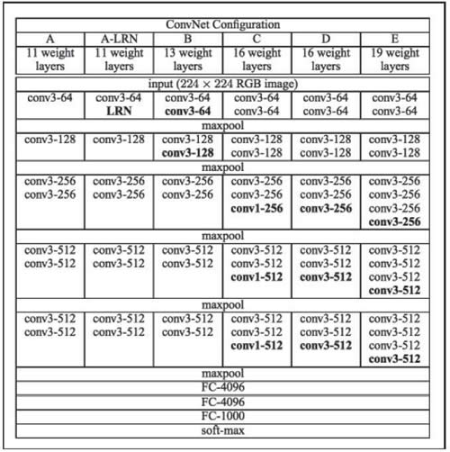
图 1 深层网络配置示例
在 2015 年，16 层或 19 层网络就可以认为是深度网络，但到了 2017 年，深度网络可达数百层。请注意，VGG 网络训练非常缓慢，并且由于深度和末端的全连接层，使得它们需要较大的权重存储空间。

## ResNet

ResNet（残差网络）的提出源自论文“[Deep Residual Learning for Image Recognition](https://arxiv.org/abs/1512.03385)”（由 Kaiming He、XiangyuZhang、ShaoqingRen 和 JianSun 于 2015 年编写）。这个网络是非常深的，可以使用一个称为残差模块的标准的网络组件来组成更复杂的网络（可称为网络中的网络），使用标准的随机梯度下降法进行训练。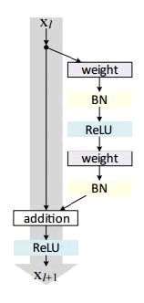与 VGG 相比，ResNet 更深，但是由于使用全局平均池操作而不是全连接密集层，所以模型的尺寸更小。

## Inception

Inception 网络源自文章“[Rethinking the Inception Architecture for Computer Vision](https://arxiv.org/abs/1512.00567)”（由 Christian Szegedy、Vincent Vanhoucke、Sergey Ioffe、Jonathon Shlens 和 Zbigniew Wojna 于 2015 年编写）。其主要思想是使用多个尺度的卷积核提取特征，并在同一模块中同时计算 1×1、3×3 和 5×5 卷积。然后将这些滤波器的输出沿通道维度堆叠并传递到网络中的下一层，如下图所示：
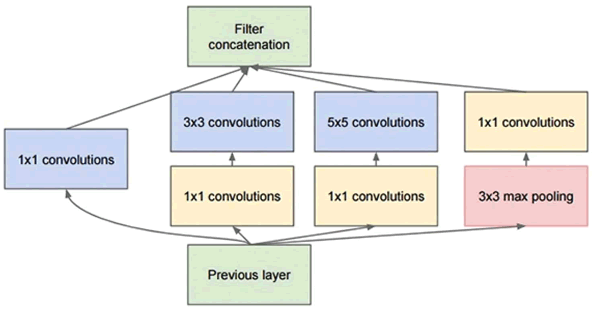
 Inception-v3 见论文“Rethinking the Inception Architecture for Computer Vision”；Inception-v4 见论文“[Inception-ResNet and the Impact of Residual Connections on Learning](https://arxiv.org/abs/1602.07261)”（由 Christian Szegedy、Sergey Ioffe、Vincent Vanhoucke 和 Alex Alemi 于 2016 年编写）。

## Xception

Xception 网络是 Inception 网络的扩展，详见论文“[Xception：Deep Learning with Depthwise Separable Convolutions](https://arxiv.org/abs/1610.02357)”（由 Fran?ois Chollet 于 2016 年编写），网址为。Xception 使用了一种叫作深度可分离卷积运算的新概念，它可以在包含 3.5 亿个图像和 17000 个类的大型图像分类数据集上胜过 Inception-v3。由于 Xception 架构具有与 Inception-v3 相同的参数数量，因此性能提升不是由于容量的增加，而是由于更高效地使用了模型参数。

## 图像分类准备工作

本节使用 Keras 因为这个框架有上述模块的预处理模块。Keras 在第一次使用时会自动下载每个网络的权重，并将这些权重存储在本地磁盘上。

换句话说，你不需要重新训练网络，而是使用互联网上已有的训练参数。假设你想在 1000 个预定义类别中分类网络，这样做是没问题的。下一节将介绍如何从这 1000 个类别开始，将其扩展到一个定制的集合，这个过程称为迁移学习。

## 具体做法

1.  导入处理和显示图像所需的预建模型和附加模块：
    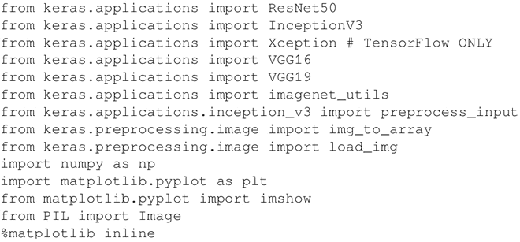

2.  定义一个用于记忆训练中图像尺寸的映射，这些是每个模型的一些常量参数：
    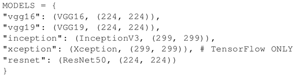

3.  定义用于加载和转换图像的辅助函数。请注意，预先训练的网络已经在张量上进行了训练，其形状还包括 batch_size 的附加维度。所以为了图像兼容性需要补充这个维度：
    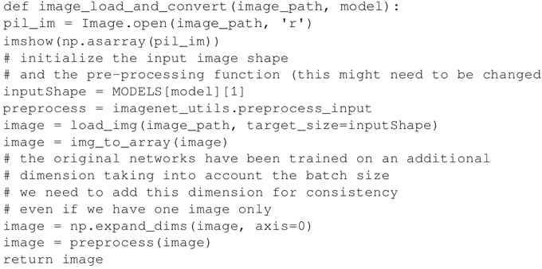

4.  定义一个辅助函数，用于对图像进行分类并对预测结果进行循环，显示前 5 名的预测概率：
    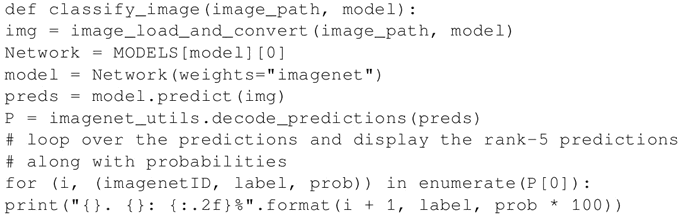

5.  测试不同类型的预训练网络，你将看到一个带有各自类别预测概率的预测列表：

    | 测试欲训练网络 | 预测列标 | 预测示例图 |
    | classify_image("image/parrot.jpg","vgg16") | 1.macaw：99.92% 2.jacamar：0.03%
    3.lorikeet：0.02%
    4.bee_eater：0.02%
    5.toucan：0.00% | 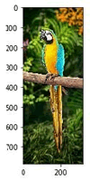 |
    | classify_image("image/parrot.jpg","vgg19") | 1.macaw：99.77% 2.lorikeet：0.07%
    3.toucan：0.06%
    4.hornbill：0.05%
    5.jacamar：0.01% |  |
    | classify_image("image/parrot.jpg","resnet") | 1.macaw：97.93% 2.peacock：0.86%
    3.lorikeet：0.23%
    4.jacamar：0.12%
    5.jay：0.12% |  |
    | classify_image("image/parrot_cropped1.jpg","resnet") | 1.macaw：99.98% 2.lorikeet：0.00%
    3.peacock：0.00%
    4.sulphur-crested_cockatoo：0.00%
    5.toucan：0.00% | 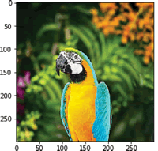 |
    | classify_image("image/incredible-hulk-180.jpg","resnet") | 1.comic_book：99.76% 2.book_jacket：0.19%
    3.jigsaw_puzzle：0.05%
    4.menu：0.00%
    5.packet：0.00% | 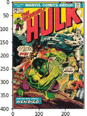 |
    | classify_image("image/croppoed_panda.jpg","resnet") | 1.giant_panda：99.04% 2.indri：0.59%
    3.lesser_panda：0.17%
    4.gibbon：0.07%
    5.titi：0.05% | 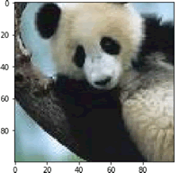 |
    | classify_image("image/space-shuttle1.jpg","resnet") | 1.space_shuttle：92.38% 2.triceratops：7.15%
    3.warplane：0.11%
    4.cowboy_hat：0.10%
    5.sombrero：0.04% | 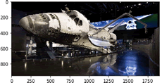 |
    | classify_image("image/space-shuttle2.jpg","resnet") | 1.space_shuttle：99.96% 2.missile：0.03%
    3.projectile：0.00%
    4.steam_locomotive：0.00%
    5.warplane：0.00% | 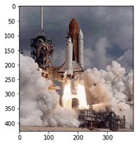 |
    | classify_image("image/space-shuttle3.jpg","resnet") | 1.space_shuttle：93.21% 2.missile：5.53%
    3.projectile：1.26%
    4.mosque：0.00%
    5.beacon：0.00% | 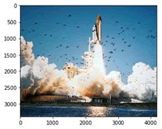 |
    | classify_image("image/space-shuttle4.jpg","resnet") | 1.space_shuttle：49.61% 2.castle：8.17%
    3.crane：6.46%
    4.missile：4.62%
    5.aircraft_carrier：4.24% | 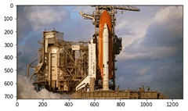 |

    注意可能报出一些错误，比如：

    | 测试欲训练网络 | 预测列标 | 预测示例图 |
    | classify_image("image/parrot.jpg","inception") | 1.stopwatch：100.00% 2.mink：0.00%
    3.hammer：0.00%
    4.black_grouse：0.00%
    5.web_site：0.00% |  |
    | classify_image("image/parrot.jpg","xception") | 1.backpack：56.69% 2.military_uniform：29.79%
    3.bib：8.02%
    4.purse：2.14%
    5.ping-pong_ball：1.52% |  |

6.  定义用于显示每个预建和预训练网络的内部架构的函数：
    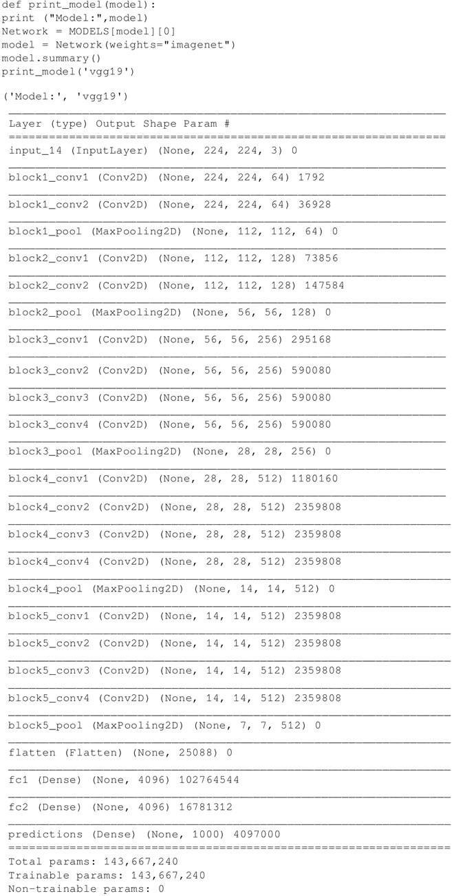

## 解读分析

我们已经使用了 Keras 应用，带有预训练权重的预训练 Keras 学习模型是可以获取的，这些模型可用于预测、特征提取以及参数微调。

在本例中，使用的是预测模型。将在下一个例子中看到如何使用该模型进行参数微调，以及如何在数据集上构建自定义的分类器，这些分类器在最初训练模型时是不可用的。

需要注意的是，Inception-v4 在 2017 年 7 月之前不能在 Keras 中直接使用，但可以在线上单独下载（[`github.com/kentsommer/keras-inceptionV4`](https://github.com/kentsommer/keras-inceptionV4)）。安装完成后，模块将在第一次使用时自动下载其权重参数。

AlexNet 是最早的堆叠深度网络之一，它只包含八层，前五层是卷积层，后面是全连接层。该网络于 2012 年提出，当年凭借其优异的性能获得冠军（其误差约为 16%，而亚军误差为 26%）。

最近对深度神经网络的研究主要集中在提高精度上。具有相同精度的前提下，轻量化 DNN 体系结构至少有以下三个优点：

1.  轻量化 CNN 在分布式训练期间需要更少的服务器通信。
2.  轻量化 CNN 需要较少的带宽将新模型从云端导出到模型所在的位置。
3.  轻量化 CNN 更易于部署在 FPGA 和其他有限内存的硬件上。

为了提供以上优点，论文“[SqueezeNet：AlexNet-level accuracy with 50x fewer parameters and<0.5MB model size](https://arxiv.org/abs/1602.07360)”（Forrest N.Iandola，Song Han，Matthew W.Moskewicz，Khalid Ashraf，William J.Dally，Kurt Keutzer，2016）提出的 SqueezeNet 在 ImageNet 上实现了 AlexNet 级别的准确性，参数少了 50 倍。

另外，由于使用模型压缩技术，可以将 SqueezeNet 压缩到小于 0.5 MB（比 AlexNet 小 510 倍）。Keras 实现的 SqueezeNet 作为一个单独的模块，已在网上开源([`github.com/DT42/squeezenet_demo`](https://github.com/DT42/squeezenet_demo))。