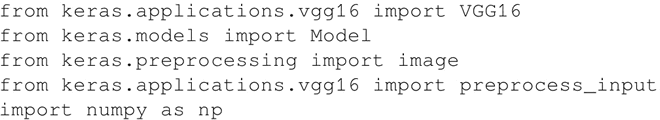
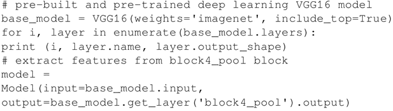
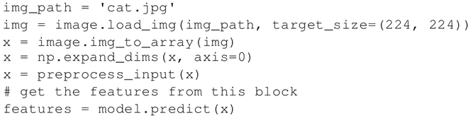

# 预建深度学习提取特征及实现（详解版）

本节将介绍如何使用深度学习来提取相关的特征。

一个非常简单的想法是使用 VGG16 和一般的 DCNN 模型来进行特征提取。这段代码通过从特定图层中提取特征来实现这个想法。

## 具体实现过程

1.  导入处理和显示图像所需的预建模型和附加模块：
    

2.  从网络中选择一个特定的图层，并获取输出的特征：
    

3.  提取给定图像的特征，代码如下所示：
    

## 解读分析

现在，你可能想知道为什么要从 CNN 中的中间层提取特征。一个直觉是：随着网络的学习将图像分类成不同类别，每一层将学习到进行最终分类所必需的特征。

较低层识别诸如颜色和边缘等较低阶特征，高层将这些较低阶特征组合成较高阶特征，诸如形状或对象。因此，中间层具有从图像中提取重要特征的能力，这些特征有助于不同种类的分类。

这种结构具有以下几个优点：

1.  可以依靠公开的大规模数据集训练，将学习参数迁移到新的领域。
2.  可以节省大量训练时间。
3.  即使在自己的数据集中没有大量的训练数据，也可以提供合理的解决方案。我们也可以为手头任务准备一个较好的起始网络形状，而不用去猜测它。